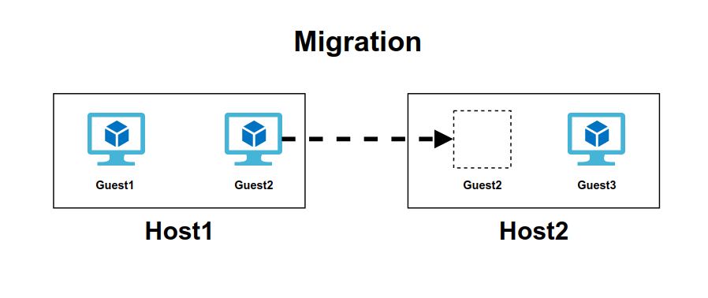

# MIGRATE TRONG OPENSTACK

# 1. Tổng quan về Migrate

Migration là quá trình di chuyển máy ảo từ host vật lí này sang một host vật lí khác. Migration được sinh ra để làm nhiệm vụ bảo trì nâng cấp hệ thống. Ngày nay tính năng này đã được phát triển để thực hiện nhiều tác vụ hơn:

- Cân bằng tải: Di chuyển VMs tới các host khác kh phát hiện host đang chạy có dấu hiệu quá tải.
- Bảo trì, nâng cấp hệ thống: Di chuyển các VMs ra khỏi host trước khi tắt nó đi.
- Khôi phục lại máy ảo khi host gặp lỗi: Restart máy ảo trên một host khác.

Trong OpenStack, việc migrate được thực hiện giữa các node compute với nhau hoặc giữa các project trên cùng 1 node compute.

# 2.Các kiểu migrate hiện có trong OPS và workflow của chúng

OpenStack hỗ trợ 2 kiểu migration đó là:

- Cold migration : Non-live migration
- Live migration :
    - True live migration (shared storage or volume-based)
    - Block live migration

## 2.1.Cold Migrate ( Non-live migrate)
- Migrate khác live migrate ở chỗ nó thực hiện migration khi tắt máy ảo ( Libvirt domain không chạy)
- Yêu cầu SSH key pairs được triển khai cho user đang chạy nova-compute với mọi hypervisors.
- **Migrate workflow**:

    - Tắt máy ảo ( tương tự “virsh destroy” ) và disconnect các volume.
    - Di chuyển thư mục hiện hành của máy ảo ra ngoài ( (instance_dir -> instance_dir_resize). Tiến trình resize instance sẽ tạo ra thư mục tạm thời.
    - Nếu sử dụng QCOW2, convert image sang dạng RAW.
    - Với hệ thống shared storage, di chuyển thư mục instance_dir mới vào. Nếu không, copy thông qua SCP.

## 2.2.Live Migration
- Thực hiện bởi câu lệnh `nova live-migration [--block-migrate]`
- Có 2 loại live migration: `normal migration` và `“block” migrations`.
- Normal live migration yêu cầu cả hai source và target hypervisor phải truy cập đến data của instance ( trên hệ thống lưu trữ có chia sẻ, ví dụ: NAS, SAN)
- Block migration không yêu cầu đặc biệt gì đối với hệ thống storage. Instance disk được migrated như một phần của tiến trình.
- Live migrations là một trong những thao tác vận hành mang tính nhạy cảm nhất liên quan đến phiên bản của QEMU đang chạy trên máy chủ nguồn và đích.
- **Live Migration Workflow**:

    - Kiểm tra storage backend là thích hợp với loại migration hay không:
        - Thực hiện kiểm ta hệ thống shared storage cho normal migrations
        - Thực hiện kiểm tra các yêu cầu cho block migrations
        - Kiểm tra trên cả source và destination, điều phối thông qua RPC calls từ scheduler.
    - Trên destination
        - Tạo các kết nối volume cần thiết.
        - Nếu là block migration, tạo thư mục instance, lưu lại các file bị mất từ Glance và tạo instance disk trống.
    - Trên source, khởi tạo tiến trình migration.
    - Khi tiến trình hoàn tất, tái sinh file Libvirt XML và define nó trên destination.

- Dưới đây minh họa cho quá trình live migrate VM:

1. Pre-Migration (Chuẩn bị)

- Máy ảo (VM A) đang hoạt động trên Compute Node A.
- Compute Node B đã được chọn làm đích cho việc di chuyển.

2. Reservation (Đặt chỗ)

- Xác nhận Compute Node B có đủ tài nguyên (CPU, RAM, Disk, Network) để tiếp nhận máy ảo từ Compute Node A.
- Nếu Compute Node B đủ tài nguyên, một vị trí sẽ được dự trữ trên Compute Node B cho máy ảo.
- Máy ảo (VM A) vẫn đang hoạt động (Active) và cung cấp dịch vụ bình thường.Nếu đủ tài nguyên, Node B sẽ đặt chỗ (reserve) để chuẩn bị tiếp nhận máy ảo.

3. Iterative Pre-Copy (Sao chép lặp lại)

- Toàn bộ bộ nhớ của máy ảo (RAM) được sao chép từ Compute Node A sang Compute Node B.Máy ảo vẫn hoạt động bình thường trên Compute Node A.
- Trong khi sao chép, một số trang bộ nhớ trên Compute Node A có thể thay đổi do hoạt động của máy ảo. Việc sao chép trang thay đổi tiếp tục lặp lại cho đến khi lượng dữ liệu thay đổi trở nên rất nhỏ.

4. Stop and Copy

- Máy ảo VM A tạm dừng (Paused).
- Sao chép các trang bộ nhớ còn lại và trạng thái CPU từ Compute node A sang Compute node B.
- Quá trình này yêu cầu tạm dừng ngắn để đảm bảo tính nhất quán của dữ liệu.

5. Commitment

- Compute node B trở thành host chính cho máy ảo (VM A Active).
- Máy ảo được khởi động trên node B và hoạt động bình thường.
- Compute node A giải phóng tài nguyên liên quan đến máy ảo.
- Tại thời điểm này, trạng thái của máy ảo đã được hoàn tất di chuyển, và VM A hiện chạy trên node B.

# 3. So sánh giữa Cold Migrate và Live Migrate

**1. Cold migrate**

- Ưu điểm:
    - Đơn giản, dễ thực hiện
    - Thực hiện được với mọi loại máy ảo
- Hạn chế:
    - Thời gian downtime lớn
    - Không thể chọn được host muốn migrate tới.
    - Quá trình migrate có thể mất một khoảng thời gian dài

**2. Live migrate**

- Ưu điểm:
    - Có thể chọn host muốn migrate
    - Tiết kiệm chi phí, tăng sự linh hoạt trong khâu quản lí và vận hành.
    - Giảm thời gian downtime và gia tăng thêm khả năng "cứu hộ" khi gặp sự cố
- Nhược điểm:
    - Dù chọn được host nhưng vẫn có những giới hạn nhất định
    - Quá trình migrate có thể fails nếu host bạn chọn không có đủ tài nguyên.
    - Bạn không được can thiệp vào bất cứ tiến trình nào trong quá trình live migrate.
    - Khó migrate với những máy ảo có dung lượng bộ nhớ lớn và trường hợp hai host khác CPU.
- Trong live-migrate, có 2 loại đó là True live migration và Block live migration. Hình dưới đây mô tả những loại storage mà 2 loại migration trên hỗ trợ:

- Ngữ cảnh sử dụng:

    - Nếu bạn buộc phải chọn host và giảm tối da thời gian downtime của server thì bạn nên chọn live-migrate (tùy vào loại storage sử dụng mà chọn true hoặc block migration)
    - Nếu bạn không muốn chọn host hoặc đã kích hoạt configdrive (một dạng ổ lưu trữ metadata của máy ảo, thường được dùng để cung cấp cấu hình network khi không sử dụng DHCP) thì hãy lựa chọn cold migrate.