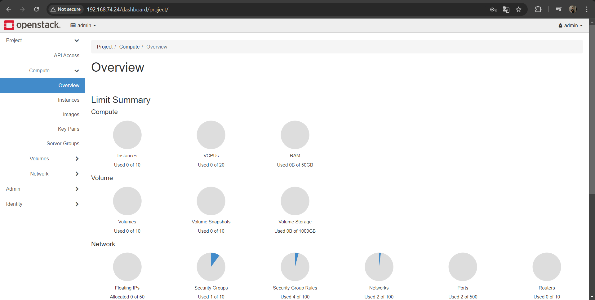

# CÀI ĐẶT OPENSTACK TRÊN UBUNTU 22.04 BẰNG DEVSTACK

# DevStack là gì?
Devstack là một loạt các tập lệnh được sử dụng để nhanh chóng đưa ra một môi trường OpenStack hoàn chỉnh. Chúng ta có thể tải xuống phiên bản OpenStack mới nhất từ ​​nhánh git master. Nó được sử dụng để thiết lập một cách nhanh hơn và nhanh hơn để thiết lập môi trường phát triển và làm cơ sở cho hầu hết các thử nghiệm chức năng của dự án OpenStack.

# Yêu cầu tối thiểu
Trước khi bắt đầu, hãy đảm bảo bạn có các điều kiện tiên quyết tối thiểu sau

- Hệ điều hành: Ubuntu 22.04
- Quyền người dùng: sudo
- Bộ nhớ RAM :4 GB
- vCPU: 2
- Dung lượng ổ cứng: 10 GB
- Kết nối Internet: có

# Các bước cài đặt 

**Bước 1: Cập nhật và nâng cấp hệ thống** 

- Cập nhật & nâng cấp kho lưu trữ hệ thống bằng lệnh sau

**Ubuntu**
```
apt update -y && apt upgrade -y 
```
**CentOS**
```
yum update -y && yum upgrade -y 
```
**Bước 2: Tạo Stack user và gán đặc quyền sudo**

- Để tạo user Stack và cấp quyền thực thi chạy lệnh sau 

```
sudo useradd -s /bin/bash -d /opt/stack -m stack 
sudo chmod +x /opt/stack
```

- Gán quyền root cho user Stack

```
echo "stack ALL=(ALL) NOPASSWD: ALL" | sudo tee /etc/sudoers.d/stack
```

**Bước 3: Cài đặt git và tải xuống Devstack**

- Chuyển sang user `stack`
```
su - stack
```

- Cài đặt git 
**Ubuntu**
```
sudo apt install git -y
```
**CentOS**
```
sudo yum install -y git
```
- Sử dụng git để sao chép kho lưu trữ git của devstack

```
git clone https://git.openstack.org/openstack-dev/devstack
```

**Bước 4: Tạo tệp cấu hình devstack**

- Điều hướng đến thư mục devstack
```
cd devstack
```

- Tạo tệp cấu hình local.conf 

```
vi local.conf
```
```
[[local|localrc]]
# Password for KeyStone, Database, RabbitMQ and Service
ADMIN_PASSWORD=thienbd@1998
DATABASE_PASSWORD=$ADMIN_PASSWORD
RABBIT_PASSWORD=$ADMIN_PASSWORD
SERVICE_PASSWORD=$ADMIN_PASSWORD
IP_VERSION=4
LOGFILE=$DEST/logs/stack.sh.log
LOG_COLOR=False
# Host IP - get your Server/VM IP address from ip addr command
HOST_IP=192.168.74.24
```


LƯU Ý:

- `ADMIN_PASSWORD` là mật khẩu bạn sẽ sử dụng để đăng nhập vào trang đăng nhập OpenStack. Tên người dùng mặc định là admin .
- `HOST_IP` là địa chỉ IP của hệ thống được lấy bằng cách chạy lệnh `ifconfig` hoặc `ip addr` lệnh.

**Bước 5: Cài đặt OpenStack với Devstack**

- Chạy lệnh dưới để bắt đầu cài đặt 
```
./stack.sh
```
Các tính năng sau đây sẽ được cài đặt:

- **Horizon** — OpenStack Dashboard
- **Nova** — Compute Service
- **Glance** — Image Service
- **Neutron** — Network Service
- **Keystone** — Identity Service
- **Cinder** — Block Storage Service
- **Placement** — Placement API

**Bước 6: Truy cập OpenStack trên trình duyệt web**

Để truy cập OpenStack qua trình duyệt web, hãy truy cập địa chỉ IP của Ubuntu như hiển thị. `https://server-ip/dashboard`


Nhập thông tin đăng nhập và nhấn “ Đăng nhập ”. Bạn sẽ có thể thấy bảng điều khiển Quản lý như hiển thị bên dưới.



*Tài liệu tham khảo*

[1] [https://docs.openstack.org/devstack/rocky/guides/single-machine.html](https://docs.openstack.org/devstack/rocky/guides/single-machine.html)

[2] [https://medium.com/@kcoupal/how-to-install-openstack-on-ubuntu-22-04-with-devstack-3336c01ddcfa](https://medium.com/@kcoupal/how-to-install-openstack-on-ubuntu-22-04-with-devstack-3336c01ddcfa)

[3] [https://www.linkedin.com/pulse/openstack-installation-ubuntu-fairbanks](https://www.linkedin.com/pulse/openstack-installation-ubuntu-fairbanks)