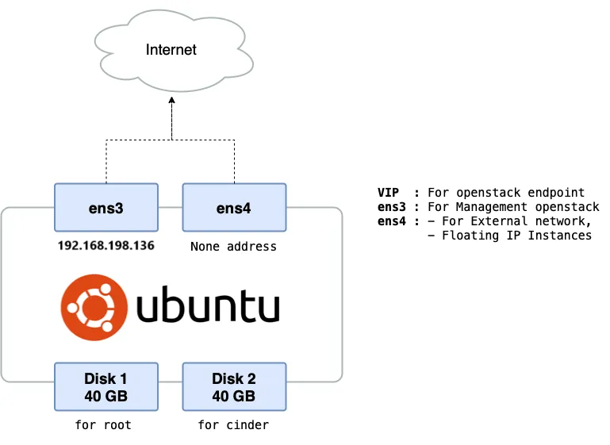

# THỰC HIỆN CÀI ĐẶT OPENSTACK ALL IN ONE BẰNG KOLLA ANSIBLEANSIBLE

# 1. Mô hình triển khai 
Yêu cầu: Dựng một cụm OpenStack All-in-one sử dụng Kolla Ansible.

**Chuẩn bị tài nguyên**
-	Ubuntu 22.04 LTS Jammy Jellyfish.
-	vCPU: 6.
-	4 GB RAM.
-	Storage vda 40GB, vdb 40GB.
-	2 network interfaces cùng dải ens33 và ens34 (Card NAT).



# 2. Setup máy ảo trước khi cài đặt 

- Cài đặt hostname
```
sudo hostnamectl set-hostname ops-aio
```
- Tắt Firewall
```
sudo systemctl status ufw 
sudo systemctl disable ufw
sudo systemctl stop ufw
```
- Cấu hình đồng bộ thời gian (Cài đặt múi giờ)
```
sudo timedatectl set-timezone Asia/Ho_Chi_Minh
```
- Cài gói ntp:
```
sudo apt install ntp -y
```
- Kiểm tra cấu hình ntp trong file sau:
```
sudo vi /etc/ntpsec/ntp.conf
```
- Kiểm tra trạng thái:
```
sudo systemctl status ntp
```
- Khởi động lại máy
```
sudo init 6
```

# 3. Thực hiện cài đặt

**Bước 1: Update Ubuntu và Cài đặt dependencies**

- update packages
```
sudo apt update -y
sudo apt upgrade -y
```
- cài đặt dependencies
```
sudo apt install git python3-dev libffi-dev python3-venv gcc libssl-dev git python3-pip -y
```
**Bước 2: Cài đặt Docker CE**

- Cài đặt các gói phụ trợ cần thiết trước khi thêm repository và cài phần mềm từ bên ngoài
```
sudo apt install apt-transport-https ca-certificates curl software-properties-common -y
```
- Thêm GPG key của Docker vào hệ thống APT, giúp xác thực tính hợp lệ khi cài đặt phần mềm từ repo Docker.
```
curl -fsSL https://download.docker.com/linux/ubuntu/gpg | sudo apt-key add -
```
- Tải và thêm key để xác minh các gói phần mềm từ repo Docker
```
sudo apt-key adv --keyserver keyserver.ubuntu.com --recv-keys 7EA0A9C3F273FCD8
```
- Tải về GPG key của Docker
```
curl -fsSL https://download.docker.com/linux/ubuntu/gpg | sudo gpg --dearmor -o /usr/share/keyrings/docker-archive-keyring.gpg 
```
- Thêm Docker APT repository vào hệ thống Ubuntu
```
echo "deb [arch=amd64 signed-by=/usr/share/keyrings/docker-archive-keyring.gpg] https://download.docker.com/linux/ubuntu jammy stable" | sudo tee /etc/apt/sources.list.d/docker.list > /dev/null
sudo apt update
```
- Kiểm tra thông tin chi tiết về gói docker-ce
```
apt-cache policy docker-ce
```
- Cài Docker và các thành phần cần thiết từ Docker APT repository.
```
sudo apt-get install docker-ce docker-ce-cli containerd.io docker-buildx-plugin docker-compose-plugin -y
```
- Kiểm tra trạng thái docker 
```
sudo docker run hello-world
sudo systemctl status docker
```

Bạn có thể thêm user mà bạn sử dụng để deploy vào Docker group để quản lý docker mà không cần sử dụng đến quyền sudo. Sau khi chạy lệnh bên dưới, user cần được log out và log in lại để có thể cập nhật quyền vì group memberships được set trong quá trình diễn ra phiên đăng nhập của user.
```
sudo usermod -aG docker thienbd
```
**Bước 3: Cài đặt dependencies cho môi trường ảo**
- Tạo một môi trường ảo và activate nó
```
sudo python3 -m venv /path/to/venv
sudo chown -R thienbd:thienbd /path/to/venv/
source /path/to/venv/bin/activate
```
- Đảm bảo phiên bản pip mới nhất được cài đặt
```
pip install -U pip
```
- Cài ansible-core, docker, …
```
pip install 'ansible-core>=2.15,<2.16.99'
pip install 'docker<6.0.0,>=5.0.0' 'requests<2.32' 
```
- Break-system-packages
```
pip show docker
pip show requests
```
**Bước 4: Cài đặt Kolla-Ansible**

- Cài đặt kolla-ansible và các dependencies của nó sử dụng pip
```
pip install git+https://opendev.org/openstack/kolla-ansible@stable/2024.1
```
- Tạo thư mục /etc/kolla
```
sudo mkdir -p /etc/kolla
sudo chown thienbd:thienbd /etc/kolla
```
- Copy các file globals.yml và passwords.yml đến thư mục /etc/kolla
```
cp -r /path/to/venv/share/kolla-ansible/etc_examples/kolla/* /etc/kolla
```
- Copy all-in-one inventory files tới thư mục hiện tại
```
cp /path/to/venv/share/kolla-ansible/ansible/inventory/all-in-one .
```
**Bước 5: Cài đặt Ansible Galaxy requirements**

- Cài đặt Ansible Galaxy dependencies
```
kolla-ansible install-deps
```
**Bước 6: Kolla passwords**

Passwords được dùng trong quá trình triển khai được lưu trong file /etc/kolla/passwords.yml, ban đầu tất cả các passwords đều blank nên cần được tạo ngẫu nhiên một cách thủ công bằng cách chạy lệnh
```
kolla-genpwd
```
**Bước 7: Chỉnh sửa file globals.yml**

Vị trí của file ở trong thư mục “/etc/kolla/”
- Chỉnh lại quyền cho file
```
chmod 666 /etc/kolla/globals.yml
```
- globals.yml là file cấu hình chính cho Kolla Ansible, chỉnh một số options trong file
```
sudo vi /etc/kolla/globals.yml
```

```
//image option
kolla_base_distro: "ubuntu"

// networking:
network_interface: "ens33"
neutron_external_interface: "ens34" 
kolla_internal_vip_address: "192.168.198.163"
```
**Bước 8: Deployment**

- Clear pip cache
```
pip cache purge
```
- Bootstrap servers with kolla deploy dependencies
```
kolla-ansible -i ./all-in-one bootstrap-servers
```
(Lệnh bootstrap sẽ làm những gì:
+ Tùy chỉnh file /etc/hosts
+ Tạo user và group
+ Cấu hình thư mục Kolla
+ Cài đặt và gỡ bỏ Package
+ Cài đặt và cấu hình docker engine
+ Vô hiệu hóa firewalls
+ Tạo môi trường Python ảo
+ Cấu hình Apparmor
+ Cấu hình NTP daemon)

Kết quả mong đợi

- Nếu gặp lỗi thiếu gói dependencie chạy lệnh sau 
```
sudo apt install -y pkg-config libdbus-1-dev libglib2.0-dev build-essential python3-dev
```
- Thực hiện pre-deployment checks cho host
```
kolla-ansible -i ./all-in-one prechecks
```
Kết quả mong đợi

- Gặp lỗi về thư viện docker thì chạy 2 lệnh bổ sung sau 
```
sudo pip3 install docker
sudo apt install python3-pip -y
```

- Thực hiện quá trình triển khai
```
kolla-ansible -i ./all-in-one deploy
```
Kết quả mong muốn

**Bước 9: Kiểm tra sau cài đặt**
```
sudo docker ps
```
Kết quả mong muốn
 
Thử đăng nhập dashboard “http://192.168.198.163”

- Nhận mật khẩu openstack horizon
```
cd /etc/kolla 
grep keystone_admin_password /etc/kolla/passwords.yml
```
# 4. Cài đặt OpenStackClient
- Cài đặt openstack CLI
```
sudo apt update
sudo apt install python3-openstackclient -y
```
- Nạp file môi trường
Tạo file `nano admin-openrc.sh` và thêm nội dung sau 
```
export OS_PROJECT_DOMAIN_NAME=Default
export OS_USER_DOMAIN_NAME=Default
export OS_PROJECT_NAME=admin
export OS_USERNAME=admin
export OS_PASSWORD=3loQPWZ3uZh19wLPe5KFLFPkr30SqASZYS6Unnwl
export OS_AUTH_URL=http://192.168.198.136:5000/v3
export OS_IDENTITY_API_VERSION=3
export OS_IMAGE_API_VERSION=2
```
- Chạy lại file
```
source admin-openrc.sh
```

*Tài liệu tham khảo*

[1] [https://docs.openstack.org/project-deploy-guide/kolla-ansible/zed/quickstart.html](https://docs.openstack.org/project-deploy-guide/kolla-ansible/zed/quickstart.html)

[2] [https://medium.com/btech-engineering/install-openstack-aio-with-kolla-ansible-in-ubuntu-2b98fc9de4ce](https://medium.com/btech-engineering/install-openstack-aio-with-kolla-ansible-in-ubuntu-2b98fc9de4ce)