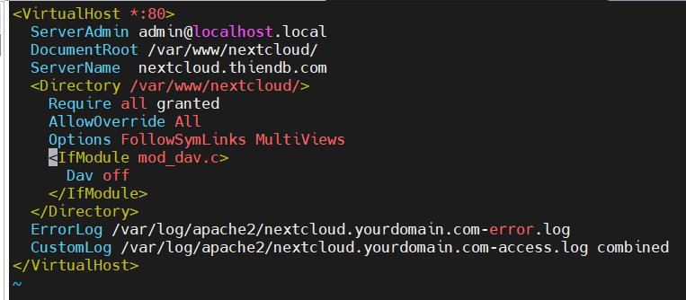
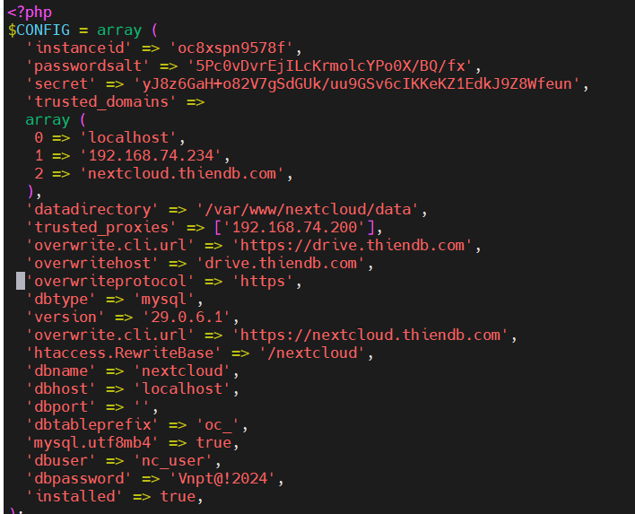

#  CẤU HÌNH TÊN MIỀN CHO NEXTCLOUD 

# 1. Cấu hình tên miền 
**1. Chỉnh sửa file virtual host của Nextcloud**

Truy cập file theo đường dẫn : `vi /etc/apache2/sites-available/nextcloud.conf`



Thêm cấu hình như hình

```
<VirtualHost *:80>
  ServerAdmin admin@localhost.local
  DocumentRoot /var/www/nextcloud/
  ServerName  nextcloud.thiendb.com
  <Directory /var/www/nextcloud/>
    Require all granted
    AllowOverride All
    Options FollowSymLinks MultiViews
    <IfModule mod_dav.c>
      Dav off
    </IfModule>
  </Directory>
  ErrorLog /var/log/apache2/nextcloud.yourdomain.com-error.log
  CustomLog /var/log/apache2/nextcloud.yourdomain.com-access.log combined
</VirtualHost>

```
**ServerName**: Tên miền của bạn (ví dụ: nextcloud.thiendb.com).
**DocumentRoot**: Thư mục cài đặt Nextcloud (thường là /var/www/nextcloud).

**2. Chỉnh sửa file cấu hình php của nextcloud**

Mở tệp cấu hình `config.php` trong thư mục cấu hình của Nextcloud: `sudo vi /var/www/nextcloud/config/config.php`

Thêm tên miền vào danh sách trusted_domains
Tìm mục `trusted_domains` và thêm tên miền của bạn vào danh sách
```
'trusted_domains' => 
array (
  0 => 'localhost',
  1 => 'your-server-ip',
  2 => 'nextcloud.thiendb.com',  // Thay thế với tên miền của bạn
),
```


**3. Restart lại dịch vụ apache2**

Dùng lệnh sau để restart lại dịch vụ : `systemctl rerstart apache2`

# 2. Cấu hình reverse proxy 

Để có thể cấu hình reverse proxy ta cần chỉnh sửa file Nextcloud : `sudo vi /var/www/nextcloud/config/config.php`

Thêm nội dung sau 
```
'trusted_proxies' => ['192.168.74.200'],
'overwrite.cli.url' => 'https://drive.thiendb.com',
'overwritehost' => 'drive.thiendb.com',
'overwriteprotocol' => 'https',
'overwritewebroot' => '/nextcloud',
'overwritecondaddr' => '^192\.168\.1\.1$',
```  


**1. trusted_proxies**
Tùy chọn 'trusted_proxies' trong cấu hình Nextcloud dùng để khai báo các địa chỉ IP của proxy mà Nextcloud nên tin tưởng. Điều này quan trọng khi bạn sử dụng reverse proxy hoặc load balancer, vì nó cho phép Nextcloud nhận diện đúng các yêu cầu từ proxy và không coi chúng là nguy hiểm.

**2. overwritehost**  
Tùy chọn này được sử dụng để ghi đè tên miền mà Nextcloud sử dụng khi tạo các liên kết và phản hồi các yêu cầu. Điều này hữu ích khi bạn đang sử dụng reverse proxy hoặc tên miền khác với cấu hình mặc định của máy chủ web.

**3. overwriteprotocol**   
Tùy chọn này cho phép bạn chỉ định giao thức (HTTP hoặc HTTPS) mà Nextcloud sẽ sử dụng. Điều này quan trọng nếu bạn đang sử dụng reverse proxy hoặc các dịch vụ khác yêu cầu một giao thức cụ thể.

**4. overwritewebroot**   
Tùy chọn này cho phép chỉ định thư mục con của web root nơi Nextcloud được cài đặt. Điều này đặc biệt hữu ích khi Nextcloud không nằm ở thư mục gốc của máy chủ web mà nằm trong một thư mục con.

**5. overwritecondaddr**   
Tùy chọn này cho phép bạn ghi đè các điều kiện địa chỉ IP khi Nextcloud được truy cập qua một địa chỉ cụ thể. Điều này hữu ích nếu bạn cần điều kiện hoá các địa chỉ IP nhất định cho việc ghi đè URL hoặc giao thức.

**6. overwrite.cli.url**   
Tùy chọn này được sử dụng để chỉ định URL mà Nextcloud sẽ sử dụng khi chạy các lệnh từ dòng lệnh (CLI). Điều này đảm bảo rằng các lệnh CLI của Nextcloud có thể hoạt động chính xác với các URL đầy đủ.