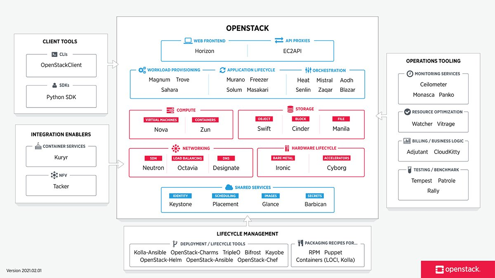

# TÌM HIỂU VỀ OPENSTACK 

# 1. Tổng quan Openstack
## 1.1. Openstack là gì 

Openstack là một bộ công cụ phần mềm cung cấp các giải pháp về phát triển hệ thống hạ tầng đám mây, với khả năng mở rộng cao và linh hoạt. Người dùng có thể tạo máy ảo và nhiều phiên bản xử lý công việc khác nhau để quản lý môi trường Cloud của mình nhanh chóng hơn. Mã nguồn mở OpenStack giúp đơn giản hóa việc mở rộng quản lý theo chiều ngang, giúp phục vụ nhiều nhu cầu của doanh nghiệp cùng lúc
Openstack triển khai theo mô hình dịch vụ IaaS và được coi là cơ sở hạ tầng như một dịch vụ 

## 1.2. Các thành phần 

- **Compute infrastructure(Nova)**: bao gồm các loại nova như nova compute, nova network, nova schedule, nova api và nova volume. Khi đó No-Schedule có nhiệm vụ lọc ra các thông tin khổng lồ để cung cấp một cách kịp thời, no-compute sẽ chạy các máy ảo, No-network thựuc hiện việc cấu hình lại các mạng ảo cho máy ảo, No-volume với nhiệm vụ tiếp nhận công việc xử lý, tạo xóa thêm hoặc bớt các volume vào instance.

- **Storage infrastructure(Swift)**: bào gồm Proxy node và Storage nodes. Đầu tiên các proxy nodes sẽ tiêsp nhận yêu cầu xử lý và gửi về cho storage nodes, sau đó thựuc hiện sao lưu các mục yêu cầu dưới một account, khi lưu trữ (container) hoặc vùng đối tượng (các object). Mặt khác, thông tin thêm các container sẽ thuộc sở hữu của một account(không giới hạn số lượng) và các object sẽ là các tập con bên trong container. Chính vì vậy, điều bắt buộc là phải có ít nhất một container bên trong account để tiến hành các thao tác update. Tóm lại, swift sẽ thực hiện các công việc như ghi chép lại các thông tin dữ liệu
- **Imageing service(Glance)**: có chức năng xử lý những file ảnh của máy chủ ảo. Đồng thời, thực hiện được một số công việc quản trị khác như cập nhật thêm các tính năng virtual disk images, cài đạt các chế độ quyền riêng tư cho các hình ảnh, dễ dàng tùy biến việc sửa hoặc xóa images
- **Networking (Neutron)**: Cung cấp dịch vụ mạng ảo, tạo và quản lý các mạng, subnet, firewall. Hỗ trợ nhiều loại mạng ảo khác nhau như VLAN, VXLAN, cho phép kết nối máy chủ ảo với nhau và với mạng bên ngoài 
- **Block storage(Cinder)**: Cung cấp dịch vụ kho lưu trữ khối, tạo và quản lý các ổ cứng ảo. Hỗ trợ nhiều loại lưu trữ khác nhau như HDD, SSD, Ceph, cho phép lưu trữ dữ liệu cho máy chủ ảo 
- **Identity (Keystone)**: Cung cấp dịch vụ xác thực và ủy quyền, quản lý người dùng, nhóm, dự án.Hỗ trợ nhiều phương thức xác thực khác nhau như LDAP, Kerberos, SAML, cho phép kiểm soát truy cập vào các tài nguyên Openstack

Ngoài 6 thành phần chính trên, Openstack còn có nhiều thành phần khác cung cấp các chức năng bổ sung như sau:

- **Horizon**: Bảng điều khiển quản lý OpenStack
- **Heat**: Dịch vụ triển khai orchestraion
- **Celiometer**: Dịch vụ đo lường và thu thập dữ liệu
- **Sahara**: Dịch vụ quản lý Hadoop

# 2. Công dụng và lợi ích 
## 2.1. Công dụng

- **Quản lý tài nguyên**: Quản lý hiệu quả các nguồn lực đám mây, bao gồm tính toán, lưu trữ và mạng. Tính năng này cho phép người dùng provision và giải phóng tài nguyên theo nhu cầu, tối ưu hóa việc sử dụng tài nguyên và giảm chi phí
- **Tính đồng nhất**: Openstack cung cấp một giao diện đồng nhất để truy cập và quản lý các nguồn lực cloud, bất kể phần cứng hoặc hệ điều hành nào được triển khai. Điều này đơn giản hóa việc quản lý cloud, cho phép người dùng nhanh chóng cung cấp và mở rộng các ứng dụng cloud trong nhiều môi trường
- **Tính tự động**: Openstack tự động hóa nhiều nhiệm vụ liên quan đến việc quản lý cloud, giúp giảm lỗi thủ công và cải thiện hiệu quả. Các tính năng tự động hóa, như provision tài nguyên theo yêu cầu và cân bằng tải, giúp tối hóa hiệu suất cloud và giảm gánh nặng quản trị 

## 2.2. Lợi ích sử dụng 
- **Tăng tốc độ triển khai ứng dụng**: Openstack giúp tự động hóa các quy trình, đẩy nhanh tốc độ triển khai ứng dụng
- **Nâng cao khả năng tự động hóa**: Openstack cung cấp nhiều công cụ tự động hóa giúp quản lý môi trường cloud hiệu quả hơn
- **Tăng cường khả năng phục hồi**: Openstack cung cấp các tính năng giúp đảm bảo tính sẵn sàng cao môi trường cloud 
- **Hỗ trợ đa dạng các dịch vụ**: Openstack cung cấp nhiều dịch vụ khác nhau, đáp ứng nhu cầu đa dạng của người dùng