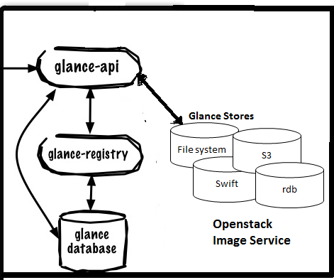
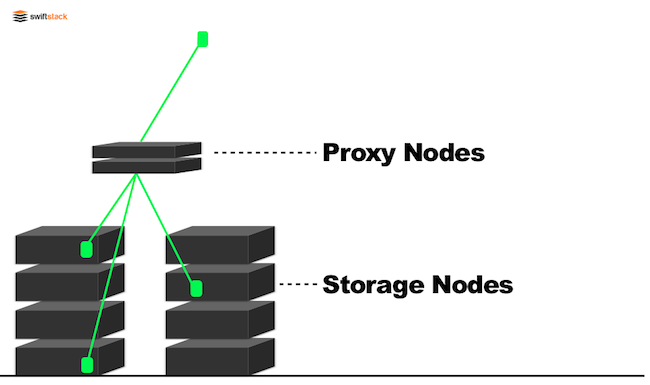
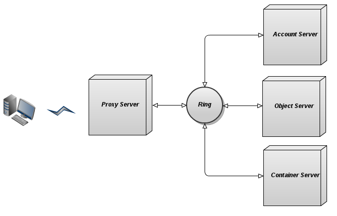

# THÀNH PHẦN VÀ CẤU TRÚC CỦA OPENSTACK

# 1.Các thành phần của openstack

|Thành phần| Project Name| Chức năng|
|---|---|---|
|Openstack compute| Nova| Quản lý và tự động hóa nguồn tài nguyên máy tính và có thể hoạt động với công nghệ ảo hóa có sẵn đã được sử dụng rộng rãi, là phần chính của dịch vụ cơ sở hạ tầng|
|Openstack Networking| Neutron| Là hệ thống điều khiển mạng lưới và địa chỉ IP dùng để đảm bảo mạng được truyền dẫn bình thường, cung cấp các mô hình mạng cho các ứng dụng và người dùng khác nhau|
| Openstack Block Storage| Cinder| Là hệ thống lưu trữ khối quản lý việc tạo, gắn và tách các thiết bị trong khối máy chủ. Cung cấp các thiết bị lưu trữ cấp khối để sử dụng với các trường hợp tính toán Openstack|
|Openstack Idenity| Keystone| Hỗ trợ nhiều hình thức xác thực như thông tin đăng nhập (tên người dùng và mật khẩu). Ngoài ra cung cấp một danh sach có thể truy vấn tất cả các dịch vụ đã triển khai trong Openstack để người dùng hoặc bên thứ 3 có thể xác định được tài nguyên nào họ có thể dùng|
|Openstack Image|Glance| Cung cấp dịch vụ tìm kiếm, đăng ký, và vận chuyển image trong ổ đĩa và máy chủ|
|Openstack Object Storage| Swift| Là hệ thống lưu trữ dự phòng có thể mở rộng để đảm bảo các bản sao chép và toàn vẹn dữ liệu được rải đều trên các máy chủ trong trung tâm dữ liệu. Nếu máy chủ hoặc ổ cứng bị lỗi, Openstack sẽ sao chép nội dung sang các vị trí mới|
|Openstack Dashboard| Horizon| Là giao diện quản lý cho người dùng và quản trị viên, cung cấp cho quản trị viên và người dùng giao diện truy cập, cung cấp và tự động hóa việc triển khai các tài nguyên dựa trên bản lưu trữ trên cloud. Có tể được thiết kế để chứa sản phẩm và dịch vụ của bên thứ 3|
| Orchesrtration| Heat| Là dịch vụ phối hợp nhiều ứng dụng cloud lại với nhau. Miêu tả và tự động hóa các hoạt động triển khai và hậy triển khai cơ sở hạ tầng|
| Database| Trove | Là một cơ sở dữ liệu,cung cấp cho người dùng dịch vụ điều khảin và quản lý một hoặc nhiều cơ sở hạ tầng có liên hệ với nhau|
| Data Processing | Sahara | Là dịch vụ cung cấp các cụm Hadoop (tập hợp các phần mềm có mã nguồn mở) một cách dễ dàng và nhanh chóng |
| Bara-Material Provisioning | Ironic | Cung cấp các máy chủ vật lý thay vì cung cấp máy ảo. Cung cấp hypervision như API và bộ trình cắm|

# 2.Kiến trúc Openstack
Sơ đồ sau đây hiển thị mối quan hệ giữa các dịch vụ OpenStack: 

# 3. Tổng quan các service thành phần trong Openstack 

**1.Keystone - Identity Service**
-----
- Cung cấp dịch vụ xác thực cho toàn bộ hạ tầng Openstack
    - Theo dõi người dùng và quyền hạn của họ
    - Cung cấp một catalog của dịch vụ đang sẵn sàng với các APi endpoint để truy cập csc dịch vụ đó 
- Về mặt bản chất, Keystone cung cấp chức năng xác thực và ủy quyền cho các phần tử trong Openstack. Người dùng khai báo chứng thực với Keystone và dựa trên kết quả của tiến trình xác thực, nó sẽ gán role cùng với token xác thực cho người dùng. Role này mô tả quyền hạn cũng như vai trò trong thực hiện việc vận hành Openstack
- "User" trong Keystone có thể là :
    - Người dùng
    - Dịch vụ (Nova, Cinder, Neutron...)
    - Endpoint(là địa chỉ có khả năng truy cập mạng như ỦL, RESTful API...)
- Keystone gán một tenant và một role cho user. Một user có thể có nhiều role trong các tennats khác nhau. Tiến trình xác thực có thể biểu diễn như sau :

- Keystone được tổ chức theo nhóm các nội dung dịch vụ(internal services) tương tác với một hoặc nhiều endpoint. Các nội dịch vụ đó là:
    - Indentity:
        - Cung cấp dịch vụ chứng thực và dữ liệu và Users, Groups, Project, Domains Roles, metadata,...
        - Về cơ bản, tất cả dữ liệu này được quản lý bởi dịch vụ, cho phép các dịch vụ quản lý các thao tác CRUD (Create - Read - Update - Delete) với dữ liệu 
        - Trong nhiều trường hợp khác nhau, dữ liệu bị thu thập từ các dịch vụ backend được ủy quyền khác như LDAP
    - Token: Xác nhận và quản lý các tokens được sử dụng để xác thực yêu cầu khi thông tin của người dùng đã được xác minh
    - Catalog: Cung cấp một endpoint registry sử dụng để phát hiện endpoint
    - Policy: Cung cấp engine để ủy quyền dựa trên rule và kết nối với giao diện quản lý rule
- Mỗi dịch vụ nayyf có thể được cấu hình để sử dụng một dịch vụ back-end. Một số back-end service điển hình:
    - Key value store: cung cấp giao diện hỗ trợ tìm kiếm theo khóa
    - Memcached: Là hệ thống phân phối và lưu trữ bộ nhớ đệm(cache) và chứa dữ liệu trên RAM. (lưu tạm thông tin những dữ liệu hay sử dụng và bộ nhớ RAM)
    - SQL: sử dụng SQLAIchemy để lưu trữ dữ liệu bền vững
    - Pluggable Authentication Module (PAM): sử dụng dich vụ PAM của hệ thống cục bộ cho việc xác thực 
    - LDAP: kết nối thông qua LDAP tới một thư mục back-end, như Active Directory để xác thực các user và lấy thông tin về role
- Từ bản Juno, Keystone có tính năng mới là fedration of identity service. Nghĩa là thay vì việc xác thực tập trung, việc xấc thực sẽ phân tán trên internet, hay còn gọi là identity providers(IdPs). Lợi ích của việc sử dụng IdPS:
    - Không cần phải dự phòng các user entries trong Keystone( các bản ghi về người dùng) bời vì các user entries đã được lưu trữ trong cơ sở dữ liệu của các IdPs
    - Không cần phải xây dựng mô hình xác thực trong Keystone, bởi vì các IdPs chịu trách nhiệm xác thực cho người dùng sử dụng bất kỳ công nghệ nào phù hợp. Do đó có thể kết hợp nhiều công nghệ xác thực khác nhau
    - Nhiều tổ chức hợp tác có thể chia sẻ chung các dịch vụ cloud bằng cách mỗi tổ chức sẽ sử dụng IdP cục bộ để xác thực người dùng của họ 

**2. Nova - Compute Service**

- Chức năng
    - Thực hiện quản lý vòng đời các máy ảo, cung cấp abstract layer tương tác với hypervisors được hỗ trợ : Hyper-V, XenServer, Xen via libvirt, KVM (libvirt/QEMU)
    - Nova phân loại hypervisors thành 3 nhóm dựa trên số lượng các bài kiển thử thành công với driver tương tác với hypervisors:
        - GROUP A: libvirt (QEMU/KVM on x86). Các drivers này được hỗ trợ hoàn toàn. Các bài kiểm tra bao gồm: unit test và functional testing
        - GROUP B: Hyper-V, VMWare, XenServer. Các driver này được hỗ trợ ở mức trung bình. Các bài tết bao gồm : unit test và functional testing cung cấp bởi một hệ thống bên ngoài 
        - GROUP C: baremetal, docker, Xen via libvirt, LXC via libvirt. Các dirver này được thực hiện một số bài kiểm thử nhỏ và có thể hoạt động không ổn định. Việc sử dụng chúng mạo hiểm. Các bài test bao gồm: unit tests và các bài test chứuc năng không public
- Các thành phần - gồm 7 thành phần chính: 
    - Cloud controller: đại diện cho trạng thái toàn cục và tương tác với các component khác
    - API server : Có thể coi như các Web services cho cloud contronller
    - Compute Controller: cung cấp tài nguyên máy chủ tính toán 
    - Auth Manager: cung cấp dịch vụ xác thực ủy quyền 
    - volume Controller: cung cấp các khổi lưu trữ bền vững và nhanh chóng cho các computer server
    - Network controller: cung cấp mạng ảo cho phép các compute server tương tác với nhau và với public network
    - Scheduler lựa chọn compute controller phù hợp nhất để host một instance( máy ảo)
- Mối quan hệ giữa các thành phần 
    - Sơ đồ 
    
    *Chú ý: Message Queue và các back-end database rất quan trọng trong khi vận hành Nova*
    - Message Queue có thể là bất kỳ một AMQP message nào. Trong Openstack đó là RabbitMQ, Apache Qpid và ZeroMQ
    - Back-end database thông thường là sqlite3, MySQL và PostgerSQL
    - Mô tả ngắn gọn về Nova
    

    - End user(DevOps, Dev, hoặc có thể là các thành phần khác trong Openstack) sẽ giao tiếp với nova-api để tương tác với Openstack Nova
    - Các Openstack Nova daemons trao đổi thông tin qua queue(lưu trữ các actionn) và dataase (infomationn) để thực hiện các API requests
    - Openstack Glance giao tiếp với Openstack Nova interfaces thông qua Glance APi
    - Nova-networking vẫn được sử dụng trong một số use cases. Người dùng có thể lựa chọn nova-networking hoặc Neutron 

**3. Glance - Image Service**

- Giới thiệu 
Openstack image service cung cấp dịch vụ quản lý các disk image của máy ảo.Dịch vụ này cung cấp dịch vụ tìm kiếm, đăng ký, chuyển các disk image tới Compute service và cũng dùng vào mục đích dự phòng các máy ảo

- Các thành phần 
Danh sách các tiến trình của Images Service và chức năng của chúng 
    - glance-api: nó tiếp nhận lời gọi Image API để thực hiện tìm kiếm,thu thập và lưu trữ các images
    - glance-registry: lưu trữ, thực thi và thu thập metadata về các image (size, type...)
    - glance-database: là cở sở dữ liệu lưu trữ matadata của các image
    - storage repository: là các image file, glace hỗ trợ hệ thống file thông thường như: RADOS block devices, Amazon S3, HTTP và Swift
Glance tiếp nhận các API request và images( hoặc metadata của images) từ người dùng cuối hoặc các Nova component và có thể lưu trữ các file ổ đĩa trong object storages service, swift hoặc các storage repo khác
- Danh sách các định dạng ổ đĩa và container được hỗ trợ bao gồm:
    - Disk Format: Disk format của một image máy ảo là định dạng của disk image bao gồm: 
        - Raw: là định dạng disk image phi cấu trúc
        - vhd: là định dạng ảnh đĩa chung sử dụng bởi các công nghệ VMWare, Xen, Microsoft, VirtualBox...
        - vmdk: định dạng disk image chung hỗ trợ bởi nhiều công nghệ ảo hóa khác nhau (điển hình là VMWare)
        - vdi: định dạng disk image hỗ trợ bởi VirtualBox và QEMU emulator
        - iso: định dạng cho việc lưu trữ dữ liệu của ổ đĩa quang
        - qcow2: hỗ trợ bởi QEMU , hỗ trợ copy on write 
        - aki, ari, ami
    - Container Format:
        - bare: định dạng này xác định rằng không có container cho image
        - ovf: định dạng OVF container
        - aki: xác định Amazon kernel image lưu trữ trong Glance
        - ami: xác định Amazon ramdisk image lưu trữ trong glance
        - ova: xác định file OVA tar lưu trữ trong Glance 
- oVirt tích hợp với Glance

oVirt (Open Virtualization Manager) từ Red Hat là project cho phép oVirt user sử dụng, trích xuất và share images với Glance. Glance sẽ được coi như một External Provider cho oVirt 3.3
Bên cạnh việc import và export các images tới Glance, việc tích hợp oVirt cho phép oVirt thực hiện tìm kiếm image và liệt kê nội dung của Glance trên giao diện của oVirt

Tính năng hữu ích khác khi tích hợp với oVirt với Glance đó là oVirt có thể "discover" kích thước của image định dạng QCOW2 bằng cách tìm kiếm trong QCOW2 header. Glance metadata không cung cấp kích thước của image 

- Glance API: 
API đóng vai trò quan trọng trong việc xử lý image của Glance. Glance APi có 2 version 1 và 2. Glance API ver2 cung cấp tiêu chuẩn của một số thuộc tính tùy chỉnh của image
Glance phụ thuộc vào Keystone và Openstack identity API thực hiện việc xác thực cho client. Bạn phải có được token xác thực từ Keystone và gửi token đó đi cùng với mọi API requests tới Glance thông qua X-Auth-Tokken header. Glance sẽ tương tác với Keystone để xác nhận hiệu lực của token và lấy được thông tin chứng thực

**4. Cinder - Block Storage Service**

- Sơ lược về Cinder
    - Tương tự như Amazon Web Services S3 (Simple Storage Service) cung cấp khối lưu trữ bền vững(persistent block storage) để vận hành các máy ảo 
    - Cinder cung cấp dịch vụ block storage. Một cách ngắn gọn, Cinder thực hiện ảo hóa pool các khối thiết bị lưu trữ và cung cấp cho người dùng cuối API để request và sử dụng tài nguyên mà không cần biết khối lưu trữ của họ thực sự luuw trữ ở đâu và loại thiết bị gì. Cũng như các dịch vụ khác trong Openstack, sefl service API được sử dụng để tương tác với dịch vụ Cinder 
    - Ý tưởng chính của Cinder là cung cấp một lớp abstract cho người dùng cuối đối với các khối thiết bị lưu trữ. Người dùng Cinder không cần phải biết chi tiết hay quản lý khối thiết bị lưu trữ vật lý, chỉ cần sử dụng lưu trữ được cung cấp.

- Các thành phần của Cinder

    - Cinder-api
        - Một ứng dụng WSGI có vai trò xác thực và chuyển request trong toàn bộ dịch vụ Block Storage
        - Request được gửi tới cinder-scheduler rồi điều hướng tới cinder-volumes thích hợp
    - Cinder-scheduler:
        - Dựa trên request được điều hướng tới, cinder-scheduler chuyển request tới Cinder Volume Service thông qua giao thức AMQP (lưu trữ bản tin điều hướng trong Queue của RabbitMQ hoặc Qpid)
        - Có thể được cấu hình để sử dụng cơ chế round-robin
        - Filter Scheduler là mode mặc định xác định nơi để gửi volume dựa trên Capacity, Avalability Zone, Volume Types, Capabilities cũng các bộ lọc tùy biến
    - Cinder-volume:
        - Quản lý các công nghệ lưu trữ back-ends khác nhau 
        - Tương tự trực tiếp với phần cứng hoặc phần mềm cung cấp khối lưu trữ
        - Cung cấp khung nhìn của volume cung cấp cho người dùng
    - Cinder-backup: 
        - Cung cấp dịch vụ backups của Cinder volumes cho Openstack Swift
- Một số khái niệm quan trọng trong Cinder
    - Back-end Storage Devices
        - Mặc định là LVM(logical Volume Manager) trên nhóm các volume cục bộ - "cinder-volumes"
        - Hỗ trợ các thiết bị khác như raid ngoài hoặc các thiết bị lưu trữ
        - Kích thước khối lưu trữ được điều chỉnh sử dụng hypervisor như KVM hoặc QEMU
    - Users và Tenants/Projects
        - Sử dụng cơ chế Role-based Access Control (RBAC) cho multi-tenants
        - Sử dụng file "policy.json" để duy trì rule cho mỗi role
        - Volume truy cập bởi mỗi người dùng riêng biệt
        - Định ra Quotas để kiểm soát mức độ tiêu tốn tài nguyên thông qua tài nguyên phần cứng sẵn sàng cho mỗi tenants
        - Quota có thể được sử dụng để kiểm soát: số lượng volume và snapshots có thể tạo ra cũng như tổng dung lượng (theo GBs) cho phép đối với mỗi tenants
    - Volumes, Snapshots và Backups:
    Tài nguyên mà dịch vụ Block Storage service cung cấp là volumes và snapshots:
        - Volumes: Cấp phát các khối lưu trữ có thể attach vào các instance như một khối lưu trữ thứ hai hoặc có thể sử dụng đẻ boot các instances. Volume là các khối lưu trữ đọc/ghi bên vững được attach trên compute node thông qua iSCSI
        - Snapshots: có thể được khởi tạo từ 1 volume đang sử dụng (bằng việc sử dụng tùy chọn --force True) hoặc trong trạng thái sẵn sàng. Snapshot sau đó có thể sử dụng để tạo volume mới.
        - Backups: là bản dự phòng của 1 volume lưu trữ trong OpenStack Object Storage
        Lưu trữ vật lý hỗ trợ Cinder có thể là ổ vật lý HDD hoặc SSD. NÓ cũng có thể là hệ thống lưu trữ ngoài cung cấp bởi giải pháp lưu trữ của bên thứ ba như NetApp hoặc EMC

**5. Swift - Object Storage Service**

- Giới thiệu

    - Swift là nền tảng lưu trữ mạnh mẽ, có khả năng mở rộng và chịu lỗi cao, được thiết kế để lưu trữ một lượng lớn dữ liệu phi cấu trúc với chi phí thấp thông qua một http RESTful API.
    - "Khả năng mở rộng cao" có nghĩa là nó có thể mở rộng đến hàng ngàn máy với hàng chục ngàn của ổ đĩa cứng. Swift được thiết kế có khả năng mở rộng theo chiều ngang. Swift là lý tưởng để lưu trữ và phục vụ cho nhiều người, nhiều người sử dụng đồng thời - một đặc điểm phân biệt nó với các hệ thống lưu trữ khác.
    - Swift có tính "dự phòng" nghĩa là swift lưu trữ nhiều bản sao của mỗi thực thể trong hệ thống. Mỗi bản sao được lưu trữ sẵn trong khu vực vật lý riêng biệt, tránh được những thất bại phổ biến như các vấn đề về ổ cứng, mạng, mất dữ liệu, etc.
    - Swift lưu trữ dữ liệu phi cấu trúc nghĩa là Swift lưu trữ theo các bits. Swift không phải là một cơ sở dữ liệu, không phải là một hệ thống lưu trữ thep khối, Swift lưu trữ blobs (Binary large Object) của dữ liệu.
    - Ngoài ra, vì Swift đảm bảo rằng các object sẽ có sẵn dữ liệu ngay khi chúng được ghi thành công, nên Swift có thể được sử dụng để lưu trữ các nội dung thay đổi thường xuyên. Để thích ứng với những nhu cầu thay đổi, hệ thống lưu trữ phải có khả năng để xử lý khối lượng công việc quy mô web với đồng thời nhiều reader và writer để lưu trữ dữ liệu. Một số dữ liệu thường viết ra và tìm kiếm, chẳng hạn như: các tập tin cơ sở dữ liệu và hình ảnh máy ảo, dữ liệu khác như: văn bản, hình ảnh, tài liệu (và sao lưu thường được ghi một lần và hiếm khi truy cập). Web và các dữ liệu di động cũng cần phải được truy cập qua web thông qua một URL để hỗ trợ web / ứng dụng di động.

- Kiến trúc Swift
Có thể nhìn nhận Swift dưới kiến trúc gồm 2 tầng như sau 

Swift có 2 loại node:
    - Proxy Nodes: những node này tương tác với "Swift client" và thực hiện xử lý các yêu cầu. Client chỉ có thể tương tác với Proxy nodes
    - Storage Nodes: đây là các node lưu trữ các objects

- Một số thuật ngữ

    - Data access:
        - Ring - "Trái tim" của Swift. Một Ring đại diện cho một ánh xạ giữa tên của các thực thể được lưu trữ trên đĩa và vị trí địa lý của chúng. Có Ring riêng biệt cho các account, container, và các object. Khi các thành phần khác cần phải thực hiện bất kỳ hoạt động trên một container, object, hoặc account, thì cần phải tương tác với Ring thích hợp để xác định vị trí của nó trong cluster.
        Sơ đồ dưới đây mô tả mối quan hệ giữa Proxy server với Account, Object, Container server thông qua Ring

    

        - Patition: phân vùng lưu trữ các đối tượng, cơ sở dữ liệu Account và cơ sở dữ liệu container. Đây là một trung gian 'vùng chứa' giúp quản lý vị trí, nơi dữ liệu sống trong cluster.
    - Data representation: 
        - Objects: là các bản ghi dưới dạng key-value lưu trữ dữ liệu các đối tượng
        - Container: nhóm các object
        - Account: nhóm các containers

        Mỗi tài khoản và container là cơ sở dữ liệu cá nhân được phân phối trên cluster. Một cơ sở dữ liệu Account có chứa danh sách các Containers trong Account đó. Một cơ sở dữ liệu Container chứa danh sách các đối tượng trong Container đó.

    - Servers Type:
        - Proxy server: Proxy Server là giao diện chung của Swift và xử lý các yêu cầu đến tát cả các API, có trách nhiệm liên kết các phần còn lại của kiến trúc Swift
        - Object server: Server Object là một blob lưu trữ server mà có thể lưu trữ, truy xuất và xóa các đối tượng được lưu trữ trên các thiết bị cục bộ.
        - Container server: Công việc chính Server container là để xử lý danh sách các đối tượng. Nó không biết về đối tượng, mà chỉ cần biết các đối tượng đang trong một container cụ thể.
        - Account server: Account Server tương đối giống với Server container, ngoại trừ, nó chịu trách nhiệm về các danh sách các container chứ không phải là các đối tượng.

    - Utility process:
        - Replicator: tiện ích xử lý tạo bản sao dữ liệu
        - Updater: xử lý các bản update không thành công của dữ liệu container hoặc account
        - Auditor: Auditors thu thập dữ liệu local server để kiểm tra tính toàn ven của các object, container và account

6. Neutron - Networking service

- Neutron - Networking Service 
    - Ban đầu khi Openstack mới ra mắt, dịch vụ network được cung cấp trong Nova - nova-networking. Sau này, khi OpenStack ngày càng trưởng thành, yêu cầu đặt ra là phải có module networking mạnh mẽ và khả chuyển (powerful & flexible).
    - Nova-networking bị hạn chế trong các network topo, và gần như không hỗ trợ các giải pháp của bên thứ ba. Nova-network chỉ có thể sử dụng Linux-bridge, hạn chế network type và iptable để cung cấp dịch vụ mạng cho hypervisor trong Nova. Do đó project network thay thế nova-networking ra đời - ban đầu đặt tên Quantum sau đổi tên lại thành Neutron
- Các thành phần của neutron 
    - neutron server (neutron-server là neutron-*-plugin)
    Dịch vụ này chạy trên các network node để phục vụ Networking API và các mở rộng của nó. Nó cũng tạo ra network model và đánh địa chỉ IP cho mỗi port. neutron-server và các plugin agent yêu cầu truy cập vào database để lưu trữ thông tin lâu dài và truy cập vào message queue (RabbitMQ) để giao tiếp nội bộ (giữa các tiến trình và với các tiến trình của các project khác)
    - plugin agent (neutron-*-agent)
    Chạy trên các Compute node để quản lý cấu hình các switch ảo cục bộ (vSwitch). Các plugin này xác định xem những agent nào đang chạy. Dịch vụ này yêu cầu truy cập vào message queue.
    - DHCP agent (neutron-dhcp-agent)
    Cung cấp dịch vụ DHCP cho tenant networks. Agent này chịu trách nhiệm duy trì cấu hình DHCP. neutron-dhcp-agent yêu cầu truy cập message queue
    - L3 agent (neutron-l3-agent)
    Cung cấp kết nối ra mạng ngoài (internet) cho các VM trên các tenant networks nhờ L3/NAT forwarding.
    - network provider service (SDN server/services)
    Cung cấp dịch vụ mạng nâng cao cho tenant network. Các dịch vụ SDN này có thể tương tác với neutron-server, neutron-plugin, plugin-agents thông qua REST APIs hoặc các kênh kết nối khác.

- Neutron API

Neutron API cho phép người dùng định nghĩa:
    - Network: người dùng có thể tạo ra một L2 segment tách biệt, tương tự như VLAN
    - Subnet: người dùng có thể định nghĩa ra được một tập các địa chỉ IP v4 hoặc v6 và các tham số cấu hình liên quan
    - Port: là điểm kết nối cho phép attach một thiết bị đơn lẻ (ví dụ như card mạng của server ảo) vào mạng ảo (Virtual network) cũng như các thông số cấu hình network liên quan như địa chỉ MAC và IP được sử dụng trên port đó.
- Neutron API extension

Với API extention, user có thể định nghĩa nên các chức năng mạng bổ sung thông tin qua Neutron plugins. Sơ đồ dưới đây biểu diễn mối quan hệ giữa Neutron API, Neutron API extension và Neutron plugin - plugin interface để giao tiếp với SDN Controller - OpenDaylight.

- Neutron plugins
Là giao diện kết nối giữa Neutron và các công nghệ back-end như SDN, Cisco, VMware NSX. Nhờ đó người dùng Neutron có thể tận dụng được các tính năng nâng cao của các thiết bị mạng hoặc phần mềm mạng của bên thứ ba. Các plugin này bao gồm: Open vSwitch, Cisco UCS/Nexus, Linux Bridge, Nicira Network Virtualization Platform, Ryu OpenFlow Controller, NEC OpenFlow.
Một trong các plugin không trực tiếp liên quan tới công nghệ bên thứ ba nhưng là 1 plugin quan trọng đó là ML2 (Modular Layer 2) plugin. Plugin này cho phép hoạt động đồng thời của nhiều công nghệ mạng hỗn hợp trong Neutron.

Không có ML2 driver, Neutron chỉ có thể cung cấp dịch vụ lớp 2. Hai khái niệm về driver trong ML2 là Type và Mechanism:

    - Type Manager: GRE, VLAN, VXLAN
    - Mechanism Manager: Cisco APIC, Cisco Nexus, Linux Bridge, OvS

*Tài liệu tham khảo*

[1] [https://www.bkns.vn/open-stack-la-gi.html](https://www.bkns.vn/open-stack-la-gi.html)     
[2] [https://github.com/hocchudong/thuctap032016/blob/master/ThaiPH/OpenStack/ThaiPH_baocaotimhieucacprojecttrongopenstack.md](https://github.com/hocchudong/thuctap032016/blob/master/ThaiPH/OpenStack/ThaiPH_baocaotimhieucacprojecttrongopenstack.md)