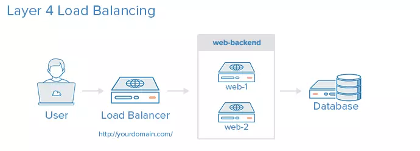
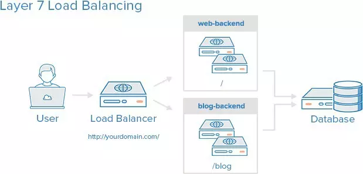

# TÌM HIỂU VỀ HAPROXY

# 1. HAProxy là gì
HAProxy, viết tắt của High Availability Proxy, là một công cụ mã nguồn mở được sử dụng để triển khai giải pháp cân bằng tải cho các giao thức TCP và HTTP
Với HAProxy người dùng có thể tối ưu hóa hiệu suất của các trang web và ứng dụng bằng cách phân phối công việc trên nhiều máy chủ, giúp giảm thiểu thời gian phản hồi. Cân bằng tải có thể được áp dụng để phân chia khối lượng công việc đối với máy chủ, mạng, ổ cứng hoặc CPU.

# 2. Mục tiêu sử dụng HAProxy
High Availability Proxy, hay HAProxy được áp dụng cho các mục đích sau 
- Tăng cường hiệu suất và độ tin cậy của các trang web và ứng dụng 
- Phân tán lưu lượng công việc trên nhiều máy chủ để đảm bảo sự ổn định và hiệu quả 
- Hỗ trợ giảm thời gian phản hồi, giúp cải thiện trải nghiệm người dùng

# 3. Tính năng của HAProxy

- Hỗ trợ cân bằng tải cả lớp 4 và lớp 7(TCP và HTTP)
- Hỗ trợ giao thứuc HTTP, HTTP/2, FastCGI
- Hỗ trợ kết thúc SSL/TLS
- Quản lý chứng chỉ SSL động
- Hỗ trợ giao diện dòng lệnh CLI
- Cung cấp tính năng rewrite URL
Ngoài ra còn nhiều tính năng khác 

# 4. Các thuật toán cân bằng tải 
Các thuật toán cân bằng tải (load balancing algorithms) như Round-robin, Leastconn và Source đều được sử dụng để phân phối tải làm việc giữa các máy chủ hoặc nguồn tài nguyên trong một hệ thống phân tán 

**1. Round-robin**
Round-robin phân phối tải theo cách lần lượt gán yêu cầu truy cập tới cac máy chủ theo chu kỳ vòng tròn 

- **Ưu điểm** : Đơn giản, dễ triển khai, không cần theo dõi trạng thái cảu các máy chủ, cân bằng tải tương đối tốt khi có số lượng lớn máy chủ hoặc yêu cầu
- **Hạn chế**: Không hiệu quả khi có sự chênh lệch về hiệu suất giữa các máy chủ, không xem xét trạng thái thực sự của các máy chủ 

**2. Leastconn**

Leastconn sẽ chọn máy chủ có số kết nối ít nhất hiện tại để gửi yêu cầu mới 

- **Ưu điểm**: Phân chia tải dựa trên tình trạng thực tế của máy chủ, giúp giảm bớt tải cho các máy chủ đang hoạt động nhiều 
- **Hạn chế** : Cần theo dõi trạng thái của các máy chủ, đòi hỏi chi phí tính toán để tìm ra máy chủ có số kết nối ít nhất 

**3. Source**

Thuật toán này dựa trên địa chỉ IP nguồn của yêu cầu để quyết định máy chủ nào sẽ được gán 
- **Ưu điểm** : Đảm bảo cùng một nguồn gửi yêu cầu sẽ luôn được chuyển đến cùng một máy chủ, hữu ích cho các ứng dụng đòi hỏi trạng thái 
- **Hạn chế**: Không cân bằng tải dựa trên tình trạng thực tế của máy chủ, có thể dẫn đến tình trạng quá tải cho các máy chủ nhận nhiều yêu cầu từ các nguồn gửi đến giống nhau 

# 5. Các thuật ngữ cân bằng tải 

**1. Access Control list (ACL)**
ACL ( danh sách kiểm soát truy cập) là một danh sách các quy tắc được áp dụng để kiểm soát quyền truy cập vào tài nguyên mạng. Các quy tắc này định nghĩa những người dùng, máy chủ hoặc dịch vụ có quyền truy cập vào tài nguyên nào, và cách họ được phép hoặc không được phép sử dụng tài nguyên đó 

Ví dụ: Một ACL có thể được cấu hình trên một bộ định tuyến (router) để kiểm soát quyền truy cập vào mạng, cho phép hoặc từ chối các gói tin dựa vào trên các tiêu chí như địa chỉ IP nguồn, địa chỉ IP đích, port, giao thức và nhiều thuộc tính khác

**2. Backend**

Backend thường được sử dụng để chỉ các máy chủ đang được cân bằng tải. Để cấu hình một backend người dùng có thể chỉ định 

- Thuật toán cân bằng tải (round-robin, least-connection,...)
- Danh sách các máy chủ và cổng mà HaProxy có thể gửi yêu cầu tới 

Một Backend có thể bao gồm một hoặc nhiều máy chủ. Việc có nhiều máy chủ Backend tăng khả năng chịu tải và hiệu suất của hệ thống. HAProxy cũng hỗ trợ máy chủ dự phòng, được kích hoạt khi các máy chủ chính offline
*Ví dụ cấu hình*

```
backend web-backend

    balance leastconn

    mode http

    server backend-1 web-backend-1.example.com check

    server backend-2 web-backend-2.example.com check

    server backend-3 backup-backend.example.com check backup

    

backend forum

    balance leastconn

    server forum-1 forum-1.example.com check

    server forum-2 forum-2.example.com check

    server forum-3 backup-forum.example.com check backup
```

Trong đó 
- Dòng balance leastconn chỉ định thuật toán cân bằng tải sẽ ưu tiên chọn các máy chủ có ít kết nối nhất 
- Dòng mode http chỉ ra rằng các proxy chỉ cân bằng cho các kết nối ở tầng 7 của lớp internet

**3. Frontend**

Frontend được dùng để xác định cách mà các yêu cầu được điều hướng tới backend, và nó được định nghĩa trong phần fronted của cấu hình HAProxy. Các thiết lập cho fronted bao gồm:
- Một địa chỉ IP 
- Các ACL được người dùng xác định
- Backend được sử dụng để nhận các yêu cầu 

*Ví dụ cấu hình*

```
frontend web

  bind 0.0.0.0

  default_backend web-backend

frontend forum

  bind 0.0.0.0:8080

  default_backend forum
```

# 6. Phân loại cân bằng tải (Load balancing)

**1. No load balancing (không có cân bằng tải)**

Đây là mô hình cơ bản nhất cho một ứng dụng web, thường được áp dụng trong môi trường có số lượng người dùng ít hoặc không có, sử dụng cho mục đích thử nghiệm hoặc phát triển 
Với mô hình này, người dùng sẽ kết nối trực tiếp tới máy chủ web tại (yourdomain.com) mà không sử dụng cân bằng tải. Nếu máy chủ web gặp sự cố hoặc có trực trặc, người dùng sẽ không thể kết nối được đến ứng dụng web 

**2. Layer 4 Load Balancing (Cân bằng tải tại lớp thứ 4)**

Sử dụng cân bằng tải ở tầng 4 (Layer 4 Load Balancing) giúp phân phối tải đều đến nhiều máy chủ. Trong trường hợp này, các yêu cầu được điều hướng dựa trên địa chỉ IP và port. Ví dụ, một yêu cầu đến `http://ducthien.com/nyc` sẽ được chuyển tiếp tới backend được ánh xạ cho tên miền `ducthien.com` với `port 80`

**3. Layer 7 Load Balancing (Cân bằng tải tại lớp thứ 7)**

Đây là một cơ chế cân bằng tải phức tạp nhất với nhiều tùy chọn tùy biến. Bằng cách sử dụng cân bằng tải tại lớp thứ 7, bạn có thể điều hướng các yêu cầu dựa trên thông tin và nội dung của chúng, cân bằng tải lớp thứ 7 với nhiều backend có thể sử dụng một domain và port duy nhất

*Ví dụ*
Khi có một yêu cầu được gửi tới `ducthien.com/nyc`, yêu cầu đó sẽ được điều hướng đến backend được xác định cho `nyc` 


*Tài liệu tham khảo*

[1] [https://vinahost.vn/haproxy-la-gi/](https://vinahost.vn/haproxy-la-gi/)