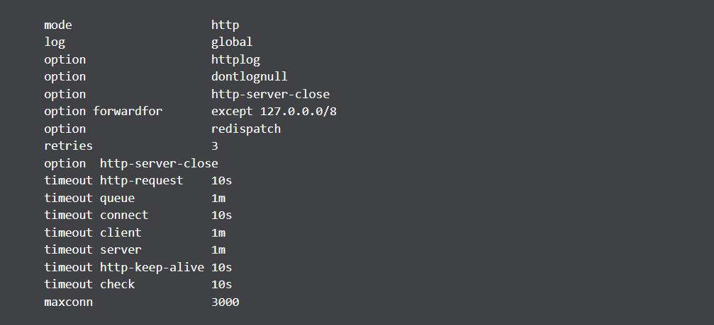
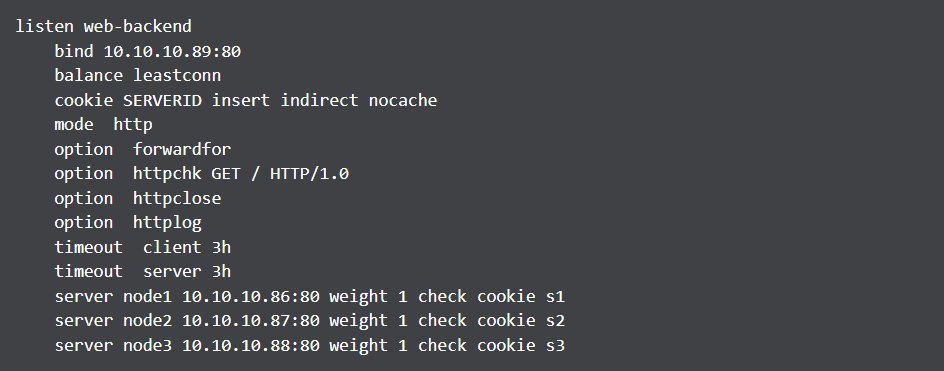

# THÀNH PHẦN CẤU THÀNH FILE CẤU HÌNH CỦA HAPROXY

Cấu hình của HAProxy thường được tạo từ 4 thành phần bao gồm global, defaults, frontend, backend. 4 thành phần sẽ định nghĩa cách HAProxy nhận, xử lý các request, điều phối các request tới các Backend phía sau.

# 1.File cấu hình haproxy.cfg
File cấu hình HAproxy là nơi lưu trữ các cấu hình cho hệ thống HAproxy. Khi chạy chương trình cân bằng tải, máy chủ HAproxy sẽ đọc file cấu hình này và thực hiện điều khiển hệ thống cân bằng tải. Đây cũng là nơi quản trị viên có thể cấu hình cho hệ thống cân bằng tải, bằng cách thay đổi các tham số được HAproxy quy định. Cấu hình của Haprox thường gồm 4 phần chính: `global`, `defaults`, `fontend` và `backend`. Các thành phần này sẽ định nghĩa cách máy chủ HAproxy tiếp nhận, xử lý yêu cầu, chọn máy chủ tiếp nhận yêu cầu và chuyển tiếp.

Đường dẫn file cấu hình HAProxy được lưu tại `/etc/haproxy/haproxy.cfg` với cấu trúc:

# 1. Global
Các thiết lập global nằm ở phần đầu của file cấu hình `haproxy.cfg`, được định danh bằng từ khóa `global` và chỉ được định nghĩa riêng một mình, quy định các thiết lập bảo mật, điều chỉnh hiệu năng… cho toàn hệ thống HAproxy. 

Ý nghĩa các cấu hình

- **log**: Bảo đảm các cảnh báo phát sinh tại HAProxy trong quá trình khởi động, vận hành sẽ được gửi tới syslog
- **maxconn**: Chỉ định giới hạn số kết nối mà HAProxy có thể thiết lập. Sử dụng với mục đích bảo vệ load balancer khởi vấn đề tràn ram sử dụng.
- **user / group** : Chỉ định quyền sử dụng để khởi tạo tiến trình HAProxy. Linux yêu cầu xử lý bằng quyền root cho nhưng port nhỏ hơn 1024. Nếu không định nghĩa user và group, HAProxy sẽ tự động sử dụng quyền root khi thực thi tiến trình.
- **stats socket** : Định nghĩa runtime api, có thể sử dụng để disable server hoặc health checks, thấy đổi load balancing weights của server. Đọc thêm

# 2. Default

Defaults chứa các cấu hình được thiết lập áp dụng chung cho cả phần frontend và backend trong file cấu hình. Các thiết lập defaults có thể được thiết lập nhiều lần trong file cấu hình và chúng được ghi đè lên nhau (các mục defaults sau sẽ đè lên các mục defaults trước nó), ngược lại các thiết lập trong frontend và backend sẽ đè lên defaults.
*Ví dụ*: Các bạn có thế thiết lập mode `http` tại mục `defaults`, khi đó toàn bộ các mục `frontend` `backend` `listen` sẽ đều dùng mode `http` làm mặc định.

- **timeout connect** : chỉ định thời gian HAProxy đợi thiết lập kết nối TCP tới backend server. Hậu tố `s` tại `10s` thể hiện khoảng thời gian 10 giây, nếu bạn không có hậu tố s, khoảng thời gian sẽ tính bằng milisecond. xem thêm.
- **timeout server** : chỉ định thời gian chờ kết nối tới backend server.

*Lưu ý*

- Khi thiết lập `mode tcp` thời gian `timeout server` phải bằng `timeout client`
- **log global**: Chỉ định `frontend` sẽ sử dụng `log settings` mặc định (trong mục `global`).
- **mode**: Thiết lập mode định nghĩa HAProxy sẽ sử dụng TCP proxy hay HTTP proxy. Cấu hình sẽ áp dụng với toàn frontend và backend khi bạn chỉ mong muốn sử dụng 1 mode mặc định trên toàn backend (Có thể thiết lập lại giá trị tại backend)
- **maxconn**: Thiết lập chỉ định số kết nối tối đa, mặc định bằng `2000`.
- **option httplog**: Bổ sung format log dành riêng cho các request http bao gồm (connection timers, session status, connections numbers, header v.v). Nếu sử dụng cấu hình mặc định các tham số sẽ chỉ bao gồm địa chỉ nguồn và địa chỉ đích.
-**option http-server-close**: Khi sử dụng kết nối dạng `keep-alive`, tùy chọn cho phép sử dụng lại các đường ống kết nối tới máy chủ (có thể kết nối đã đóng) nhưng đường ống kết nối vẫn còn tồn tại, thiết lập sẽ giảm độ trễ khi mở lại kết nối từ phía client tới server.
- **option dontlognull**: Bỏ qua các log format không chứa dữ liệu
- **option forwardfor**: Sử dụng khi mong muốn backend server nhận được IP thực của người dùng kết nối tới. Mặc định backend server sẽ chỉ nhận được IP của HAProxy khi nhận được request. Header của request sẽ bổ sung thêm trường X-Forwarded-For khi sử dụng tùy chọn.
- **option redispatch**: Trong mode HTTP, khi sử dụng kỹ thuật stick session, client sẽ luôn kết nối tới 1 backend server duy nhất, tuy nhiên khi backend server xảy ra sự cố, có thể client không thể kết nối tới backend server khác (Trong bài toán load balancer). Sử dụng kỹ thuật cho phép HAProxy phá vỡ kết nối giữa client với backend server đã xảy ra sự cố. Đồng thời, client có thể khôi phục lại kết nối tới backend server ban đầu khi dịch vụ tại backend server đó trở lại hoạt động bình thường.
- **retries**: Số lần thử kết nối lại backend server trước khi HAProxy đánh giá backend server xảy ra sự cố.
- **timeout check**: Kiểm tra thời gian đóng kết nối (chỉ khi kết nối đã được thiết lập)
- **timeout http-request**: Thời gian chờ trước khi đóng kết nối HTTP
- **timeout queue**: Khi số lượng kết nối giữa client và haproxy đạt tối đã (`maxconn`), các kết nối tiếp sẽ đưa vào hàng đợi. Tùy chọn sẽ làm sạch hàng chờ kết nối.

# 3. Fronted

Các thiết lập trong phần frontend định nghĩa địa chỉ IP và port mà client có thể kết nối tới, có thể có nhiều mục frontend tùy ý, chỉ cần đặt label của chúng khác nhau : frontend<tên>

- **bind**: IP và Port HAProxy sẽ lắng nghe để mở kết nối. IP có thể bind tất cả địa chỉ sẵn có hoặc chỉ 1 địa chỉ duy nhất, port có thể là một port hoặc nhiều port (1 khoảng hoặc 1 list).
- **http-request redirect**: Phản hỏi tới client với đường dẫn khác. Ứng dụng khi client sử dụng http và phản hồi từ HAProxy là https, điều hướng người dùng sang giao thức https
- **use_backend**: Chỉ định backend sẽ xử lý request nếu thỏa mãn điều kiện (Khi sử dụng ACL)
- **default_backend**: Backend mặc định sẽ xử lý request (Nếu request không thỏa mẵn bất kỳ điều hướng nào)

# 4.Backend
Các thiết lập trong phần backend định nghĩa tập server sẽ được cân bằng tải khi có các kết nối tới (ví dụ tập các server chạy dịch vụ web giống nhau)

- **balance**: Kiểm soát cách HAProxy nhận, điều phối request tới các backend server. Đây chính là các thuật toán cân bằng tải.
- **cookie**: Sử dụng cookie-based. Cấu hình sẽ khiến HAProxy gửi cookie tên SERVERUSER tới client, liên kết backend server với client. Từ đó các request xuất phát từ client sẽ tiến tục nói chuyện với server chỉ định. Cần bổ sung thêm tùy chọn cookie trên server line.
- **option httpchk**: Với tùy chọn, HAProxy sẽ sử dụng health check dạng HTTP (Layer 7) thay vì kiếm trả kết nối dạng TCP (Layer 4). Và khi server không phản hồi request http, HAProxy sẽ thực hiện TCP check tới IP Port. Health check sẽ tự động loại bỏ các backend server lỗi, khi không có backend server sẵn sàng xử lý request, HAProxy sẽ trả lại phản hồi 500.
- **server error**: Mặc định HTTP check sẽ kiểm tra root path (có thể thay đổi). Và nếu phản hồi health check là 2xx, 3xx sẽ được coi là thành công.
- **default server**: Bổ sung tùy chọn cho bất kỳ backend server thuộc backend section (VD: health checks, max connections, v.v). Điều này kiến cấu hình dễ dàng hơn khi đọc.
- **server**: Tùy chọn quan trọng nhất trong backend section. Tùy chọn đi kèm bao gồm tên, id, port. Có thể dùng domain thay cho IP.

# 5. Listen
Là sự kết hợp của cả 2 mục frontend và backend, có thể sử dụng listen thay thế các các mục frontend và backend. Một số thiết lập được định nghĩa trong phần listen như:

- **inter**: khoảng thời gian giữa hai lần check liên tiếp. ** rise*: Số lần kiểm tra backend server thành công trước khi HAProxy đánh giá nó đang hoạt động bình thường và bắt đầu điều hướng request tới.
- **rise**: Số lần kiểm tra backend server thành công trước khi HAProxy đánh giá nó đang hoạt động bình thường và bắt đầu điều hướng request tới
- **fall**: Số lần kiểm tra backend server bị tính là thất bại trước khi HAProxy đánh giá nó xảy ra sự cố và không điều hướng request tới.

*Tài liệu tham khảo*

[1] [https://blog.cloud365.vn/linux/cau-truc-file-cau-hinh-haproxy/#:~:text=C%E1%BA%A5u%20h%C3%ACnh%20c%E1%BB%A7a%20HAProxy%20th%C6%B0%E1%BB%9Dng,t%E1%BB%9Bi%20c%C3%A1c%20Backend%20ph%C3%ADa%20sau.](https://blog.cloud365.vn/linux/cau-truc-file-cau-hinh-haproxy/#:~:text=C%E1%BA%A5u%20h%C3%ACnh%20c%E1%BB%A7a%20HAProxy%20th%C6%B0%E1%BB%9Dng,t%E1%BB%9Bi%20c%C3%A1c%20Backend%20ph%C3%ADa%20sau.)  
[2] [https://viblo.asia/p/tim-hieu-ve-load-balancing-server-voi-haproxy-ByEZkoDxZQ0](https://viblo.asia/p/tim-hieu-ve-load-balancing-server-voi-haproxy-ByEZkoDxZQ0)