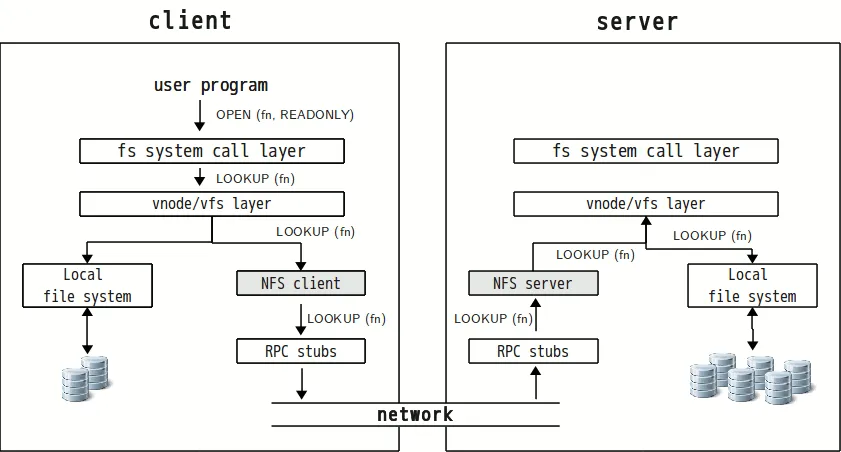
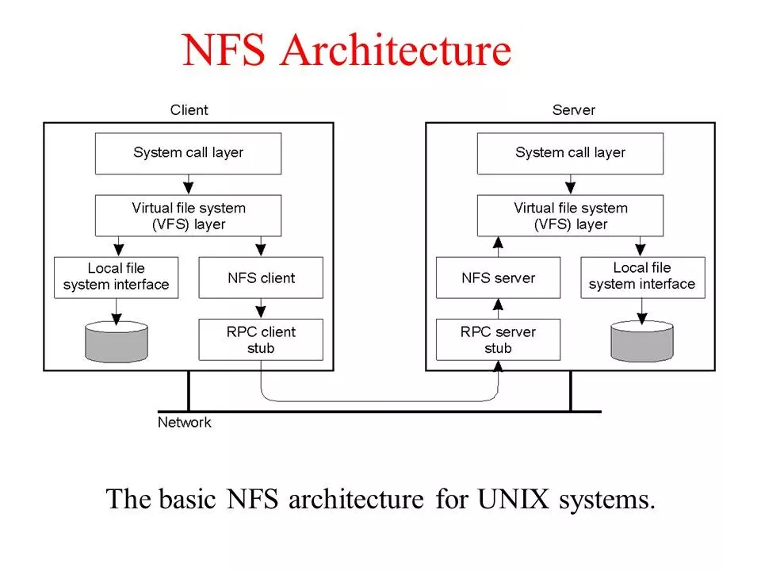

# TỔNG QUAN VỀ NETWORK FILE SYSTEM (NFS)

# 1. NFS là gì 
NFS (Network File System) là hệ thống giao thức chia sẻ dữ liệu. NFS cung cấp khả năng truy cập tới hệ thống file trên một máy khách được chia sẻ thông qua một mạng máy tính tương tự như việc truy cập trực tiếp trên ổ cứng. Được phát triển bởi `SunMicrosystems` vào năm 1984, cho phép người dùng xem, tùy chọn lưu trữ và cập nhật trên máy tính từ xa.     
Sử dụng TCP và UDP để truy cập và phân phối dữ liệu tùy thuộc vào phiên bản được sử dụng.
Cơ chế hệ thống tệp cho phép lưu trữ và truy xuất dữ liệu từ nhiều đĩa và thư mục.

# 2. Các phiên bản
- NFSv2: Tháng 3 năm 1989  
    - Có thể sử dụng cả TCP và UDP qua mạng IP ( cổng 2049 )
    - Ban đầu chỉ hoạt động trên UDP   
    - NFSv2 chỉ cung cấp khả năng đọc 2GB đầu tiên của file vì bị giới hạn 32 bit.
- NFSv3: Tháng 6 năm 1995  
    - An toàn và mạnh mẽ hơn khi xử lý lỗi so với v2. Sử dụng cả TCP và UDP qua cổng 2049
    - NFSv3 hỗ trợ kích thước và độ lệch file 64bit nên có thể dễ dàng xử lý các tệp lớn hơn 2GB.
    - NFSv3 hỗ trợ ghi không đồng bộ trên máy chủ, từ đó có thể cải thiện hiệu suất ghi.
    - Vẫn là phiên bản được sử dụng rộng rãi nhất
- NFSv4: Tháng 4 năm 2003  
    - Hoạt động thông qua tường lửa và trên internet
    - Hỗ trợ ACL ( Danh sách các câu lệnh chỉ ra loại packet nào được chấp nhận, hủy bỏ dựa vào địa chỉ nguồn, đích hoặc số port)
    - Sử dụng giao thức TCP là bắt buộc
- NFSv4.1: Tháng 1 năm 2010  
    - Khả năng cung cấp quyền truy cập song song có thể mở rộng vào các tệp được phân phối giữa nhiều máy chủ
- NFSv4.2: Tháng 11 năm 2016  
    - Sao chép và sao chép phía máy chủ
    - Một lợi thế lớn của NFSv4 so với các phiên bản trước đó là chỉ có một cổng IP được sử dụng để chạy dịch vụ, giúp đơn giản hóa việc sử dụng giao thức trên tường lửa.

# 3. Ưu, nhược điểm
- Ưu điểm :

    - NFS là 1 giải pháp chi phí thấp để chia sẻ tệp mạng.
    - Dễ cài đặt vì nó sử dụng cơ sở hạ tầng IP hiện có
    - Cho phép quản lý trung tâm, giảm nhu cầu thêm phần mềm cũ và dụng lượng đĩa trên các hệ thống người dùng cá nhân
- Nhược điểm :

    - NFS vốn không an toàn, chỉ nên sử dụng trên 1 mạng đáng tin cậy sau Firewall
    - NFS bị chậm trong khi lưu lượng mạng lớn
    - Client và server tin tưởng lần nhau vô điều kiện
    - Tên máy chủ có thể là giả mạo (tự xưng là máy khác)

# 4. Cách thức hoạt động 
NFS là một giao thức client – server .

Sever NFS là máy chủ (host) đáp ứng các yêu cầu sau:

- Đã cài đặt phần mềm server NFS.
- Có ít nhất một kết nối mạng để chia sẻ tài nguyên NFS.
- Được cấu hình để chấp nhận và phản hồi các yêu cầu NFS qua kết nối mạng.

Các yêu cầu cần đáp ứng phía client NFS:
- Đã cài đặt phần mềm client NFS.
- Có kết nối mạng với sever NFS.
- Được phép truy cập tài nguyên trên Sever NFS.
- Được cấu hình để gửi và nhận các yêu cầu NFS qua kết nối mạng.

Quá trình thiết lập dịch vụ NFS bao gồm ba bước, áp dụng cho cả server và client NFS:

1. Xác minh rằng rpc.mountd hoặc chỉ mountd đã được cài đặt và hoạt động. Đây là daemon NFS – chương trình lắng nghe mạng cho các yêu cầu NFS.
2. Tạo hoặc chọn một thư mục chia sẻ trên máy chủ. Đây là mount point NFS . Sử dụng mount point, địa chỉ hoặc server host name của máy chủ xác định duy nhất tài nguyên NFS.
3. Định cấu hình quyền trên máy chủ NFS để cho phép người dùng được ủy quyền đọc, ghi và thực thi các file trong file system.

Việc thiết lập máy khách NFS để truy cập máy chủ NFS có thể được thực hiện theo cách thủ công, sử dụng lệnh mount hoặc sử dụng configuration file — /etc/exports . Mỗi dòng trong file configuration metadata NFS chứa mount point, địa chỉ IP hoặc tên miền máy chủ lưu trữ và bất kỳ configuration metadata nào cần thiết để truy cập hệ thống tệp.

# 5. Kiến trúc NFS

**Phía client**:

- Client có xu hướng truy cập file system bằng các cuộc gọi từ hệ thống (system call).
- Giao diện trên hệ thống Unix được thay thế bởi giao diện dành cho hệ thống tệp ảo (VFS).
- Hoạt động trên giao diện VFS sẽ được chuyển trực tiếp đến hệ thống tệp cục bộ (Local file) hoặc một thành phần riêng biệt có tên gọi là NFS Client.
- NFS client đảm nhiệm công việc xử lý quyền truy cập vào các tệp lưu trữ tại máy chủ từ xa.
- Tất cả các giao tiếp giữa máy chủ và máy khách được thực hiện thông qua RPC, hay còn được gọi là cuộc gọi thủ tục.

**Phía Server**:

- NFS server có thể xử lý các yêu cầu từ phía client.
- Từ RPC stub unmarshals request, Server sẽ tiến hành chuyển chúng thành các hoạt động tệp VFS.
- VFS chịu trách nhiệm trong việc triển khai một hệ thống tệp cục bộ.

