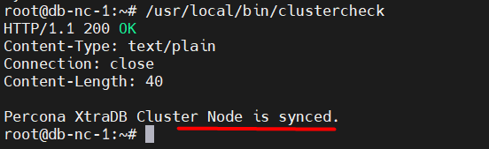
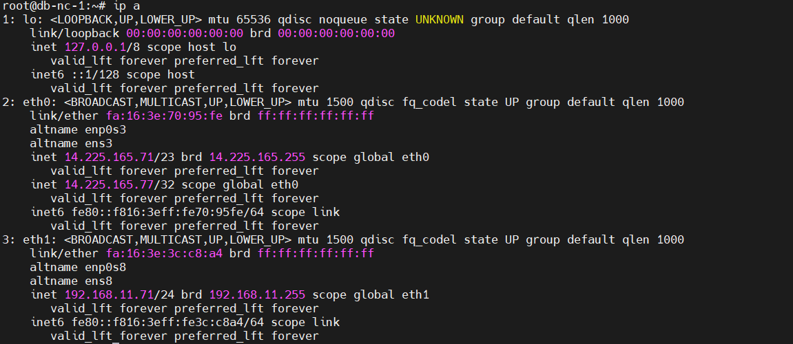
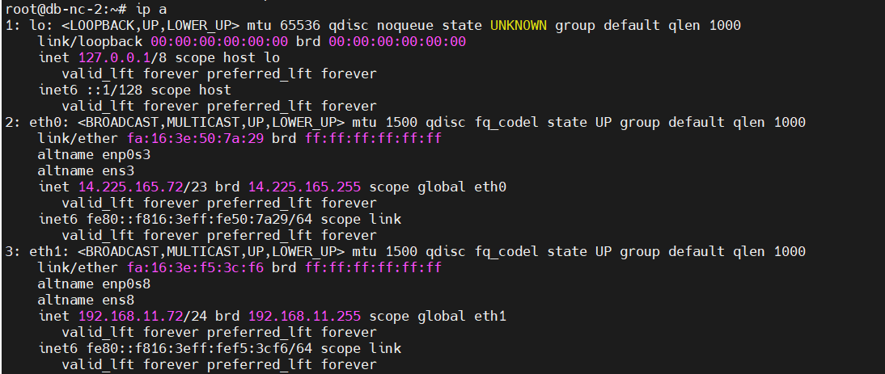
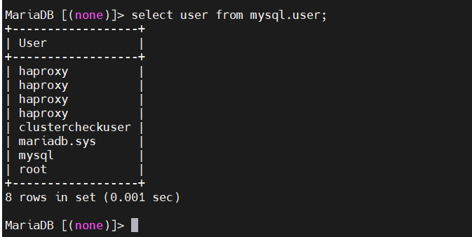

# Cài đặt HA + Keepalive

# 1. Thiết lập ban đầu 

## Cài đặt Healthcheck cho MariaDB Galera Cluster
Có nhiều cách để thực hiện việc healthcheck cho cụm MariaDB Galera, ở đây tôi sẽ sử dụng một dịch vụ là xinetd. Dịch vụ này có chức năng điều khiển các kết nối mạng đến hệ thống. Từ đó sẽ thực hiện định nghĩa ra một service trên hệ thống có tên là mysqlchk được listen qua port tcp 9200, service này sẽ có nhiệm vụ giao tiếp với HAproxy để thực hiện healthcheck cụm MariaDB cluster
```
THỰC HIỆN TRÊN TẤT CẢ CÁC NODE
```
**Bước 1**: Thực hiện cài đặt xinetd

```
apt -y install xinetd
```

**Bước 2**: Tạo script check cho dịch vụ mysqlchk

`Script` này sẽ thực hiện check trạng thái các node trong cụm MariaDB Galera. Tạo file `vi /usr/local/bin/clustercheck` có nội dung:

```
#!/bin/bash
#
# Script to make a proxy (ie HAProxy) capable of monitoring Percona XtraDB Cluster nodes properly
#
# Author: Olaf van Zandwijk <olaf.vanzandwijk@nedap.com>
# Author: Raghavendra Prabhu <raghavendra.prabhu@percona.com>
#
# Documentation and download: https://github.com/olafz/percona-clustercheck
#
# Based on the original script from Unai Rodriguez
#

if [[ $1 == '-h' || $1 == '--help' ]];then
    echo "Usage: $0 <user> <pass> <available_when_donor=0|1> <log_file> <available_when_readonly=0|1> <defaults_extra_file>"
    exit
fi

# if the disabled file is present, return 503. This allows
# admins to manually remove a node from a cluster easily.
if [ -e "/var/tmp/clustercheck.disabled" ]; then
    # Shell return-code is 1
    echo -en "HTTP/1.1 503 Service Unavailable\r\n"
    echo -en "Content-Type: text/plain\r\n"
    echo -en "Connection: close\r\n"
    echo -en "Content-Length: 51\r\n"
    echo -en "\r\n"
    echo -en "Percona XtraDB Cluster Node is manually disabled.\r\n"
    sleep 0.1
    exit 1
fi

MYSQL_USERNAME="${1-clustercheckuser}"
MYSQL_PASSWORD="${2-clustercheckpassword!}"
AVAILABLE_WHEN_DONOR=${3:-0}
ERR_FILE="${4:-/dev/null}"
AVAILABLE_WHEN_READONLY=${5:-1}
DEFAULTS_EXTRA_FILE=${6:-/etc/my.cnf}

#Timeout exists for instances where mysqld may be hung
TIMEOUT=10

EXTRA_ARGS=""
if [[ -n "$MYSQL_USERNAME" ]]; then
    EXTRA_ARGS="$EXTRA_ARGS --user=${MYSQL_USERNAME}"
fi
if [[ -n "$MYSQL_PASSWORD" ]]; then
    EXTRA_ARGS="$EXTRA_ARGS --password=${MYSQL_PASSWORD}"
fi
if [[ -r $DEFAULTS_EXTRA_FILE ]];then
    MYSQL_CMDLINE="mysql --defaults-extra-file=$DEFAULTS_EXTRA_FILE -nNE --connect-timeout=$TIMEOUT \
                    ${EXTRA_ARGS}"
else
    MYSQL_CMDLINE="mysql -nNE --connect-timeout=$TIMEOUT ${EXTRA_ARGS}"
fi
#
# Perform the query to check the wsrep_local_state
#
WSREP_STATUS=$($MYSQL_CMDLINE -e "SHOW STATUS LIKE 'wsrep_local_state';" \
    2>${ERR_FILE} | tail -1 2>>${ERR_FILE})

if [[ "${WSREP_STATUS}" == "4" ]] || [[ "${WSREP_STATUS}" == "2" && ${AVAILABLE_WHEN_DONOR} == 1 ]]
then
    # Check only when set to 0 to avoid latency in response.
    if [[ $AVAILABLE_WHEN_READONLY -eq 0 ]];then
        READ_ONLY=$($MYSQL_CMDLINE -e "SHOW GLOBAL VARIABLES LIKE 'read_only';" \
                    2>${ERR_FILE} | tail -1 2>>${ERR_FILE})

        if [[ "${READ_ONLY}" == "ON" ]];then
            # Percona XtraDB Cluster node local state is 'Synced', but it is in
            # read-only mode. The variable AVAILABLE_WHEN_READONLY is set to 0.
            # => return HTTP 503
            # Shell return-code is 1
            echo -en "HTTP/1.1 503 Service Unavailable\r\n"
            echo -en "Content-Type: text/plain\r\n"
            echo -en "Connection: close\r\n"
            echo -en "Content-Length: 43\r\n"
            echo -en "\r\n"
            echo -en "Percona XtraDB Cluster Node is read-only.\r\n"
            sleep 0.1
            exit 1
        fi
    fi
    # Percona XtraDB Cluster node local state is 'Synced' => return HTTP 200
    # Shell return-code is 0
    echo -en "HTTP/1.1 200 OK\r\n"
    echo -en "Content-Type: text/plain\r\n"
    echo -en "Connection: close\r\n"
    echo -en "Content-Length: 40\r\n"
    echo -en "\r\n"
    echo -en "Percona XtraDB Cluster Node is synced.\r\n"
    sleep 0.1
    exit 0
else
    # Percona XtraDB Cluster node local state is not 'Synced' => return HTTP 503
    # Shell return-code is 1
    echo -en "HTTP/1.1 503 Service Unavailable\r\n"
    echo -en "Content-Type: text/plain\r\n"
    echo -en "Connection: close\r\n"
    echo -en "Content-Length: 44\r\n"
    echo -en "\r\n"
    echo -en "Percona XtraDB Cluster Node is not synced.\r\n"
    sleep 0.1
    exit 1
fi
```

**Bước 3**: Phân quyền cho script vừa tạo

```
chmod 0777 /usr/local/bin/clustercheck
```
**Bước 4**: Cấu hình dịch vụ xinetd
```

cat << EOF > /etc/xinetd.d/mysqlchk
service mysqlchk
{
      disable = no
      flags = REUSE
      socket_type = stream
      port = 9200
      wait = no
      user = nobody
      server = /usr/local/bin/clustercheck
      log_on_failure += USERID
      only_from = 0.0.0.0/0
      bind = 
      per_source = UNLIMITED
}
EOF
```
**Bước 5**: Khai báo dịch vụ mysqlchk trên hệ thống

```
cat << EOF >> /etc/services
mysqlchk     9200/tcp # MySQL check
EOF
```

**Bước 6**: Khởi động lại dịch vụ xinetd

```
systemctl restart xinetd
```
**Bước 7**: Gán quyền cho user trong Database để có thể thực hiện check thông qua service
```
mysql -uroot -p -e "GRANT PROCESS ON *.* TO 'clustercheckuser'@'localhost' IDENTIFIED BY 'clustercheckpassword\!';"

mysql -uroot -p -e "FLUSH PRIVILEGES;"
```
Kiểm tra đã thực hiện healthcheck thành công hay chưa trên node bất kỳ:

```
/usr/local/bin/clustercheck
```




# 2. Cài đặt Keepalived

```
THỰC HIỆN TRÊN TẤT CẢ CÁC NODE
```
**Cài đặt keepalived** 
```
sudo apt install -y keepalived 
```
**Bước 1** :Cấu hình cho phép kernel có thể binding tới IP VIP   

Dịch vụ Keepalived sẽ giúp chúng ta tạo *1 Virtual IP* để dùng cho máy chủ, nói một cách nôm na là máy chủ sẽ sử dụng IP do chúng ta tự định nghĩa bằng Keepalived chứ không phải dùng IP trên interface của máy chủ (được cấp bởi 1 DHCP nào đó hay do chúng ta tự gán.). Để làm việc này, chúng ta cần vào file `/etc/sysctl.conf` và thêm dòng sau vào file sysctl.conf :

```
net.ipv4.ip_nonlocal_bind=1
```
Sau đó các bạn lưu lại và thoát ra. Tiếp tục thực thi câu lệnh được gán vào bằng cách restart server hoặc chạy câu lệnh sau :

```
sudo sysctl -p
```

**Bước 2** : Config Keepalived   
File config của Keepalived sẽ được lưu ở `/etc/keepalived/keepalived.conf` .Lưu ý nếu file chưa có sẵn thì tạo file mới nhé.

```
vi /etc/keepalived/keepalived.conf
```

Điền nội dung sau vào node 1

```
global_defs {
  router_id db-nc-1
}
vrrp_script chk_haproxy {
  script "killall -0 haproxy"
  interval 2
  weight 2
}
vrrp_instance VI_1 {
  virtual_router_id 51
  advert_int 1
  priority 100
  state MASTER
  interface eth1
  virtual_ipaddress {
    192.168.11.70 dev eth1
  }
 authentication {
     auth_type PASS
     auth_pass 123
     }
  track_script {
    chk_haproxy
  }
}
```

Tương tự trên các node còn lại 
```
global_defs {
  router_id db-nc-2
}
vrrp_script chk_haproxy {
  script "killall -0 haproxy"
  interval 2
  weight 2
}
vrrp_instance VI_1 {
  virtual_router_id 51
  advert_int 1
  priority 98
  state BACKUP
  interface eth1
  virtual_ipaddress {
    192.168.11.70 dev eth1
  }
 authentication {
     auth_type PASS
     auth_pass 123
     }
  track_script {
    chk_haproxy
  }
}
```

Một số thông tin cần lưu ý 

- **router_id db-nc-1**: khai báo route_id của keepalived
- **interface eth0**: thông tin tên interface của server
- **14.225.165.77 dev eth0**: Khai báo Virtual IP cho interface tương ứng
- **auth_pass 123**: Password này phải khai báo giống nhau giữa các server keepalived
- **state MASTER**: Có quyền giữ V IP
- **state BACKUP**: Có quyền giữ V IP thấp hơn
- **priority 100**: mức độ ưu tiên 


Sau khi khai báo file keepalived.conf ở tất cả các node thì khởi động lại dịch vụ
```
sudo service keepalived start
```

Virtual IP chỉ được gán vào interface eth0 của máy db-nc-1 chứ không được gán vào máy db-nc-2 dù ta đã khai báo trên tất cả node. Vì hiện tại khởi tạo ban đầu máy db-nc-1 giữ vai trò MASTER





# 3. Cài đặt HAProxy

**Bước 1**: Cài đặt HAProxy

```
sudo apt install haproxy -y
```

Cấu hình file config cho haproxy:

```
cp /etc/haproxy/haproxy.cfg /etc/haproxy/haproxy.cfg.bak
echo 'global
    log         127.0.0.1 local2
    chroot      /var/lib/haproxy
    pidfile     /var/run/haproxy.pid
    maxconn     4000
    user        haproxy
    group       haproxy
    daemon
    stats socket /var/lib/haproxy/stats
defaults
    mode                    http
    log                     global
    option                  httplog
    option                  dontlognull
    option http-server-close
    option forwardfor       except 127.0.0.0/8
    option                  redispatch
    retries                 3
    timeout http-request    10s
    timeout queue           1m
    timeout connect         10s
    timeout client          1m
    timeout server          1m
    timeout http-keep-alive 10s
    timeout check           10s
    maxconn                 3000

listen stats
    bind :8080
    mode http
    stats enable
    stats uri /stats
    stats realm HAProxy\ Statistics

listen galera
    bind 192.168.11.71:3306
    balance source
    mode tcp
    option tcpka
    option tcplog
    option clitcpka
    option srvtcpka
    timeout client 28801s
    timeout server 28801s
    option mysql-check user haproxy
    server db-nc-1 192.168.11.71:3306 check inter 5s fastinter 2s rise 3 fall 3
    server db-nc-2 192.168.11.72:3306 check inter 5s fastinter 2s rise 3 fall 3 backup
    server db-nc-3 192.168.11.73:3306 check inter 5s fastinter 2s rise 3 fall 3 backup' > /etc/haproxy/haproxy.cfg
```

Cấu hình Log cho HAProxy

```
sed -i "s/#\$ModLoad imudp/\$ModLoad imudp/g" /etc/rsyslog.conf
sed -i "s/#\$UDPServerRun 514/\$UDPServerRun 514/g" /etc/rsyslog.conf
echo '$UDPServerAddress 127.0.0.1' >> /etc/rsyslog.conf

echo 'local2.*    /var/log/haproxy.log' > /etc/rsyslog.d/haproxy.conf

systemctl restart rsyslog

```

Tại Node db-nc-1 tạo user haproxy, phục vụ plugin health check của HAProxy (option mysql-check user haproxy)

```
mysql -u root -p
CREATE USER 'haproxy'@'db-nc-1';
CREATE USER 'haproxy'@'db-nc-2';
CREATE USER 'haproxy'@'db-nc-3';
CREATE USER 'haproxy'@'%';
```

