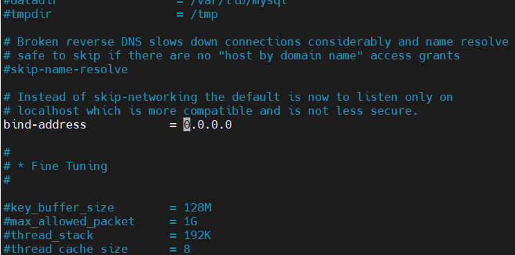

# CẤU HÌNH DATABASES CHO DỊCH VỤ WEB

# 1. Cài đặt dịch vụ web Nextcloud

Tham khảo bài viết : [Cài đặt Nextcloud](https://github.com/ducthien1998/system-intership/blob/main/ThienBD/24.Nextcloud/docs/1.Install_Nextcloud.md)


# 2. Cấu hình MariaDB để cho phép kết nối từ xa

Mặc định, MariaDB chỉ cho phép kết nối từ localhost. Bạn cần thay đổi cấu hình để chấp nhận kết nối từ các địa chỉ IP bên ngoài.

1. Sửa file cấu hình MariaDB:
```
sudo vi /etc/mysql/mariadb.conf.d/50-server.cnf
```

2. Chỉnh sửa dòng `bind-address`:

Tìm dòng `bind-address` và thay đổi từ `127.0.0.1` sang `0.0.0.0` để cho phép kết nối từ tất cả các địa chỉ IP:


*Lưu ý*: Nếu muốn chỉ cho phép kết nối từ một IP nhất định, bạn có thể đặt bind-address thành địa chỉ của Web Server thay vì 0.0.0.0.

3. Lưu và thoát file, sau đó khởi động lại MariaDB

```
sudo systemctl restart mariadb
```

*Tài liệu tham khảo* 

[1] [https://webdock.io/en/docs/how-guides/database-guides/how-enable-remote-access-your-mariadbmysql-database?srsltid=AfmBOoolTDzLULbCmpgZSx6qzxMaIuBC34q17sPqB5fpRF10Tg0gJe5V](https://webdock.io/en/docs/how-guides/database-guides/how-enable-remote-access-your-mariadbmysql-database?srsltid=AfmBOoolTDzLULbCmpgZSx6qzxMaIuBC34q17sPqB5fpRF10Tg0gJe5V)


