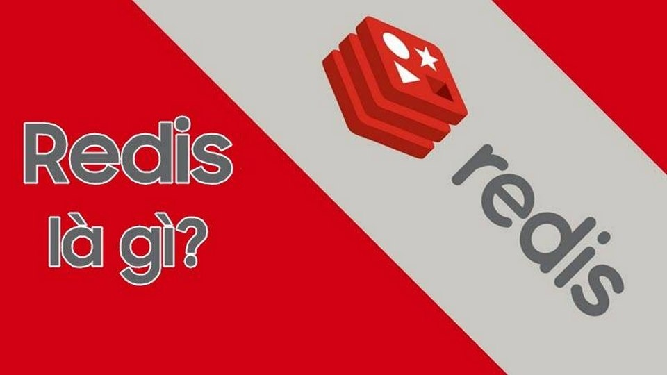
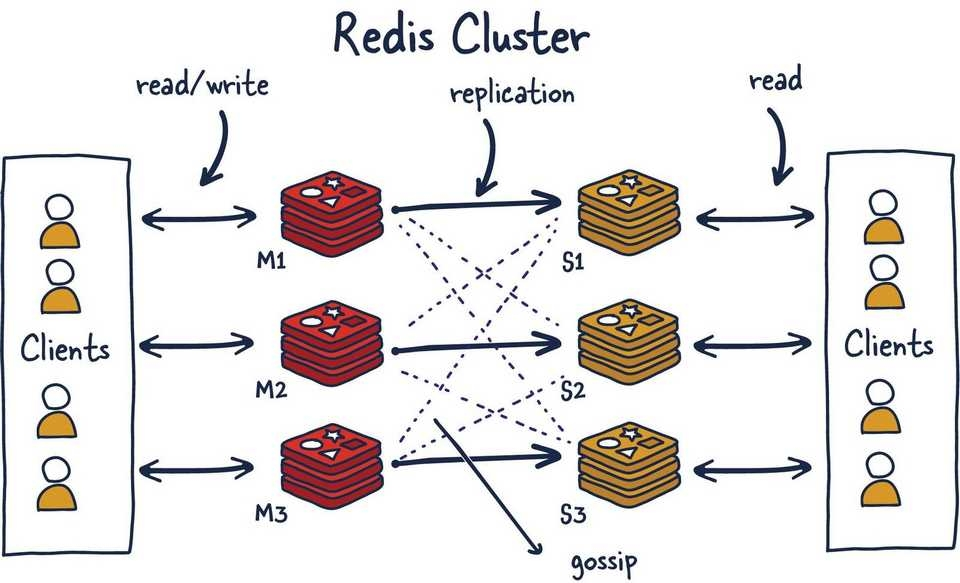

# TÌM HIỂU TỔNG QUAN VỀ REDIS

# 1. Redis là gì 
Redis (Remote Dictionary Server) là một hệ thống cơ sở dữ liệu mã nguồn mở có hiệu suất cao và được sử dụng phổ biến cho việc lưu trữ dữ liệu trong bộ nhớ hoặc lưu trữ trên đĩa. Những chế độ hoạt động chính của Redis thường là lưu trữ dữ liệu cache và thông tin phi tập trung và xử lý hàng đợi. Nền tảng hỗ trợ nhiều loại dữ liệu như chuỗi, bảng băm, danh sách, tập hợp, tập hợp sắp xếp và hyperloglog. 

Redis cũng có khả năng xử lý hàng trăm nghìn yêu cầu đọc và ghi mỗi giây. Điều này đã làm cho nó trở thành một lựa chọn phổ biến trong các ứng dụng có yêu cầu hiệu suất cao như trò chơi trực tuyến, ứng dụng di động và các hệ thống web quy mô lớn.

# 2. Các ứng dụng của Redis

Redis có nhiều tính ứng dụng quan trọng trong lĩnh vực công nghệ thông tin và phát triển phần mềm. Dưới đây là một số ví dụ cụ thể về cách mà Redis được sử dụng trong thực tế:

**1. Lưu trữ Cache**  
Redis thường được sử dụng làm hệ thống lưu trữ cache. Dữ liệu được lưu trong Redis có thể được truy cập nhanh chóng, giúp tăng tốc độ phản hồi của ứng dụng.

Nền tảng cung cấp cơ chế cho các hàng đợi tin nhắn, đặc biệt là trong mô hình publish-subscribe. Nơi mà nhiều ứng dụng có thể giao tiếp và trao đổi dữ liệu theo thời gian thực.

**2. Thiết kế ứng dụng di động**  
Redis có thể được sử dụng trong việc lưu trữ thông tin phi tập trung cho ứng dụng di động. Hệ thống cho phép người dùng dễ dàng đồng bộ và cập nhật dữ liệu trên nhiều thiết bị.

Hệ thống cung cấp cơ chế tốt cho lưu trữ và truy xuất từ các bảng băm phân tán, giúp tạo ra một hệ thống lưu trữ phân tán và có thể mở rộng.

**3. Lưu trữ thông tin phi tập trung**  
Redis cũng thường được sử dụng để lưu trữ thông tin phiên làm việc của người dùng trên các ứng dụng web. Từ đó mà ứng dụng có thêm khả năng mở rộng và duy trì tính nhất quán.

**4. Bộ đếm (Counter)**  
Bộ đếm (Counter) là một trong những ứng dụng quan trọng của Redis với nhiều tính năng hữu ích. Bằng cách sử dụng Counter trong Redis, người dùng có thể thu thập dữ liệu thống kê như số lần truy cập, số lượng đăng ký, số lượt xem và các dạng dữ liệu số khác. Từ đó thực hiện phân tích và tối ưu hóa chiến lược kinh doanh, marketing và sản phẩm.

Counter còn được sử dụng để theo dõi tình trạng của ứng dụng. Ví dụ như số lượng người dùng đang trực tuyến, số lượng thông báo được gửi trong khoảng thời gian nhất định hoặc bất kỳ dạng thông tin số nào mà bạn muốn theo dõi trong thời gian thực.

# 3. Ưu - nhược điểm của Redis

**Ưu điểm**
- **Tốc độ truy cập dữ liệu cực nhanh**: Redis hoạt động dựa trên bộ nhớ trong (in-memory), cho phép truy cập dữ liệu với tốc độ cao hơn nhiều so với các hệ thống lưu trữ dữ liệu truyền thống như MySQL hay PostgreSQL.

- **Khả năng mở rộng linh hoạt**: Redis có thể dễ dàng mở rộng bằng cách thêm các máy chủ mới vào hệ thống, đáp ứng nhu cầu lưu trữ và truy cập dữ liệu ngày càng tăng.

- **Tính đơn giản**: Cấu trúc dữ liệu đơn giản và dễ sử dụng cũng là yếu tố quan trọng khi nhắc về ưu điểm của Redis là gì. Theo đó, đặc trưng này góp phần giúp các lập trình viên dễ dàng tích hợp Redis vào các ứng dụng của mình.

- **Mã nguồn mở**: Như đã đề cập đến ở trên, Redis là một hệ thống mã nguồn mở, miễn phí và dễ dàng tích hợp với các ứng dụng khác.

- **Hỗ trợ nhiều cấu trúc dữ liệu**: Redis hỗ trợ nhiều cấu trúc dữ liệu khác nhau, bao gồm string, hash, list, set, sorted set,... Trên cơ sở đó, chúng có thể đáp ứng nhu cầu lưu trữ đa dạng của các ứng dụng. 

**Nhược điểm** 

- **Lưu trữ dữ liệu tạm thời**: Redis lưu trữ dữ liệu trong bộ nhớ trong, do đó dữ liệu có thể bị mất nếu máy chủ bị lỗi hoặc khởi động lại. Để khắc phục vấn đề này, cần sử dụng các cơ chế sao lưu dữ liệu như RDB (Redis Database) hoặc AOF (Append-only file).

- **Khả năng truy vấn dữ liệu hạn chế**: Redis không hỗ trợ các truy vấn phức tạp như các hệ thống cơ sở dữ liệu truyền thống.

- **Không phù hợp cho dữ liệu lớn**: Redis cũng được cho là không phù hợp cho việc lưu trữ dữ liệu với dung lượng lớn vì có thể ảnh hưởng đến hiệu suất hệ thống.

- **Yêu cầu kiến thức chuyên môn**: Việc triển khai và quản lý Redis hiệu quả đòi hỏi kiến thức chuyên môn về hệ thống và vận hành.

*Tài liệu tham khảo* 

[1] [https://viettelidc.com.vn/tin-tuc/redis-la-gi-tat-tan-tat-uu-nhuoc-diem-va-ung-dung](https://viettelidc.com.vn/tin-tuc/redis-la-gi-tat-tan-tat-uu-nhuoc-diem-va-ung-dung)

[2] [https://fptshop.com.vn/tin-tuc/danh-gia/redis-la-gi-173207](https://fptshop.com.vn/tin-tuc/danh-gia/redis-la-gi-173207)