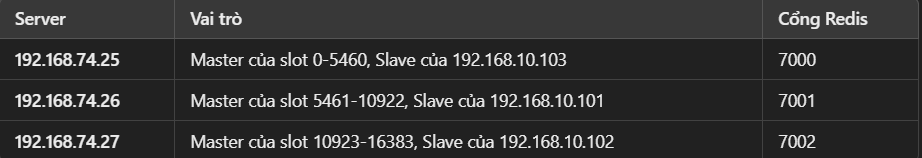
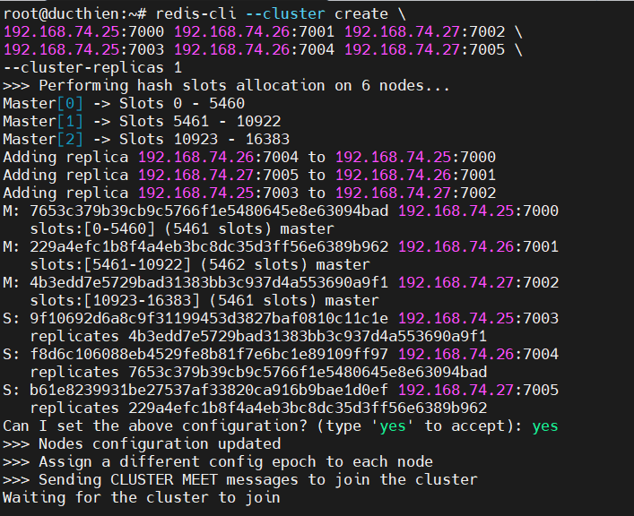
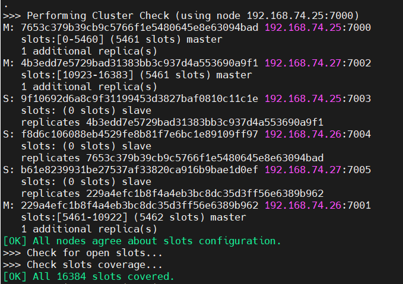
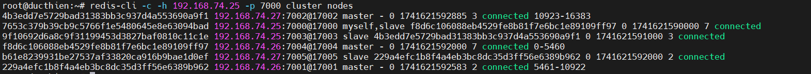
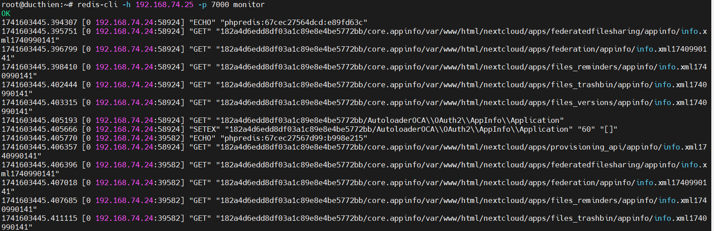

# HƯỚNG DẪN CÀI ĐẶT REDIS CLUSTER
# 1. Mô hình Redis Cluster
Redis Cluster yêu cầu tối thiểu `3 node master`, và trong trường hợp này, mỗi node vừa là `master`, vừa là `slave` của node khác.



# 2. Cài đặt Redis server

**Bước 1. Cài đặt Redis trên tất cả các node**  
1. Đăng nhập vào VM và cập nhật hệ thống:
```
sudo apt update && sudo apt upgrade -y
```
2. Cài đặt Redis:
```
sudo apt install redis-server -y
```
3. Kiểm tra Redis đã hoạt động:
```
sudo systemctl status redis
redis-server --version
```
**Cài đặt redis bằng source**
```
apt update && apt upgrade -y
mkdir -p /opt/setup
cd /opt/setup
wget https://github.com/redis/redis/archive/7.0.8.tar.gz
tar -xvzf 7.0.8.tar.gz
apt install make
apt install make-guile
apt install -y build-essential pkg-config gcc
apt install -y libjemalloc-dev
make distclean
make
make install
```


**Bước 2. Cấu hình Redis cluster**

1. Trên mỗi server, tạo thư mục chứa dữ liệu Redis
```
sudo mkdir -p /etc/redis 
sudo mkdir -p /var/redis
```
2. Cấu hình trên từng node  
**Tạo file cấu hình Redis riêng cho từng server**

🔹 Server 1:   
`Cấu hình Master (7000)`  
Tạo file /etc/redis/7000.conf với nội dung: 
```
sudo vi /etc/redis/7000.conf
```
```
port 7000
bind 192.168.74.25
dir /var/redis/7000
cluster-enabled yes
cluster-config-file nodes-7000.conf
cluster-node-timeout 5000
appendonly yes
daemonize yes

```
`Cấu hình Slave (7003)`  
Tạo file /etc/redis/7003.conf với nội dung:
```
sudo vi /etc/redis/7003.conf
```
```
port 7003
bind 192.168.74.25
dir /var/redis/7003
cluster-enabled yes
cluster-config-file nodes-7003.conf
cluster-node-timeout 5000
appendonly yes
daemonize yes

```
🔹 Server 2:   
`Cấu hình Master (7001)`   
Tạo file /etc/redis/7001.conf với nội dung: 
```
sudo vi /etc/redis/70011.conf
```

```
port 7001
bind 192.168.74.26
dir /var/redis/7001
cluster-enabled yes
cluster-config-file nodes-7001.conf
cluster-node-timeout 5000
appendonly yes
daemonize yes

```
`Cấu hình Slave (7004)`
Tạo file /etc/redis/7004.conf với nội dung:   
```
sudo vi /etc/redis/7004.conf
```
```
port 7004
bind 192.168.74.26
dir /var/redis/7004
cluster-enabled yes
cluster-config-file nodes-7004.conf
cluster-node-timeout 5000
appendonly yes
daemonize yes

```
🔹 Server 3:

`Cấu hình Master (7002)`   
Tạo file /etc/redis/7002.conf với nội dung: 
```
sudo vi /etc/redis/7002.conf
```

```
port 7002
bind 192.168.74.27
dir /var/redis/7002
cluster-enabled yes
cluster-config-file nodes-7002.conf
cluster-node-timeout 5000
appendonly yes
daemonize yes

```
`Cấu hình Slave (7005)`   
Tạo file /etc/redis/7005.conf với nội dung:
```
sudo vi /etc/redis/7005.conf
```
```
port 7005
bind 192.168.74.27
dir /var/redis/7005
cluster-enabled yes
cluster-config-file nodes-7005.conf
cluster-node-timeout 5000
appendonly yes
daemonize yes

```

**Bước 3: Tạo thư mục và cấp quyền cho Redis đọc và ghi nội dung vào** 

🔹 Server 1:
- **Cho Master**  
```
sudo mkdir -p /var/redis/7000
sudo chown redis:redis /var/redis/7000
sudo chmod 770 /var/redis/7000
```
- **Cho Slave**  
```
sudo mkdir -p /var/redis/7003
sudo chown redis:redis /var/redis/7003
sudo chmod 770 /var/redis/7003
```
🔹 Server 2:
- **Cho Master**  
```
sudo mkdir -p /var/redis/7001
sudo chown redis:redis /var/redis/7001
sudo chmod 770 /var/redis/7001
```
- **Cho Slave**  
```
sudo mkdir -p /var/redis/7004
sudo chown redis:redis /var/redis/7004
sudo chmod 770 /var/redis/7004
```
🔹 Server 3:
- **Cho Master**  
```
sudo mkdir -p /var/redis/7002
sudo chown redis:redis /var/redis/7002
sudo chmod 770 /var/redis/7002
```
- **Cho Slave**  
```
sudo mkdir -p /var/redis/7005
sudo chown redis:redis /var/redis/7005
sudo chmod 770 /var/redis/7005
```

**Bước 4: Mở Cổng Trên Firewall**
Chạy trên tất cả các server:
```
sudo ufw allow 7000:7005/tcp
sudo ufw reload
```

**Bước 5: Khởi Động Redis Trên Mỗi Server**

Chạy trên từng server:

🔹 Server 1:
```
redis-server /etc/redis/7000.conf --daemonize yes  
redis-server /etc/redis/7003.conf --daemonize yes  
```
🔹 Server 2:
```
redis-server /etc/redis/7001.conf --daemonize yes  
redis-server /etc/redis/7004.conf --daemonize yes  
```
🔹 Server 3:
```
redis-server /etc/redis/7002.conf --daemonize yes  
redis-server /etc/redis/7005.conf --daemonize yes
```
Kiểm tra Redis đã chạy chưa:
```
ps aux | grep redis
```
**Bước 6: Tạo Redis Cluster**

Chạy trên bất kỳ server nào, ví dụ `192.168.74.25`:
```
redis-cli --cluster create \
192.168.74.25:7000 192.168.74.26:7001 192.168.74.27:7002 \
192.168.74.25:7003 192.168.74.26:7004 192.168.74.27:7005 \
--cluster-replicas 1
```

Nhập `yes` để xác nhận.



Kết quả trả về ta có `3 Master` và `3 Slave` 

**Bước 7: Kiểm tra Cluster**  
Chạy trên bất kỳ server nào, ví dụ `192.168.74.25`:
```
redis-cli -c -h 192.168.74.25 -p 7000 cluster nodes
```


# 3. Cấu Hình Redis Cluster Cho Nextcloud

**Bước 1: Cấu hình file config**  
Mở file cấu hình Nextcloud (config.php):

```
sudo vi /var/www/html/nextcloud/config/config.php
```
```
'memcache.local' => '\\OC\\Memcache\\Redis',
  'memcache.distributed' => '\\OC\\Memcache\\Redis',
  'memcache.locking' => '\\OC\\Memcache\\Redis',
  'redis.cluster' => [
      'seeds' => [ // provide some/all of the cluster servers to bootstrap discovery, port required
          '192.168.74.25:7000',
          '192.168.74.26:7001',
          '192.168.74.27:7002',
          '192.168.74.25:7003',
          '192.168.74.26:7004',
          '192.168.74.27:7005',
  ],
  'timeout' => 0.0,
  'read_timeout' => 0.0,
  'failover_mode' => \RedisCluster::FAILOVER_ERROR
  ],

```
**Bước 2: Restart lại dịch vụ** 

```
sudo systemctl restart apache2
```
**Bước 3: Kiểm Tra Kết Nối Redis**
```
redis-cli -c -h 192.168.74.25 -p 7000 ping
redis-cli -c -h 192.168.74.26 -p 7001 ping
redis-cli -c -h 192.168.74.27 -p 7002 ping
```
Nếu trả về `PONG`, Redis đang hoạt động tốt.
# 4. Kiểm Tra Redis Có Nhận Lệnh Từ Nextcloud Không
Trên server Nextcloud, chạy lệnh:
```
redis-cli -c -h 192.168.74.25 -p 7000 monitor
```
Bây giờ mở Nextcloud trên trình duyệt, thao tác vài trang, rồi quay lại terminal. Nếu thấy các lệnh `GET/SET` xuất hiện, Nextcloud đang sử dụng Redis.

