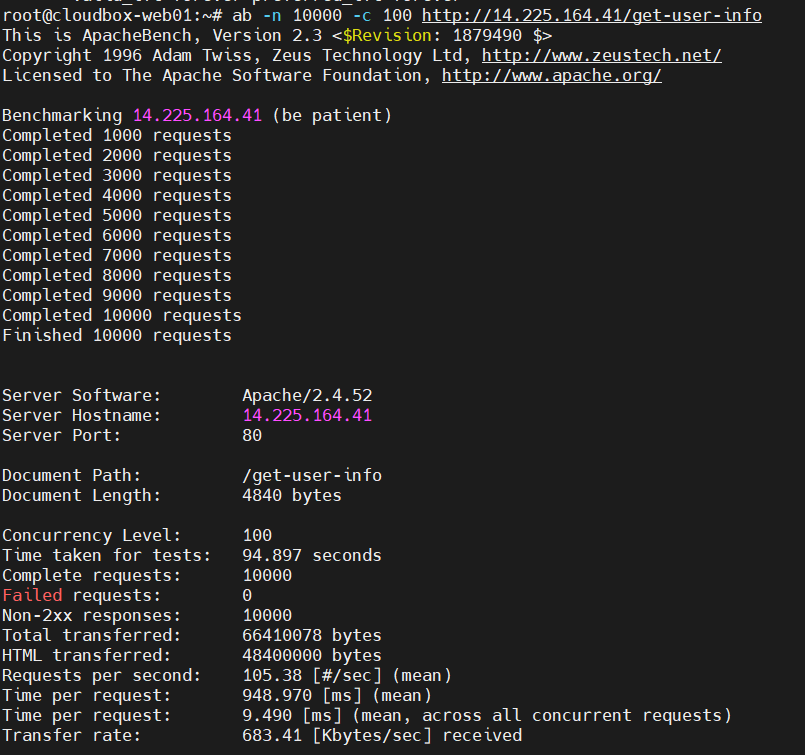
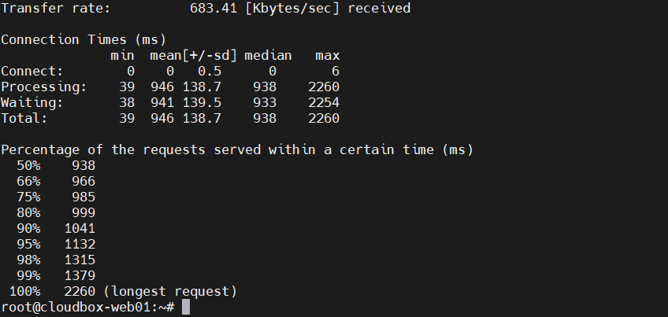
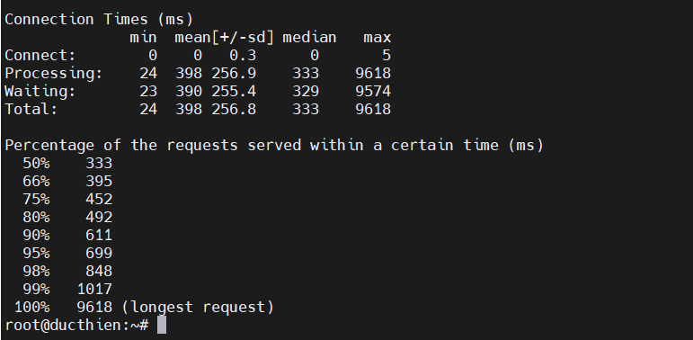
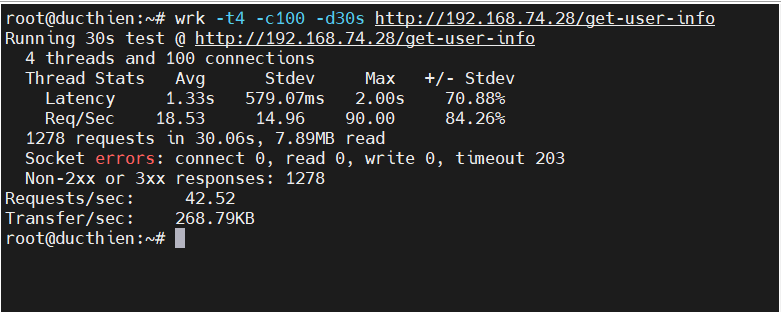
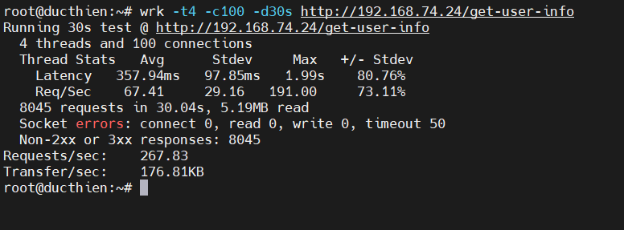

# ĐÁNH GIÁ HIỆU NĂNG GIỮA WEB SỬ DỤNG REDIS VÀ KHÔNG SỬ DỤNG REDIS 

# 1. Các công cụ trong bài test
Dưới đây là một số công cụ phổ biến giúp đo hiệu năng:

- **Apache Benchmark (ab)**: Kiểm tra số lượng request xử lý.
- **wrk**: Kiểm tra hiệu suất web server với nhiều kết nối đồng thời.
- **siege**: Mô phỏng lượng lớn người dùng truy cập.
- **gatling/k6**: Công cụ kiểm thử hiệu năng nâng cao
# 2. Thực hiện test 
## 2.1. Kiểm tra số lượng request xử lý  
Sử dụng câu lệnh   
```
ab -n 10000 -c 100 http://yourserver.com/get-user-info
```
**1. Thực hiện trên web không sử dụng Redis**

```
This is ApacheBench, Version 2.3 <$Revision: 1879490 $>
Copyright 1996 Adam Twiss, Zeus Technology Ltd, http://www.zeustech.net/
Licensed to The Apache Software Foundation, http://www.apache.org/

Benchmarking 14.225.164.41 (be patient)
Completed 1000 requests
Completed 2000 requests
Completed 3000 requests
Completed 4000 requests
Completed 5000 requests
Completed 6000 requests
Completed 7000 requests
Completed 8000 requests
Completed 9000 requests
Completed 10000 requests
Finished 10000 requests


Server Software:        Apache/2.4.52
Server Hostname:        14.225.164.41
Server Port:            80

Document Path:          /get-user-info
Document Length:        4840 bytes

Concurrency Level:      100
Time taken for tests:   94.897 seconds
Complete requests:      10000
Failed requests:        0
Non-2xx responses:      10000
Total transferred:      66410078 bytes
HTML transferred:       48400000 bytes
Requests per second:    105.38 [#/sec] (mean)
Time per request:       948.970 [ms] (mean)
Time per request:       9.490 [ms] (mean, across all concurrent requests)
Transfer rate:          683.41 [Kbytes/sec] received

Connection Times (ms)
              min  mean[+/-sd] median   max
Connect:        0    0   0.5      0       6
Processing:    39  946 138.7    938    2260
Waiting:       38  941 139.5    933    2254
Total:         39  946 138.7    938    2260

Percentage of the requests served within a certain time (ms)
  50%    938
  66%    966
  75%    985
  80%    999
  90%   1041
  95%   1132
  98%   1315
  99%   1379
 100%   2260 (longest request)
```



**2. Thực hiện trên web sử dụng Redis**

```
ab -n 10000 -c 100 http://192.168.74.24/get-user-info
This is ApacheBench, Version 2.3 <$Revision: 1879490 $>
Copyright 1996 Adam Twiss, Zeus Technology Ltd, http://www.zeustech.net/
Licensed to The Apache Software Foundation, http://www.apache.org/

Benchmarking 192.168.74.24 (be patient)
Completed 1000 requests
Completed 2000 requests
Completed 3000 requests
Completed 4000 requests
Completed 5000 requests
Completed 6000 requests
Completed 7000 requests
Completed 8000 requests
Completed 9000 requests
Completed 10000 requests
Finished 10000 requests


Server Software:        Apache/2.4.52
Server Hostname:        192.168.74.24
Server Port:            80

Document Path:          /get-user-info
Document Length:        289 bytes

Concurrency Level:      100
Time taken for tests:   40.400 seconds
Complete requests:      10000
Failed requests:        0
Non-2xx responses:      10000
Total transferred:      6760000 bytes
HTML transferred:       2890000 bytes
Requests per second:    247.53 [#/sec] (mean)
Time per request:       403.996 [ms] (mean)
Time per request:       4.040 [ms] (mean, across all concurrent requests)
Transfer rate:          163.41 [Kbytes/sec] received

Connection Times (ms)
              min  mean[+/-sd] median   max
Connect:        0    0   0.3      0       5
Processing:    24  398 256.9    333    9618
Waiting:       23  390 255.4    329    9574
Total:         24  398 256.8    333    9618

Percentage of the requests served within a certain time (ms)
  50%    333
  66%    395
  75%    452
  80%    492
  90%    611
  95%    699
  98%    848
  99%   1017
 100%   9618 (longest request)
```



**3. Đánh giá kết quả**

| Nội dung | Không sử dụng Redis| Có sử dụng Redis|
|-----|-----|-----|
|Tổng số yêu cầu| 10.000|10.000|
|Yêu cầu lỗi | 0| 0|
|Tổng thời gian thực hiện| 150.193s | 40.400s |
|Request trung bình mỗi giây|66.58 req/sec|247.53 req/sec|
|Thời gian trung bình mỗi Request| 1501.925 ms| 403.99ms|
|Tốc độ truyền tải dữ liệu| 422.18 KB/sec| 163.41 KB/sec|

## 2.2 Kiểm tra hiệu suất web server với nhiều kết nối đồng thời.
Sử dụng câu lệnh wrk cho thấy hiệu suất endpoint /get-user-info trên server khi chạy 30 giây với 4 threads và 100 kết nối đồng thời.
```
wrk -t4 -c100 -d30s http://192.168.74.24/get-user-info
```

**1. Thực hiện trên web không sử dụng Redis**

```
root@ducthien:~# wrk -t4 -c100 -d30s http://192.168.74.28/get-user-info
Running 30s test @ http://192.168.74.28/get-user-info
  4 threads and 100 connections
  Thread Stats   Avg      Stdev     Max   +/- Stdev
    Latency     1.33s   579.07ms   2.00s    70.88%
    Req/Sec    18.53     14.96    90.00     84.26%
  1278 requests in 30.06s, 7.89MB read
  Socket errors: connect 0, read 0, write 0, timeout 203
  Non-2xx or 3xx responses: 1278
Requests/sec:     42.52
Transfer/sec:    268.79KB
```


**2. Thực hiện trên web sử dụng Redis**

```
root@ducthien:~# wrk -t4 -c100 -d30s http://192.168.74.24/get-user-info
Running 30s test @ http://192.168.74.24/get-user-info
  4 threads and 100 connections
  Thread Stats   Avg      Stdev     Max   +/- Stdev
    Latency   357.94ms   97.85ms   1.99s    80.76%
    Req/Sec    67.41     29.16   191.00     73.11%
  8045 requests in 30.04s, 5.19MB read
  Socket errors: connect 0, read 0, write 0, timeout 50
  Non-2xx or 3xx responses: 8045
Requests/sec:    267.83
Transfer/sec:    176.81KB
```


**3. Đánh giá kết quả**

| Nội dung | Không sử dụng Redis| Có sử dụng Redis|
|-----|-----|-----|
|Tổng số request| 1278 |8045|
|Yêu cầu lỗi | 0| 0|
|Thời gian phản hồi trung bình|  1.33s | 357.94ms |
|Request trung bình mỗi giây|42.52 req/sec|267.83 req/sec|
|Tổng dữ liệu đọc| 7.89MB | 5.19MB|
|Tốc độ truyền tải dữ liệu| 268.79KB|  176.81KB|


# 3. Kết Luận
- Redis giúp tăng tốc web server bằng cách giảm truy vấn database.
- Redis đặc biệt hữu ích khi xử lý dữ liệu cache tĩnh như session, kết quả truy vấn lặp lại.
- Redis giúp web server xử lý nhiều request hơn, giảm độ trễ.
- Redis tiêu tốn RAM, nên cần cân nhắc khi triển khai trên server có tài nguyên hạn chế.
