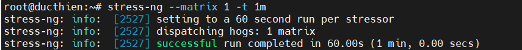
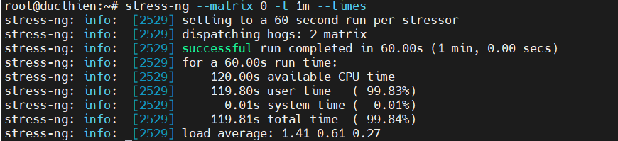
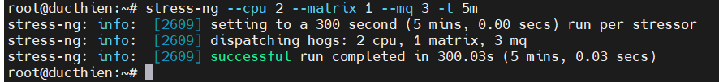
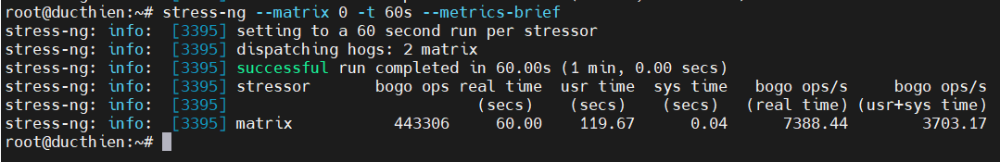
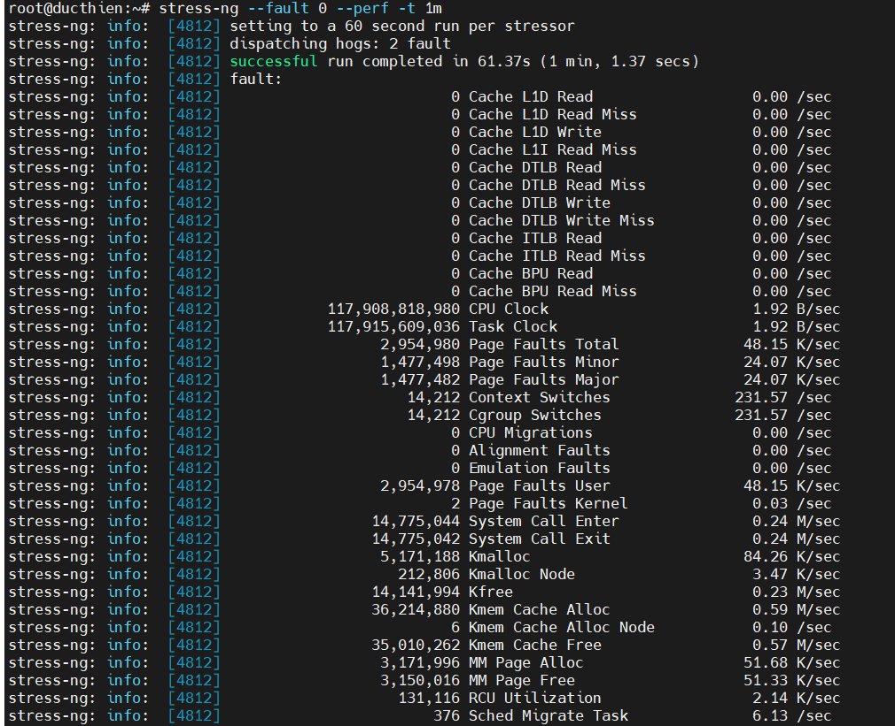
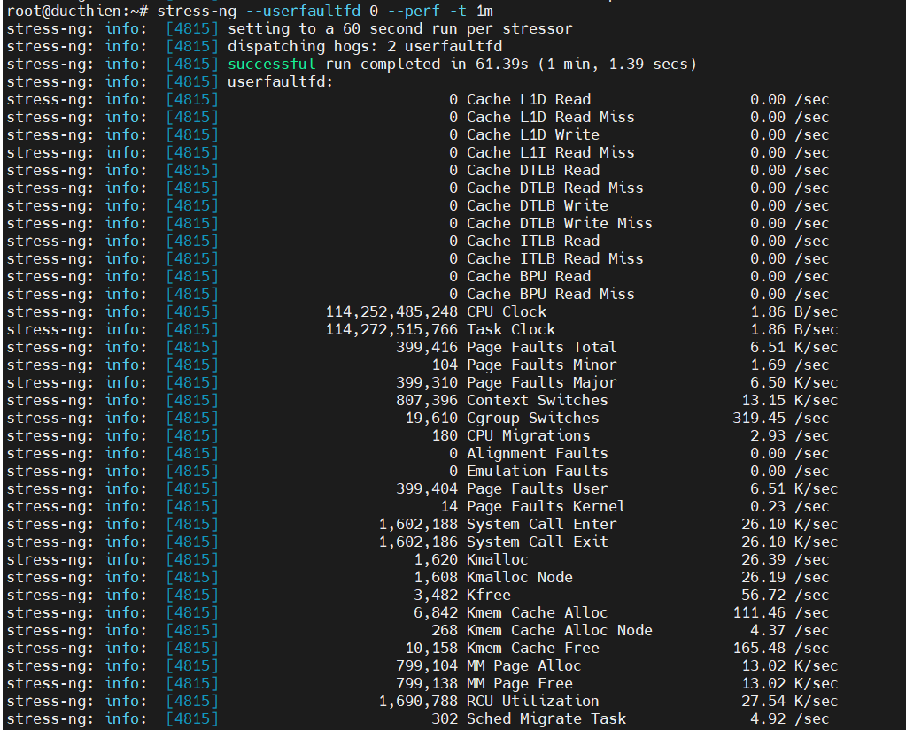

# KỊCH BẢN TEST HIỆU NĂNG BẰNG STRESS-NG

# 1.Kiểm tra khả năng chịu tải của CPU trong vòng 60s

1. Lệnh `stress-ng --matrix 1 -t 1m` được sử dụng để kiểm tra khả năng chịu tải của CPU trong vòng 1 phút bằng cách thực hiện các phép toán ma trận. Cụ thể:

- `-matrix 1`: Sử dụng một lõi CPU để chạy các phép toán ma trận.
- `t 1m`: Giới hạn thời gian kiểm tra trong 1 phút (1 minute).

Lệnh này sẽ giúp bạn kiểm tra hiệu suất của CPU khi xử lý các phép toán ma trận, thường được dùng để đo khả năng xử lý dấu phẩy động và hiệu suất bộ nhớ đệm của CPU.

2. Một số option khác khi chạy lệnh 
- `--matrix 0`: Sử dụng tất cả các lõi CPU để thực hiện các phép toán ma trận. Phép toán ma trận thường dùng để kiểm tra khả năng xử lý số thực và các phép toán phức tạp trên CPU.
- `-times`: Hiển thị thời gian thực tế mà CPU đã tiêu tốn (thời gian sử dụng hệ thống và thời gian xử lý của từng thread).

*Ví dụ*:
```
stress-ng --matrix 0 -t 1m --times
```

3. Lệnh `stress-ng --mq 0 -t 30s --times --perf` sẽ chạy stress test với các hàng đợi thông điệp (message queues) trên tất cả các CPU sẵn có trong 30 giây, sau đó hiển thị thông tin chi tiết về thời gian CPU sử dụng, cũng như các chỉ số hiệu năng của hệ thống thu thập được thông qua tính năng "perf"

- `--mq 0`:Tùy chọn này sử dụng "message queue stressor" (kiểm tra hàng đợi thông điệp) để stress test khả năng xử lý hàng đợi của hệ thống. Giá trị 0 có nghĩa là stress-ng sẽ sử dụng tất cả các CPU sẵn có để thực hiện bài test.
- `-t 30s`: Tùy chọn -t chỉ định thời gian thực hiện bài kiểm tra, ở đây là 30 giây.
- `--times`: Tùy chọn này yêu cầu stress-ng hiển thị thông tin chi tiết về thời gian CPU đã sử dụng (user time) và thời gian hệ thống tiêu tốn (system time) sau khi bài test kết thúc.
-`--perf`: Tùy chọn này yêu cầu stress-ng kích hoạt tính năng "performance monitoring". Nó sẽ thu thập và hiển thị các chỉ số về hiệu năng của CPU trong quá trình stress test (các chỉ số như số lượng nhịp CPU, số lệnh thực hiện, cache misses, v.v.). Điều này yêu cầu hệ thống có hỗ trợ bộ đếm hiệu năng (perf events).


# 2. Kiểm tra khả năng xử lý CPU

1. Lệnh `stress-ng --cpu 2 --matrix 1 --mq 3 -t 5m` sẽ thực hiện một bài kiểm tra stress test trên hệ thống trong vòng 5 phút với các thành phần CPU, phép toán ma trận và hàng đợi tin nhắn (message queues).


- `--cpu 2`: Sử dụng 2 luồng CPU để thực hiện các phép toán cơ bản và kiểm tra khả năng xử lý của CPU.
- `--matrix 1`: Chạy bài kiểm tra với 1 phép toán ma trận, tập trung vào các phép toán số thực (floating-point operations) để kiểm tra khả năng tính toán của CPU.
- `--mq 3`: Thực hiện 3 thread kiểm tra khả năng xử lý các hàng đợi tin nhắn (message queues) của hệ thống. Đây là một dạng kiểm tra hệ thống liên quan đến xử lý thông tin qua các hàng đợi, thường được dùng trong các ứng dụng liên lạc liên tiến trình (IPC).
- `-t 5m`: Chạy bài kiểm tra trong 5 phút (5 minutes).

2. Một số option khác khi chạy lệnh 

- `--all 2`: Chạy đồng loạt stress-test, 
- `--seq 4 -t 20`: Để chạy từng tác nhân gây căng thẳng khác nhau theo một trình tự cụ thể (Chạy tất cả các bài stress-test trong 20 phút)

3. Để loại trừ các stress-test cụ thể khỏi quá trình chạy thử, hãy sử dụng option: `-x`

*Ví dụ*:
```
stress-ng --seq 1 -x numa,matrix,hdd
```

# 3. Đo mức độ sinh nhiệt CPU

Để đo sự sinh nhiệt của CPU, các ứng suất được chỉ định tạo ra nhiệt độ cao trong một khoảng thời gian ngắn để kiểm tra độ tin cậy và độ ổn định làm mát của hệ thống khi tạo nhiệt tối đa. Sử dụng tùy chọn này, bạn có thể đo nhiệt độ CPU tính bằng độ C trong một khoảng thời gian ngắn. `--matrix-size`

```
stress-ng --matrix 0 --matrix-size 64 --tz -t 60
```

- `stress-ng`: Đây là công cụ dòng lệnh được sử dụng để kiểm tra ứng suất và đánh giá chuẩn hệ thống. Nó cho phép người dùng áp dụng nhiều loại ứng suất khác nhau cho các phần khác nhau của hệ thống (CPU, bộ nhớ, I/O, v.v.).

- `--matrix 0`: Tùy chọn này chỉ định khối lượng công việc của ma trận. 0Chỉ ra rằng khối lượng công việc của ma trận sẽ không thực hiện bất kỳ hoạt động thực tế nào (nó hoạt động như một trình giữ chỗ trong ngữ cảnh này). Nếu bạn muốn chỉ định một giá trị khác không, nó sẽ thực hiện một số phép tính ma trận nhất định.

- `--matrix-size 64`: Điều này đặt kích thước của ma trận cho khối lượng công việc là 64x64. Điều này có nghĩa là trong quá trình kiểm tra ứng suất, các ma trận có kích thước này sẽ được tạo và xử lý, mặc dù trong trường hợp này, các hoạt động thực sự là không có tác dụng vì 0đã chỉ định.

- `--tz`: Tùy chọn này nhấn mạnh vào cách xử lý múi giờ của hệ thống, có thể bao gồm việc chuyển đổi giữa các múi giờ và xác minh cách hệ thống quản lý những thay đổi về thời gian.

- `-t 60`: Tùy chọn này chỉ định thời lượng của bài kiểm tra. Trong trường hợp này, bài kiểm tra sẽ chạy trong 60 giây.

2. Một số option khác khi chạy lệnh 

- `--tz` :Để in báo cáo khi kết thúc quá trình chạy, hãy sử dụng tùy chọn


# 4. Đo lường kết quả thử nghiệm với các hoạt động bogo 

Để đo lường kết quả kiểm tra với các hoạt động bogo, hãy sử dụng với option: `--metrics-brief`

```
stress-ng --matrix 0 -t 60s --metrics-brief
```
- `--matrix 0`: Điều này chỉ rõ rằng không có phép toán ma trận nào được thực hiện trong quá trình thử nghiệm.
- `-t 60s`: Đặt thời lượng kiểm tra là 60 giây.
- `--metrics-brief`: Yêu cầu chương trình đưa ra bản tóm tắt ngắn gọn về các số liệu thu thập được trong quá trình thử nghiệm.


# 5. Tạo áp lực bộ nhớ ảo 

Khi chịu áp lực bộ nhớ, kernel bắt đầu viết các trang ra để trao đổi. Bạn có thể nhấn mạnh bộ nhớ ảo bằng cách sử dụng tùy chọn để buộc các trang không cư trú hoán đổi trở lại vào bộ nhớ ảo.

Để kiểm tra stress bộ nhớ ảo, hãy sử dụng tùy chọn: `--page-in`

```
stress-ng --vm 2 --vm-bytes 2G --mmap 2 --mmap-bytes 2G --page-in
```

- **--vm 2**: Tùy chọn này khởi động 2 stress-test cho bộ nhớ ảo. Mỗi bộ sẽ cố gắng tiêu thụ bộ nhớ.
- **--vm-bytes 2G**:Mỗi stress-test cho bộ nhớ ảo sẽ cố gắng phân bổ 2 gigabyte bộ nhớ.
- **--mmap 2**: Tùy chọn này khởi động 2 stress-test được ánh xạ vào bộ nhớ.
- **--mmap-bytes 2G**:Mỗi stress-test được ánh xạ bộ nhớ sẽ cố gắng ánh xạ 2 gigabyte bộ nhớ.
- **--page-in**: Tùy chọn này buộc các trang trong bộ nhớ ảo phải được truy cập, mô phỏng tải bộ nhớ thực tế hơn.

# 6. Kiểm tra độ ổn định với tải cao 

Khi bạn chạy lệnh này, nó sẽ đặt hệ thống của bạn dưới áp lực trong khoảng thời gian được chỉ định trong khi ghi lại tần suất các sự kiện hẹn giờ 

```
stress-ng --timer 32 --timer-freq 1000000
```
- **--timer 32**: Tùy chọn này xác định thời gian chạy của bài kiểm tra là 32 giây.
- **--timer-freq 1000000**: Tùy chọn này thiết lập tần số kiểm tra lại của bộ hẹn giờ là 1.000.000 lần mỗi giây. Nói cách khác, chương trình sẽ kiểm tra xem đã hết thời gian chưa 1 triệu lần trong mỗi giây.

Lệnh này sẽ chạy một bài kiểm tra stress trong 32 giây, liên tục tạo tải cho hệ thống với tần số rất cao. Điều này sẽ giúp xác định xem hệ thống có thể chịu được tải nặng trong thời gian dài hay không, và có bất kỳ lỗi nào xảy ra hay không.

# 7. Kiểm tra hiệu năng và độ ổn định của CPU

Chạy `stress-ng --fault 0 --perf -t 1m` sẽ gây căng thẳng cho CPU trong 1 phút mà không gây ra bất kỳ lỗi nào. Tùy chọn này `--perf` sẽ đưa ra số liệu hiệu suất, chẳng hạn như mức sử dụng CPU, mức sử dụng bộ nhớ và chuyển đổi ngữ cảnh.



Sau đây là phân tích các tùy chọn lệnh:

- `--fault 0`: Tùy chọn này vô hiệu hóa việc tiêm lỗi. Lỗi có thể được sử dụng để mô phỏng lỗi phần cứng hoặc lỗi phần mềm.
- `--perf`: Tùy chọn này cho phép theo dõi hiệu suất và xuất dữ liệu.
- `-t 1m`: Tùy chọn này đặt thời lượng kiểm tra ứng suất là 1 phút.

Ngoài ra, lệnh `stress-ng --userfaultfd 0 --perf -t 1m` được sử dụng để tạo tải cho CPU trong vòng 1 phút, đồng thời theo dõi và hiển thị các chỉ số hiệu năng của hệ thống. Tùy chọn `--userfaultfd 0` có vai trò đặc biệt trong việc kiểm soát cách xử lý các lỗi trang (page fault).

- `--userfaultfd 0`: userfaultfdlà một cơ chế trong Linux cho phép các tiến trình bắt và xử lý các lỗi trang một cách tùy chỉnh.
Khi đặt userfaultfd thành 0, nghĩa là tắt tính năng này. Điều này có nghĩa là hệ thống sẽ sử dụng cơ chế xử lý lỗi trang mặc định, thường là swap hoặc kill tiến trình.
- `--perf`: Tùy chọn này bật chế độ hiển thị các chỉ số hiệu năng chi tiết, bao gồm:
    - Sử dụng CPU
    - Sử dụng bộ nhớ
    - Số lần chuyển đổi ngữ cảnh
    - Và các chỉ số khác liên quan đến hiệu năng hệ thống
- `-t 1m`: Thiết lập thời gian chạy của bài kiểm tra là 1 phút.

