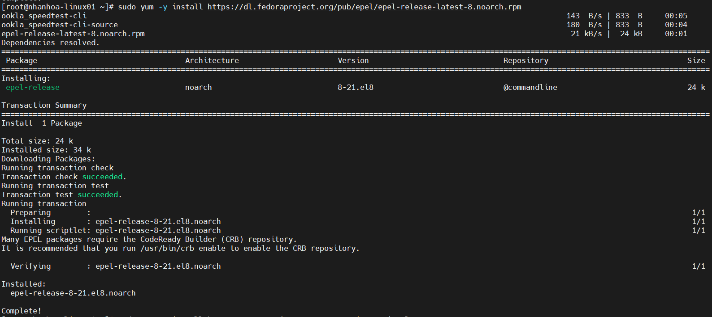
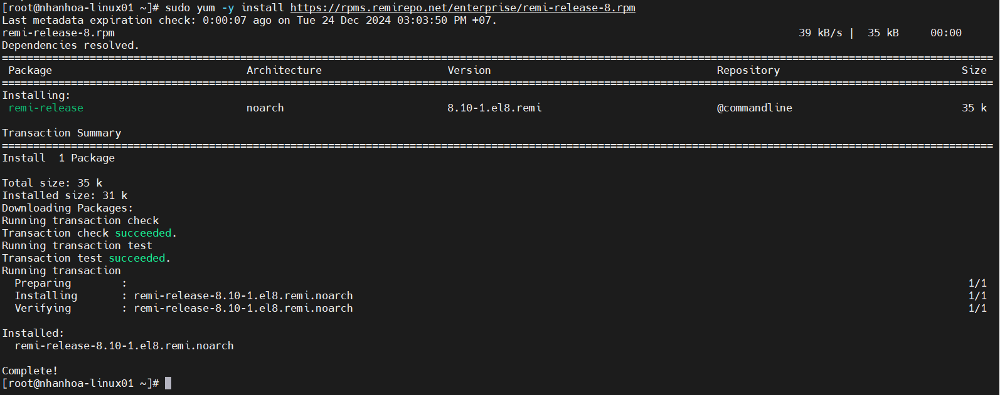
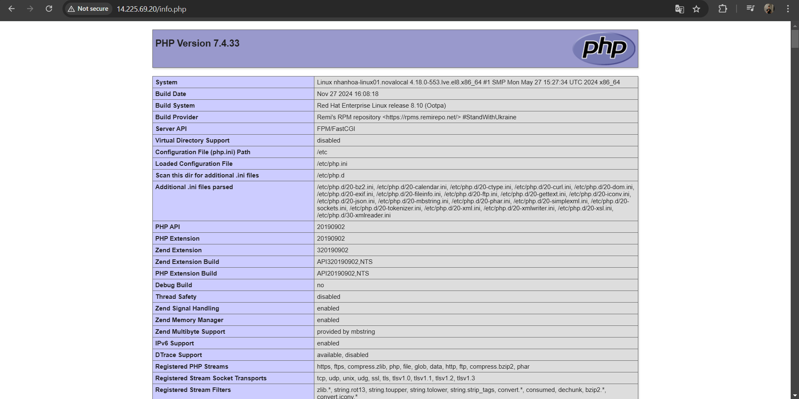

# CÀI ĐẶT WORDPRESS TRÊN LINUX WEBSERVER

# 1. Cài đặt HTTPD

- Để cài đặt httpd , chạy lệnh

```
sudo yum -y install httpd
```
- Bật dịch vụ và cho phép khởi động dịch vụ cùng hệ thống 
```
systemctl start httpd
systemctl enable httpd
```
- Kiểm tra lại trạng thái hệ thống 

```
systemctl status httpd
```
- Bạn cũng có thể kiểm tra trạng thái trên trình duyệt bằng cách gõ trên thanh tìm kiếm địa chỉ ip của serverserver

# 2.Cài đặt hệ quản lí cơ sở dữ liệu(MariaDB)

- Cài đặt Mariadb

```
sudo yum install mariadb-server
```
- Bật dịch vụ và cho phép khởi động dịch vụ cùng hệ thống 
```
systemctl start mariadb
systemctl enable mariadb
```
- Kiểm tra lại trạng thái hệ thống 

```
systemctl status mariadb
```

- Cài lại mật khẩu mật khẩu cho quyền root của cơ sở dữ liệu:
```
mysql_secure_installation
```


# 3.Cài đặt PHP

- Thêm kho lưu trữ EPEL và REMI
```
sudo yum -y install https://dl.fedoraproject.org/pub/epel/epel-release-latest-8.noarch.rpm
```


```
sudo yum -y install https://rpms.remirepo.net/enterprise/remi-release-8.rpm
```


- Cài đặt PHP 7.4 
```
sudo dnf -y install dnf-utils
```

- Kích hoạt module stream cho PHP 7.4
```
sudo dnf module reset php -y
sudo dnf module install php:remi-7.4 -y
sudo yum install php-mysqlnd
```

- Tạo một tệp PHP mới có tên là info.php trong thư mục /var/www/html, với nội dung sau

```
echo "<?php phpinfo();?>" > /var/www/html/info.php
```
Kết quả sau khi truy cập địa chỉ ip của server ta có



