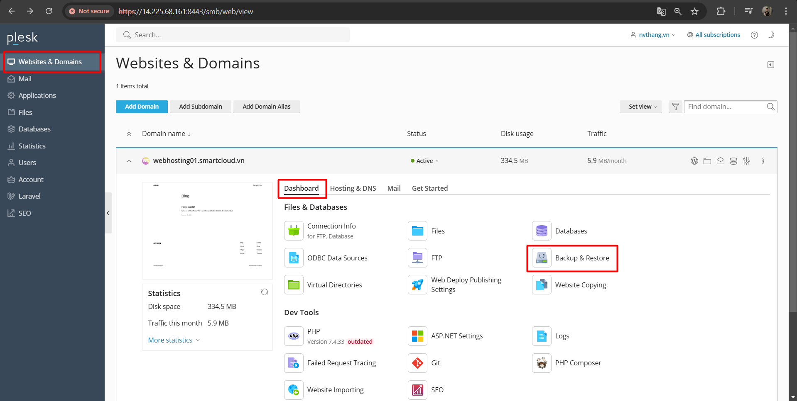
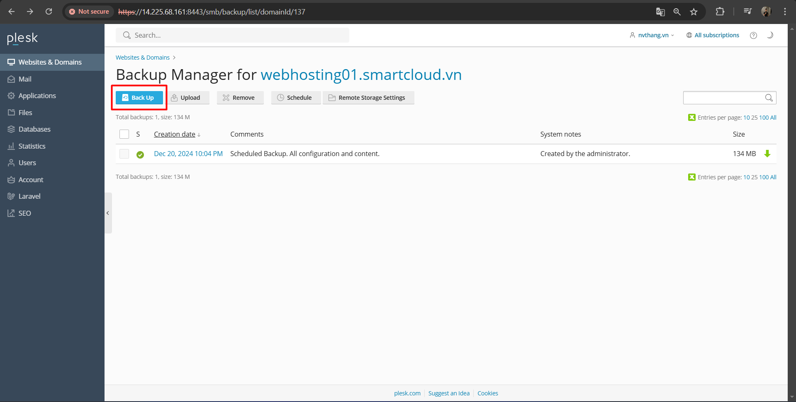
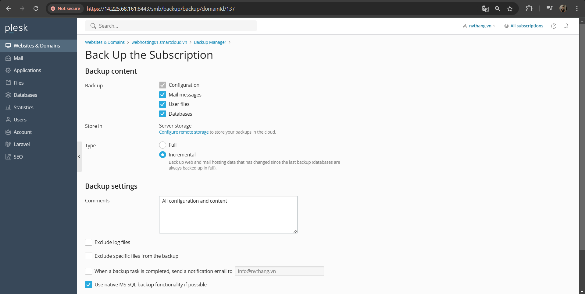
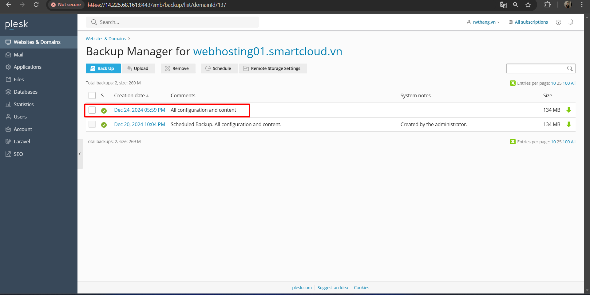
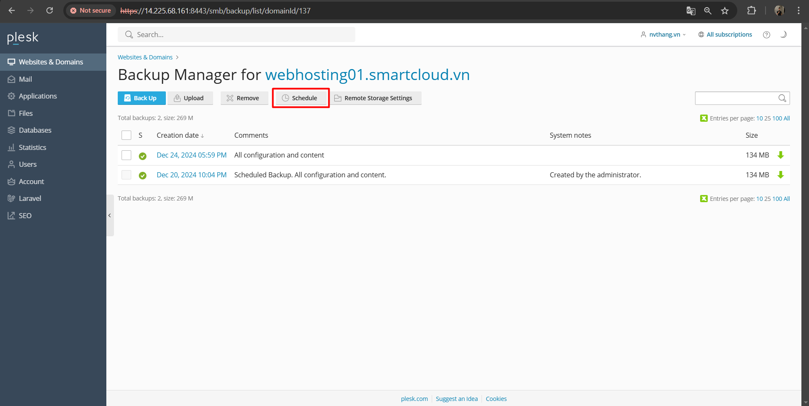
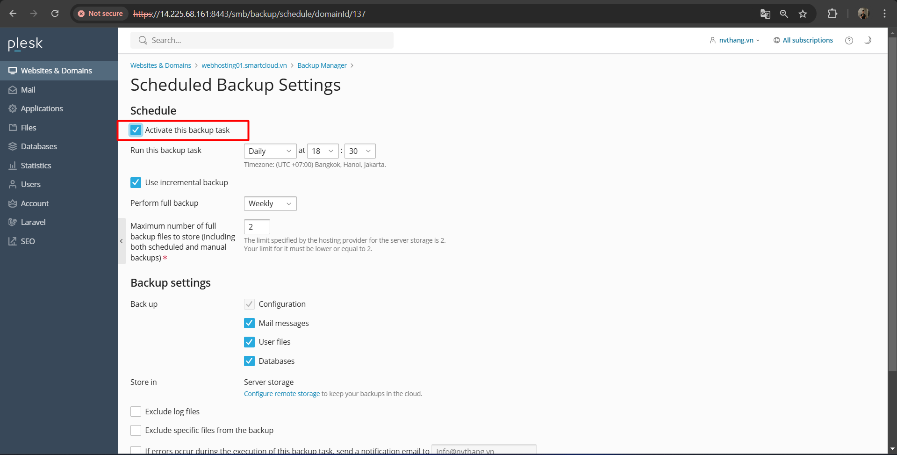
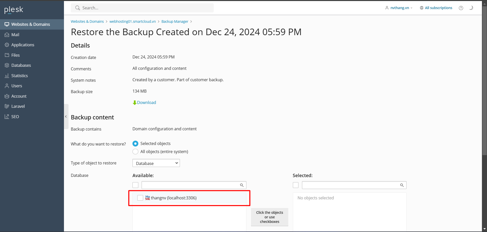

# CÀI ĐẶT BACKUP/RESTORE TỪ WINDOW SANG LINUX

# 1. Thực hiện backup

- Trên giao diện web lần lượt chọn `Websites & Domains` -> `Dashboard` -> `Backup & Restore`

- Trên cửa sổ mới ta chọn `Backup` để lựa chọn nội dung `Backup`

- Trên cửa số mới ta chọn các nội dung backup sau đó bấm chọn OK

- Sau khi Backup thành công hệ thống sẽ sinh ra file backups có tên chứa thời gian backup

# 2. Đặt lịch Backups

Tại màn hình `Backup Manager` lựa chọn `Schedule`

Chọn Activate this backup task này và chỉ định những điều sau

- Khi nào và tần suất chạy bản sao lưu.
- Có thực hiện sao lưu gia tăng hay không và nếu có, tần suất sao lưu đầy đủ nên được thực hiện. Một bản sao lưu đầy đủ chứa tất cả cấu hình và nội dung (nếu bạn chọn sao lưu nội dung) nhưng chiếm nhiều dung lượng hơn. Bản sao lưu gia tăng chỉ chứa sự khác biệt giữa trạng thái hiện tại của tài khoản của bạn và trạng thái tại thời điểm sao lưu đầy đủ cuối cùng được thực hiện. Điều này giúp tiết kiệm dung lượng ổ đĩa, nhưng một bản sao lưu gia tăng sẽ vô dụng nếu bản sao lưu đầy đủ tương ứng bị xóa hoặc bị hỏng.
- Các tệp sao lưu sẽ được giữ trong bao lâu trước khi bị xóa.
- Có bao gồm cấu hình và nội dung thư cũng như tệp người dùng và cơ sở dữ liệu trong bản sao lưu hay chỉ sao lưu cấu hình miền.
- Lưu trữ bản sao lưu trên máy chủ hay trong bộ lưu trữ FTP. Nếu không có bộ lưu trữ FTP nào được định cấu hình, hãy nhấp vào Định cấu hình để thiết lập một bộ nhớ.
- Bạn cũng có thể gửi thông báo cho bạn trong trường hợp có bất kỳ sự cố nào với quy trình sao lưu hoặc tạm dừng tất cả các miền trong quá trình sao lưu để đảm bảo tính nhất quán của bản sao lưu. Trên Windows, bạn cũng có thể chọn sao lưu cơ sở dữ liệu Microsoft SQL Server bằng chức năng sao lưu gốc bất cứ khi nào có thể.

- Bấm Apply Để chỉnh sửa cài đặt sao lưu đã lên lịch:
- Đi tới Tools & Utilities > Backup Manager.
- Nhấp vào Schedule và thực hiện các thay đổi mong muốn.
- Để tắt các bản sao lưu đã lên lịch:
- đi tới Tools & Utilities > Backup Manager.
- Click Schedule và bỏ chọn Activate this backup task checkbox.

# 3.Restore
- Tại màn hình `Database Manager` hiển thị các bản Backup hiện có, để `Restore` bạn chọn 1 bản bất kỳ và lựa chọn nội dung `Restore`.

Chọn Databases để restore

