# HƯỚNG DẪN CHI TIẾT EXPORT VÀ IMPORT DỮ LIỆU WEBHOSTING SANG MÁY CHỦ WINDOWS

# 1. Tải file lên Wordpress
Trên giao diện Wordpress , chọn Media -> Add new media file . Ta sẽ tải 1 số file lên 

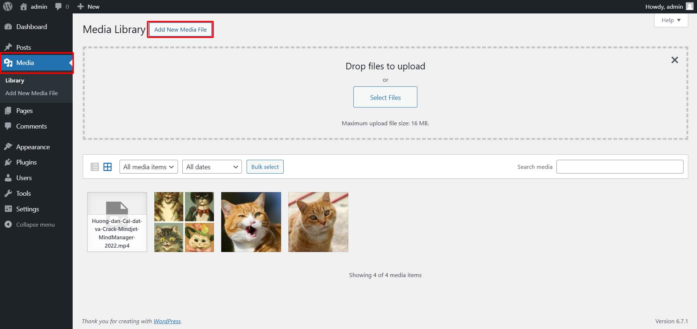

Ở đây như các bạn thấy tôi đã tải lên 3 tấm ảnh và 1 file 

Tiếp theo ta up thêm 1 post mới trên wordpress

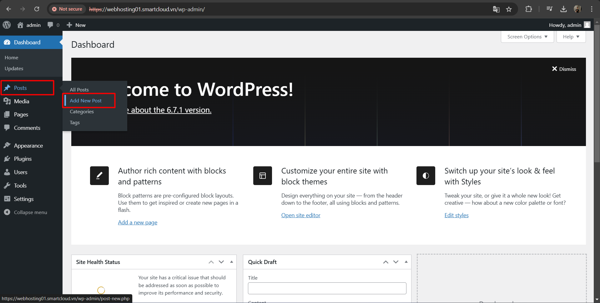

Ở cửa sổ tiếp theo , đã viết nội dung mong muốn và ấn Publish

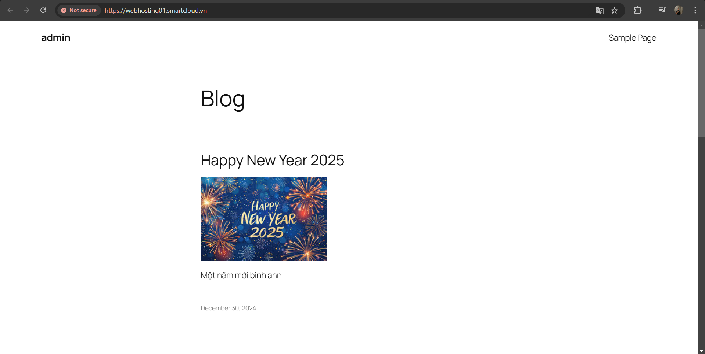

# 2. Kiểm tra thông tin databases trên phpMyAdmin
Ở mục Databases ta chọn phpMyAdmin

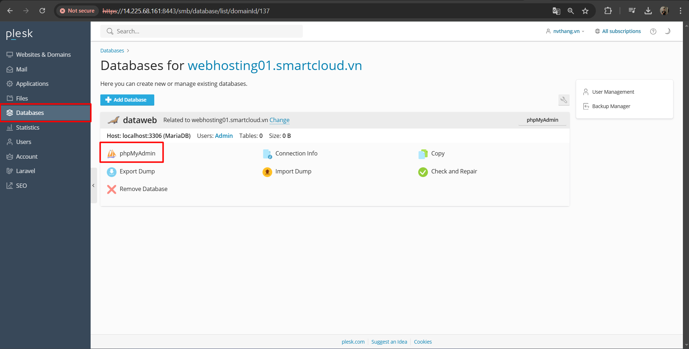

Sau khi được chuyển sang 1 giao diện làm việc khác của phpMyAdmin, ta chọn mục wp-post

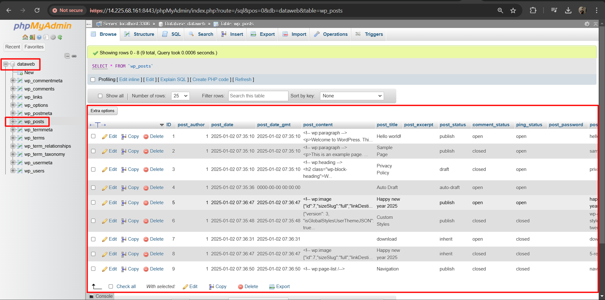

Ta sẽ thấy những file đã tải lên trước đó và các post đã đăng thêm

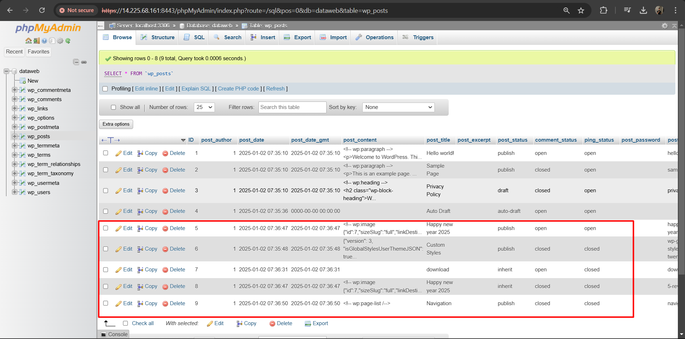

# 3. Export Databases trên Plesk

Trên giao diện web Plesk , chọn Websites & Domains -> Databases

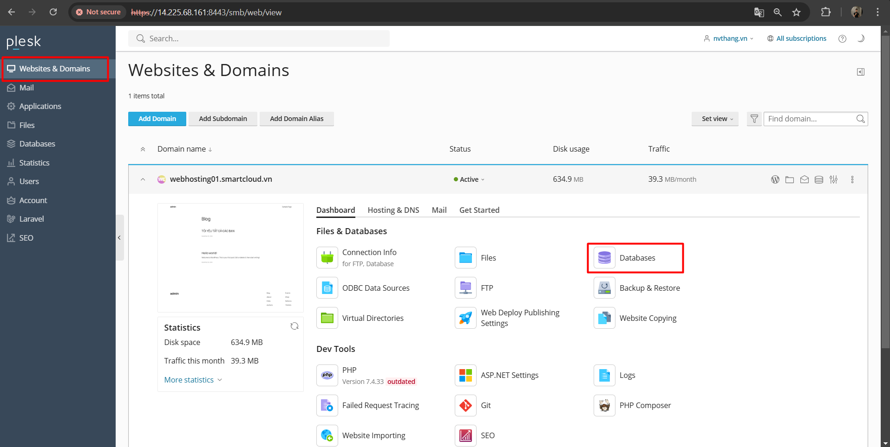

Ở cửa số mới này, ta kiểm tra đúng databases của domain `webhosting01.smartcloud.vn`
Chọn Export database để xuất dữ liệu

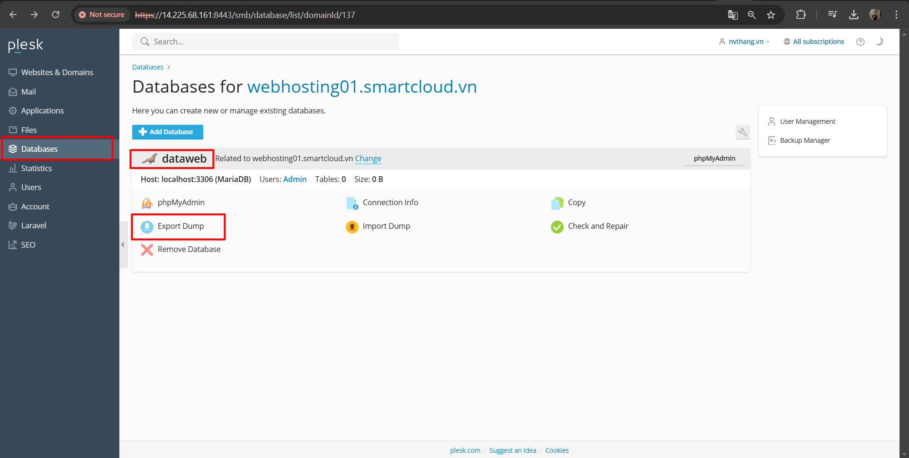

Một cửa sổ sẽ hiện lên, ở đây ta sẽ chọn nơi lưu file export, tên file , và lựa chọn tự động tải file về sau khi nén thành công

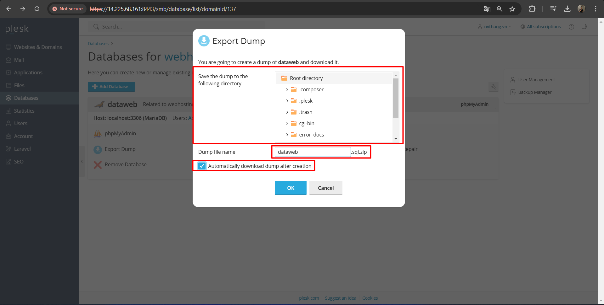

# 4. Import database lên linux

Sau khi tải file export về máy tính, ta giải nén file copy file lên VM , kéo trực tiếp file vào mục SSH browser (SFTP) trên mobaxterm

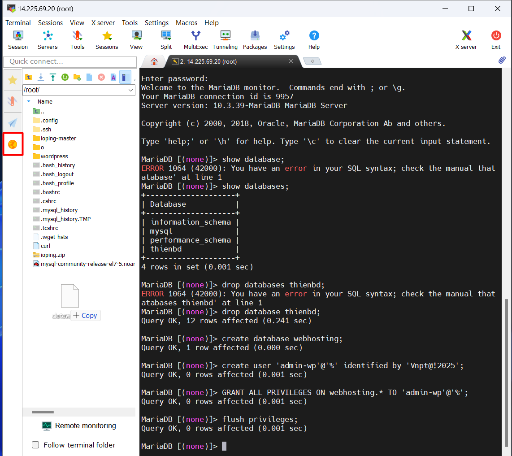

Tạo databases mới trước khi import dữ liệu. Databasesnày sẽ lưu trữ dữ liệu sẽ import.

Đăng nhập vào Mariadb với tư cách là root hoặc người dùng khác có đủ quyền để tạo cơ sở dữ liệu mới:
```
mysql -u root -p
```
Lệnh này sẽ đưa bạn đến dấu nhắc shell Mariadb. Tiếp theo, tạo một cơ sở dữ liệu mới bằng lệnh sau. Trong ví dụ này, cơ sở dữ liệu mới được gọi là thienbd:

```
CREATE DATABASE thienbd;
```
Chỉnh sửa file thangnv.sql

```
vi thangnv.sql
```

Xóa ký tự `\` ờ dòng số 1 của file 

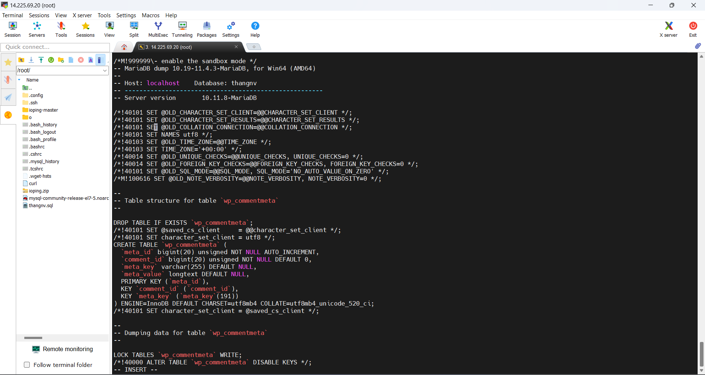

Từ dòng lệnh thông thường, bạn có thể nhập tệp dump bằng lệnh sau:

```
mysql -u root -p thienbd < thangnv.sql
```
Sau khi import dữ liệu, ta đăng nhập lại vào Mariadb và kiểm tra 

Hiển thị các databases hiện có 

```
show databases;
```
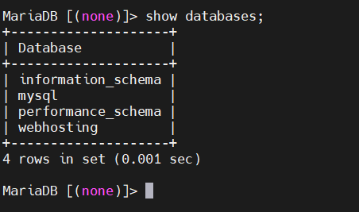

Lựa chọn databases để kiểm tra 

```
USE thienbd;
```
Chạy lệnh sau để hiển thị các bảng có trong databases thienbd

```
SHOW TABLES;
```
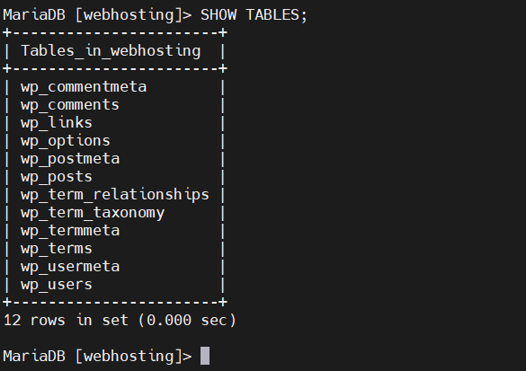

Tiếp tục kiểm tra thư mục wp_posts bằng lệnh sau

```
SELECT * FROM wp_posts LIMIT 10;
```

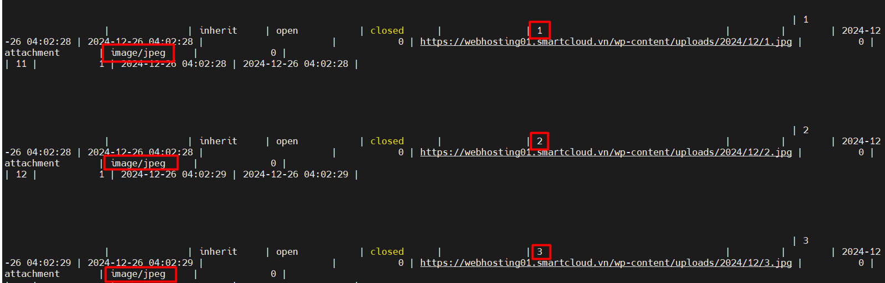

Thông tin hiện ra ta thấy dữ liệu của những tấm ảnh ta đã tải lên trước đó

