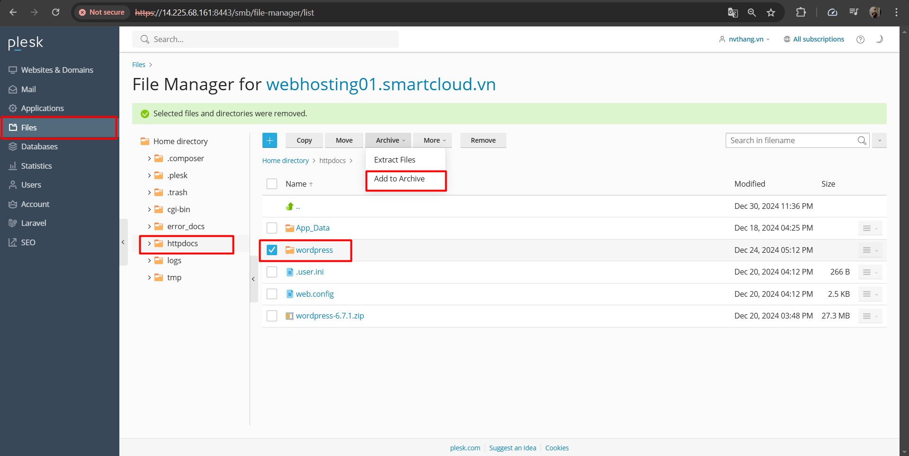
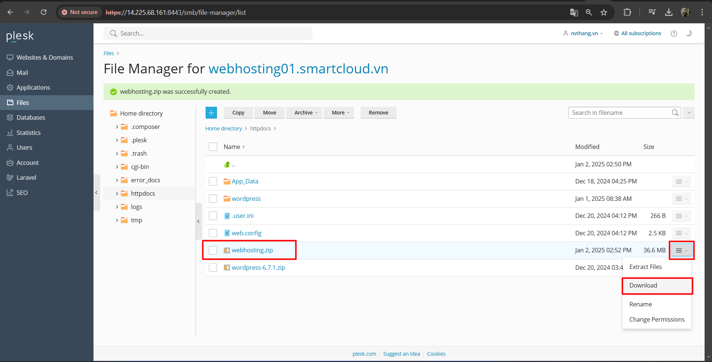
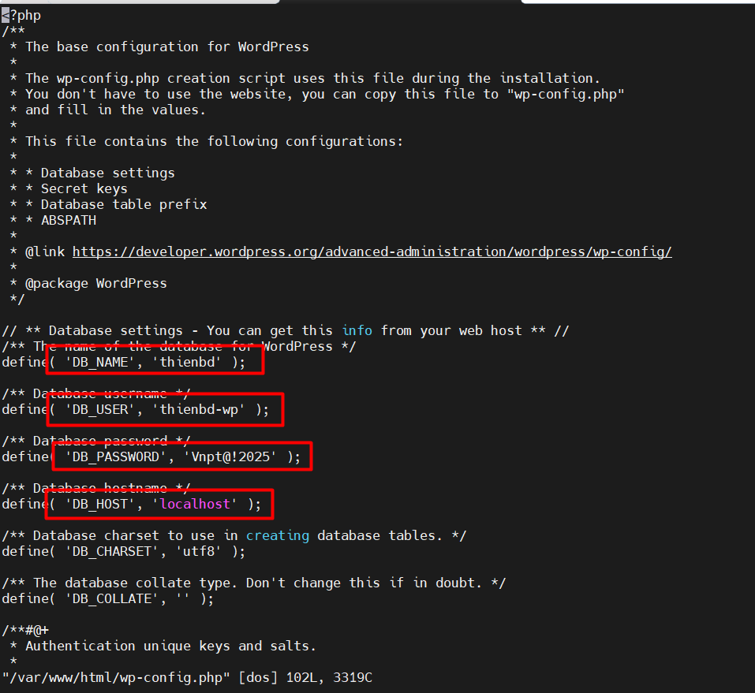
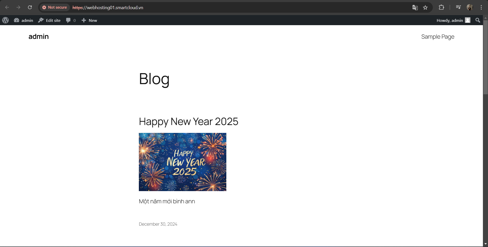

# NHẬP VÀ XUẤT WEB WORDPRESS

# 1. Xuất giữ liệu webhosting 

Trên giao diện web, ở option File, ta chọn thư mục httpdocs, chọn thư mục wordpress, chọn option Archive, chọn Add a archive



Cửa sổ mới hiện lên, ta nhập tên file muốn nén
Sau khi nén xong , download file về máy tính



Sau khi tải về máy tính, giải nén file và tải file lên VM. Kéo trực tiếp thư mục wordpress vào phần SSH browser (SFTP).

Chuyển tất cả các file trong thư mục `wordpress` vào `/var/www/html`

```
mv wordpress/* /var/www/html
```

Tạo user, password mới cho databases thienbd đã tạo trước đó và cấp quyền cho user đó

```
create user 'thienbd-wp'@'%' identified by 'Vnpt@!2025';
GRANT ALL PRIVILEGES ON thienbd.* TO 'thienbd-wp'@'%';
flush privileges;
```

Chỉnh sửa file cấu hình wp-config.php theo databases, user, password mới



Truy cập trực tiếp vào ip của VM



Kết quả nhận được là web wordpress

