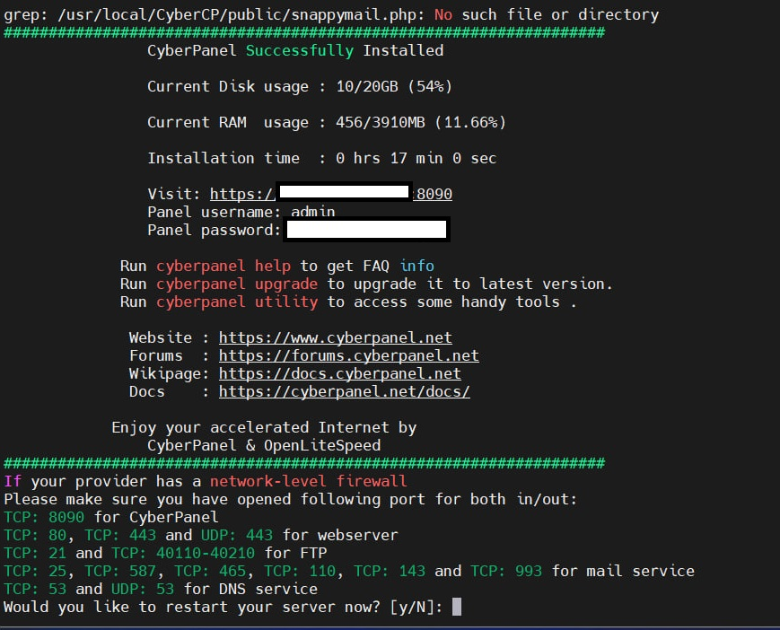
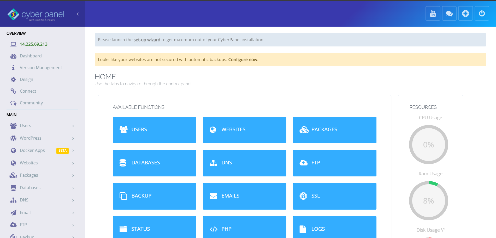

# CÀI ĐẶT CYBER PANEL

# 1. Yêu cầu cài đặt 

Để cài đặt CyberPanel, bạn cần đảm bảo đáp ứng các yêu cầu sau.
- **Hệ điều hành khuyến nghị** :  Ubuntu 18.04, Ubuntu 20.04, AlmaLinux 8, AlmaLinux 9 , Ubuntu 22.04 , CloudLinux 8 .
- **RAM** : 1024MB hoặc cao hơn
- **Dung lượng đĩa còn trống** : >10GB

# 2. Các bước cài đặt 

**1. Update server Packages**

- For Ubuntu
```
sudo apt update && sudo apt upgrade -y
```
- For CentOS/Alma/RockyRocky
```
sudo yum check-update
sudo yum update
```

**2. Run the Installation Script**

Thực hiện lệnh được cung cấp để khởi chạy tập lệnh cài đặt tự động.
```
sh <(curl https://cyberpanel.net/install.sh || wget -O - https://cyberpanel.net/install.sh)
```

**3. Select the version you would like to use**

Ở bước này các bạn sẽ lựa chọn các option version cài đặt mà bộ cài đặt cung cấp


- Nếu bạn chọn `LiteSpeed ​​Enterprise`, bạn sẽ thấy lời nhắc sau. **Nhập số sê-ri của bạn**
- Nếu bạn không có bất kỳ giấy phép nào, bạn cũng có thể sử dụng giấy phép dùng thử (nếu máy chủ chưa từng sử dụng  giấy phép dùng thử trước đó), hãy nhập TRIAL

Tiếp tục ta sẽ chọn các dịch vụ và các gói cần cài đặt
Bạn sẽ thấy các lời nhắc sau :

- Full Service (default Y):
- Remote MySQL (default N): Cho phép Cơ sở dữ liệu của bạn được cài đặt trên máy chủ từ xa
- Remote MySQL (default N): Cho phép Cơ sở dữ liệu của bạn được cài đặt trên một máy chủ từ xa


- CyberPanel Version (default Latest Version): Bạn có thể chọn cài đặt phiên bản trước của CyberPanel hoặc nhấn Enter để cài đặt phiên bản mới nhất.


- Memcached (default Y): Hệ thống lưu trữ đối tượng bộ nhớ phân tán

- Redis (default Y): Kho lưu trữ cấu trúc dữ liệu trong bộ nhớ, được sử dụng làm cơ sở dữ liệu, bộ nhớ đệm và thông báo bị hỏng


**4. Hoàn tất cài đặt** \

Quá trình cài đặt sẽ mất từ 10-15 phút
Sau khi cài đặt xong hệ thống sẽ hiển thị thông tin tài khoản mặc định được tạo trong lúc cài đặt và hỏi người dùng có muốn Restart lại hệ thống ngay bây giờ không 


Truy cập ip của VM với port 8090 để truy cập web Cyber Panel


*Tài liệu tham khảo*

[1] [https://cyberpanel.net/KnowledgeBase/home/install-cyberpanel/](https://cyberpanel.net/KnowledgeBase/home/install-cyberpanel/)