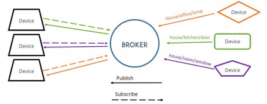
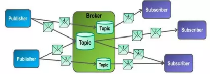
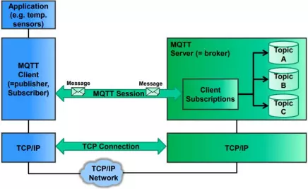

# TỔNG QUAN VỀ MQTT (MESSAGE QUEUING TELEMETRY TRANSPORT)

# 1. Sơ lược về giao thức MQTT
## 1.1. MQTT là gì
MQTT (Message Queuing Telemetry Transport) là một giao thức truyền thông điệp (message) dựa trên mô hình `Publish/Subscribe`. Giao thức này được sử dụng giữa các thiết bị IoT với băng thông thấp, độ tin cậy cao và hoạt động trong mạng lưới không ổn định. Vì vậy, đây là giải pháp hoàn hảo để trao đổi dữ liệu giữa nhiều thiết bị IoT.

MQTT phục vụ tốt nhất trong những trường hợp
- Những nơi mà giá mạng viễn thông đắt đỏ hoặc băng thông thấp hay thiếu tin cậy.
- Khi chạy trên thiết bị nhúng bị giới hạn về tài nguyên tốc độ và bộ nhớ.
- Bởi vì giao thức này sử dụng băng thông thấp trong môi trường có độ trễ cao nên nó là một giao thức lý tưởng cho các ứng dụng M2M (Machine to Machine).

## 1.2. Tính năng và đặc điểm 
- Dạng truyền thông điệp theo mô hình Pub/Sub cung cấp việc truyền tin phân tán một chiều, tách biệt với phần ứng dụng.
- VViệc truyền thông điệp là ngay lập tức, không quan tâm đến nội dung được truyền.
- Sử dụng TCP/IP là giao thức nền.
- Tồn tại ba mức độ tin cậy cho việc truyền dữ liệu (`QoS: Quality of service`)
    - QoS 0: Broker/client sẽ gửi dữ liệu đúng một lần, quá trình gửi được xác nhận bởi chỉ giao thức TCP/IP.
    - QoS 1: Broker/client sẽ gửi dữ liệu với ít nhất một lần xác nhận từ đầu kia, nghĩa là có thể có nhiều hơn 1 lần xác nhận đã nhận được dữ liệu.
    - QoS 2: Broker/client đảm bảo khi gửi dữ liệu thì phía nhận chỉ nhận được đúng một lần, quá trình này phải trải qua 4 bước bắt tay.
- Phần bao bọc dữ liệu truyền nhỏ và được giảm đến mức tối thiểu để giảm tải cho đường truyền.

# 2. MQTT server là gì
Một hệ thống MQTT bao gồm nhiều Clients `(Publishers/Subscribers)` được định cấu hình để giao tiếp với Server, còn được gọi là Broker. Broker được xem là trung tâm hay điểm giao của tất cả các kết nối.     
Nhiệm vụ chính của Broker là nhận thông điệp (message) từ client, xếp vào hàng đợi rồi chuyển đến một địa điểm cụ thể. Ngoài ra, nó còn đảm nhận thêm một vài tính năng khác như: bảo mật message, lưu trữ message, logs, ….      
- Có 4 Packets điều khiển MQTT chính mà máy khách và máy chủ có thể sử dụng để giao tiếp:
    - **Connect**: Gửi từ Package này được gửi từ máy khách đến máy chủ để thiết lập kết nối.
    - **Disconnect**: Được gửi từ máy khách đến máy chủ thông báo lý do tại sao kết nối bị ngắt.
    - **Subscribe**: Một gói đăng ký luôn được gửi từ máy khách đến máy chủ để tạo một hoặc nhiều đăng ký Topic.
    - **Publish**: Một gói xuất bản có thể được gửi từ máy khách đến máy chủ để vận chuyển một thông điệp ứng dụng hoặc từ máy chủ đến một máy khách đã đăng ký Topic tương ứng.
- Có 3 tùy chọn mà giao thức MQTT đang hỗ trợ (QoS):
    - **Nhiều nhất một lần**: Một thông điệp được gửi một lần duy nhất. Không có hành động tiếp theo nào được thực hiện bởi client  hoặc máy chủ để xác nhận rằng một thông báo đã được nhận. Cài đặt này có chi phí thấp nhất.
    - **Ít nhất một lần**: Sau khi gửi thông điệp đi, máy khách sẽ gửi phản hồi để xác nhận rằng thông điệp đã được nhận. Nếu không có xác nhận, máy chủ sẽ tiếp tục gửi lại.
    - **Chính xác một lần**: Đảm bảo rằng thông điệp giữa máy chủ với client được nhận và chỉ được gửi một lần. Cài đặt này có chi phí cao nhất.

- Một số thuật ngữ liên quan đến giao thức MQTT:

    - **Publish/Subscribe**: Trong hệ thống Publish/Subscribe, một thiết bị có thể xuất bản thông điệp về một Topic hoặc có thể đăng ký một Topic cụ thể để nhận thông điệp.
    - **Messages (thông điệp)**: Đây là thông tin mà bạn muốn trao đổi giữa các thiết bị của mình. Ví dụ, Messages có thể là một thông báo như lệnh hoặc dữ liệu như các chỉ số cảm biến.
    - **Topic (chủ đề)**: Chỉ phạm vi các thông điệp đến hoặc cách bạn chỉ định nơi bạn muốn xuất bản thông điệp.

# 3. Ưu nhược điểm 
Giao thức MQTT giúp đảm bảo truyền dữ liệu diễn ra trơn tru với băng thông thấp, giảm tải cho CPU và RAM. 

*Ưu điểm*:

- Dữ liệu được truyền tải ngay lập tức, không phụ thuộc nội dung được truyền.
- Sử dụng TCP/IP làm giao thức nền.
- Tăng khả năng mở rộng và giảm đáng kể tiêu thụ băng thông mạng.
- Tiết kiệm thời gian xây dựng và phát triển.
- Chi phí thấp nhưng vẫn đảm bảo an toàn, bảo mật.
- Được sử dụng trong các ngành công nghiệp và các công ty lớn như Amazon, Facebook, ….

*Nhược điểm*:
- MQTT có chu kỳ truyền dữ liệu chậm hơn so với một số giao thức khác như CoAP.
- MQTT không được mã hóa trực tiếp, tên người dùng và mật khẩu được gửi dưới dạng văn bản rõ ràng. Thay vào đó, giao thức sử dụng TLS/SSL để bảo mật. SSL/TLS không phải là giao thức nhẹ.
- Rất khó để tạo ra một mạng MQTT mở rộng toàn cầu.
- Các thách thức MQTT khác liên quan đến khả năng tương tác và xác thực.

# 4. Mô hình Pub/Sub và Cơ chế hoạt động của MQTT
## 4.1. Mô hình Pub/Sub

- Client
    - Publisher - Nơi gửi thông điệp
    - Subscriber - Nơi nhận thông điệp
- Broker - Máy chủ môi giới

Trong đó Broker được coi như trung tâm, nó là điểm giao của tất cả các kết nối đến từ Client (Publisher/Subscriber). Nhiệm vụ chính của Broker là nhận thông điệp (message) từ Publisher, xếp vào hàng đợi rồi chuyển đến một địa điểm cụ thể. Nhiệm vụ phụ của Broker là nó có thể đảm nhận thêm một vài tính năng liên quan tới quá trình truyền thông như: bảo mật message, lưu trữ message, logs, ....

Client thì được chia thành hai nhóm là Publisher và Subscriber. Client chỉ làm ít nhất một trong 2 việc là publish các thông điệp (message) lên một/nhiều topic cụ thể hoặc subscribe một/nhiều topic nào đó để nhận message từ topic này.

## 4.2. Cơ chế hoạt động của MQTT theo mô hình Pub/Sub
**1. Tính chất và những đặc điểm riêng**   

- Tính chất:
    - Space decoupling (Không gian tách biệt)
    - Time decoupling (Thời gian tách biệt)
    - Synchronization decoupling (Sự đồng bộ riêng rẽ)
- Đặc điểm riêng:
    - MQTT sử dụng cơ chế lọc thông điệp dựa vào tiêu đề (subject-based)
    - MQTT có một tầng gọi là chất lượng dịch vụ (Quality of Services – QoS). Nó giúp cho dễ dàng nhận biết được là message có được truyền thành công hay không.

**2. Cơ chế tổng quan** 

- MQTT hoạt động theo cơ chế client/server, nơi mà mỗi cảm biến là một khách hàng (client) và kết nối đến một máy chủ, có thể hiểu như một Máy chủ môi giới (broker), thông qua giao thức TCP (Transmission Control Protocol). Broker chịu trách nhiệm điều phối tất cả các thông điệp giữa phía gửi đến đúng phía nhận.
- MQTT là giao thức định hướng bản tin. Mỗi bản tin là một đoạn rời rạc của tín hiệu và broker không thể nhìn thấy. Mỗi bản tin được publish một địa chỉ, có thể hiểu như một kênh (Topic). Client đăng kí vào một vài kênh để nhận/gửi dữ liệu, gọi là subscribe. Client có thể subscribe vào nhiều kênh. Mỗi client sẽ nhận được dữ liệu khi bất kỳ trạm nào khác gửi dữ liệu vào kênh đã đăng ký. Khi một client gửi một bản tin đến một kênh nào đó gọi là publish.

**3. Kiến trúc thành phần** 

- Thành phần chính của MQTT là Client (Publisher/Subscriber), Server (Broker), Sessions (tạm dịch là Phiên làm việc), Subscriptions và Topics.
- MQTT Client (Publisher/Subscriber): Clients sẽ subscribe một hoặc nhiều topics để gửi và nhận thông điệp từ những topic tương ứng.
- MQTT Server (Broker): Broker nhận những thông tin subscribe (Subscriptions) từ client, nhận thông điệp, chuyển những thông điệp đến các Subscriber tương ứng dựa trên Subscriptions từ client.
- Topic: Có thể coi Topic là một hàng đợi các thông điệp, và có sẵn khuôn mẫu dành cho Subscriber hoặc Publisher. Một cách logic thì các topic cho phép Client trao đổi thông tin với những ngữ nghĩa đã được định nghĩa sẵn. Ví dụ: Dữ liệu cảm biến nhiệt độ của một tòa nhà.
- Session: Một session được định nghĩa là kết nối từ client đến server. Tất cả các giao tiếp giữa client và server đều là 1 phần của session.
- Subscription: Không giống như session, subscription về mặt logic là kết nối từ client đến topic. Khi đã subscribe một topic, Client có thể nhận/gửi thông điệp (message) với topic đó.

*Tài liệu tham khảo*

[1] [https://www.bkns.vn/mqtt-server-la-gi-tim-hieu-chi-tiet-ve-giao-thuc-mqtt.html](https://www.bkns.vn/mqtt-server-la-gi-tim-hieu-chi-tiet-ve-giao-thuc-mqtt.html)    
[2] [https://viblo.asia/p/mqtt-la-gi-vai-tro-cua-mqtt-trong-iot-V3m5WL3bKO7](https://viblo.asia/p/mqtt-la-gi-vai-tro-cua-mqtt-trong-iot-V3m5WL3bKO7)