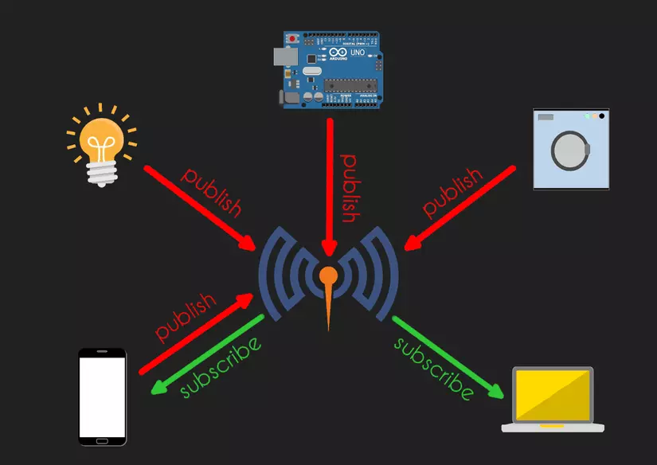
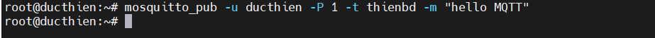
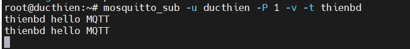

# TRIỂN KHAI MOSQUITTO BROKER TRÊN UBUNTU SERVER 22.04 - TÍCH HỢP CƠ CHẾ XÁC THỰC ỦY QUYỀN

# 1. Mosquitto Broker là gì
Mosquitto Broker là một phần mềm mã nguồn mở, nhẹ và hiệu quả, được thiết kế để hoạt động trên nhiều nền tảng khác nhau và hỗ trợ đầy đủ các tính năng của giao thức MQTT. Mosquitto thường được sử dụng trong các dự án IoT để thu thập và truyền tải dữ liệu từ các cảm biến và thiết bị khác nhau đến một máy chủ trung tâm hoặc giữa các thiết bị với nhau.



# 2. Cài đặt Mosquitto Broker
## 2.1. Cài đặt dịch vụ
- Cài đặt gói yêu cầu 
```
sudo apt-get update
sudo apt-get install curl gnupg2 wget git apt-transport-https ca-certificates -y
```
- Thêm Mosquitto PPA:
```
sudo add-apt-repository ppa:mosquitto-dev/mosquitto-ppa -y
```
- Cài đặt Mosquitto Broker và Mosquitto Clients
```
sudo apt install mosquitto mosquitto-clients -y
```
- Kiểm tra trạng thái và version Mosquitto:
```
sudo systemctl status mosquitto
```
## 2.2. Cấu hình dịch vụ
Theo mặc định, Mosquitto được cấu hình cho phép các kết nối anonymous. Để cài đặt bảo mật, bạn làm như sau:   
**1. Tạo file để lưu mật khẩu quản trị MQTT**

- Chạy lệnh cmd để tạo file lưu mật khẩu và thêm người dùng mới :
```
sudo mosquitto_passwd -c /etc/mosquitto/passwd <your_username>
Password: <your_password>
Reenter password: <your_password>
```
- Đặt quyền sở hữu cho tệp mật khẩu:
```
sudo chown mosquitto:mosquitto /etc/mosquitto/passwd
```
- Ở đây, mình sẽ tạo một file cấu hình bổ sung:
```
sudo nano /etc/mosquitto/conf.d/default.conf
```
- Thêm vào file các dòng sau:
```
stener 1883
allow_anonymous false
password_file /etc/mosquitto/passwd
```
*Trong đó, Mosquitto Broker sẽ lắng nghe các kết nối MQTT ở port 1883, và tệp mật khẩu "/etc/mosquitto/passwd" dùng để xác thực người dùng.*

- Liên kết file cấu hình trên vào mosquitto:

Thêm lệnh sau vào file "/etc/mosquitto/mosquitto.conf"
```
include_dir /etc/mosquitto/conf.d
```
- Kiểm tra cấu hình mosquitto :

Nếu hệ thống đã chạy dịch vụ "mosquitto.service", hãy dừng dịch vụ bằng lệnh:
```
sudo systemctl stop mosquitto.service
```

- Chạy mosquitto broker bằng tay và xem full log:
```
mosquitto -c /etc/mosquitto/mosquitto.conf -v
```
- Sau khi kiểm trả cấu hình hoàn tất, Khởi động lại Mosquitto:
```
sudo systemctl restart mosquitto
journalctl -u mosquitto -f # hiển thị Log gần nhất
```
- Kiểm tra Mosquitto với mosquitto-clients

Tạo một cửa sổ CMD và đăng kí topic:
```
mosquitto_sub -u <your_username> -P <your_password> -v -t <your_topic>
```


Tạo một cửa sổ khác để xuất bản tin nhắn trong topic "hello/topic":
```
mosquitto_pub -u <your_username> -P <your_password> -t <your_topic> -m "hello MQTT"
```


Nếu bạn chạy Mosquitto trên một port khác, sử dụng thêm tham số -p để cấu hình port:
```
mosquitto_sub -p <your_port> -u admin -P <your_password> -v -t <your_topic>
```

**2. Sử dụng tệp ACL (Access Control List) để kiểm soát quyền truy cập người dùng vào các chủ đề.**

- Tạo một file acl mới:
```
sudo nano /etc/mosquitto/acls
```
Về cơ bản một acl sẽ có cấu trúc như sau:
```
user <username>
topic [read|write|readwrite|deny] <topic>
```
Do đó, mình sẽ thêm vào file các thông tin sau:
```
# Cấp cho người dùng admin quyền đọc và ghi mọi chủ đề
user admin
topic readwrite #

# Cấp cho người dùng user 1 quyền đọc và ghi chủ đề "temperature"
user user1
topic readwrite temperature

# Cấp cho người dùng user2 quyền ghi vào mọi chủ đề bắt đầu bằng "actuators/"
user user2
topic write actuators/#
```
- Liên kết file acls vào mosquitto:

Thêm lệnh sau vào cuối file "/etc/mosquitto/conf.d/default.conf"
```
acl_file /etc/mosquitto/acls
```
- Restart mosquitto.service
```
sudo systemctl restart mosquitto.service
```
- Tiếp tục thử nghiệm tính năng phân quyền nào

Thêm thông tin người dùng mới vào file passwd:
```
sudo mosquitto_passwd /etc/mosquitto/passwd user2
```


*Tài liệu tham khảo*

[1] [https://viblo.asia/p/trien-khai-mosquitto-broker-tren-ubuntu-server-2204-va-tich-hop-co-che-xac-thuc-uy-quyen-part-1-EbNVQwroJvR](https://viblo.asia/p/trien-khai-mosquitto-broker-tren-ubuntu-server-2204-va-tich-hop-co-che-xac-thuc-uy-quyen-part-1-EbNVQwroJvR)   
[2] [https://viblo.asia/p/xac-thuc-uy-quyen-cho-mosquitto-broker-dua-tren-plugin-mosquitto-go-auth-va-mysql-part-2-7ymJXP7WJkq](https://viblo.asia/p/xac-thuc-uy-quyen-cho-mosquitto-broker-dua-tren-plugin-mosquitto-go-auth-va-mysql-part-2-7ymJXP7WJkq)