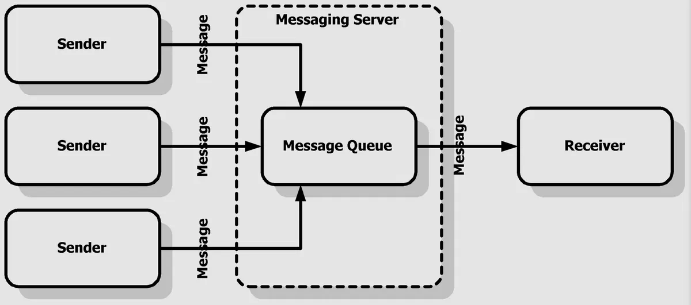

# TỔNG QUAN VỀ AMQP (ADVANCED MESSAGE QUEUING PROTOCOL)

# 1. Sơ lược về AMQP
## 1.1. AMQP là gì 
AMQP (Advanced Message Queuing Protocol) là một giao thức giao tiếp để gửi và nhận tin nhắn giữa các hệ thống. Nó bảo đảm tin nhắn được gửi đến đúng hàng đợi và được xử lý một cách chính xác. AMQP cung cấp các tính năng như giới hạn băng thông, giới hạn tải, và tự động chuyển tiếp tin nhắn đến hệ thống khác nếu hệ thống gốc không thể xử lý tin nhắn đó.

## 1.2. Mô hình xếp hàng thông tin nâng cao 
Mô hình xếp hàng thông tin nâng cao của AMQP (AMQ) là một cấu trúc để quản lý và phân phối thông tin trong hệ thống. Hãy xem xét các thành phần chính trong mô hình này.

- **Producer (Người sản xuất)**: Đây là một người dùng hoặc ứng dụng gửi thông tin đến hệ thống AMQ. Producer tạo ra và gửi thông tin đến một nơi gọi là trao đổi.
- **Exchange (Trao đổi)**: Đây là nơi nhận thông tin từ producer và quyết định điều hướng nó đến đâu. Trao đổi xác định quy tắc về cách thông tin được phân phối dựa trên loại trao đổi và khóa định tuyến (routing key) được sử dụng.
- **Queue (Hàng đợi)**: Đây là nơi lưu trữ thông tin trong hệ thống AMQ. Mỗi hàng đợi có một tên duy nhất và thông tin được gửi đến hàng đợi để chờ được xử lý bởi người đăng ký (subscriber).
- **Subscriber (Người đăng ký)**: Đây là người dùng hoặc ứng dụng nhận và xử lý thông tin từ hàng đợi. Subscriber có thể đăng ký để nhận thông tin từ một hoặc nhiều hàng đợi và thực hiện các hành động tương ứng.

Quá trình hoạt động của mô hình AMQ như sau: Producer gửi thông tin đến một trao đổi, sau đó trao đổi quyết định gửi thông tin đó đến các hàng đợi phù hợp dựa trên quy tắc xác định. Cuối cùng, subscriber nhận thông tin từ hàng đợi và tiến hành xử lý. Mô hình AMQ giúp quản lý và phân phối thông tin một cách linh hoạt và tin cậy trong hệ thống. Nó sử dụng một cơ chế xếp hàng thông minh để đảm bảo thông tin được xử lý và gửi đến đúng đích trong hệ thống.

## 1.3. Các thành phần của AMQP
- **Nodes**: Một node là một thành phần của hệ thống AMQP, có thể là một hệ thống gửi tin nhắn hoặc hệ thống nhận tin nhắn.
- **Connections**: Một connection là một kết nối giữa hai nodes trong hệ thống AMQP.
- **Channels**: Một channel là một đường dây truyền tin nhắn giữa hai nodes thông qua một connection.
- **Exchanges**: Một exchange là một thành phần trung gian trong hệ thống AMQP, nó chuyển tiếp tin nhắn từ gửi đi tới hàng đợi đích.
- **Queues**: Một queue là một hàng đợi tin nhắn trong hệ thống AMQP, nó chứa các tin nhắn được chuyển tiếp từ exchange.
- **Bindings**: Một binding là một liên kết giữa một exchange và một queue, nó cho phép tin nhắn từ exchange được chuyển tiếp tới queue.
- **Routing keys**: Một routing key là một chuỗi ký tự dùng để đánh dấu tin nhắn và xác định hàng đợi mà tin nhắn sẽ được chuyển tiếp đến.

# 2. Sơ lược về Message broker
## 2.1. Message broker là gì

Message broker (hay còn gọi là integration broker hoặc interface engine) là một module trung gian trung chuyển message từ người gửi đến người nhận. Nó là một mô hình kiến trúc (architentural pattern) để kiểm tra, trung chuyển và điều hướng message; làm trung gian giữa các ứng dụng với nhau, tối giản hóa giao tiếp giữa các ứng dụng đó và để tăng hiệu quả tối đa cho việc tách ra các khối nhỏ hơn. Nhiệm vụ chính của một Message broker là tiếp nhận những message từ các ứng dụng và thực hiện một thao tác nào đó. Hãy cùng nhìn vào sequence diagram dưới đây:

Trong quá trình Initialize, Service1 và Sevice2 init, rồi sau đó load proxy và register đến Broker. Từ đó, Broker sẽ trung chuyển các message đến với proxy đã được register từ trước. Pattern này sẽ có những lợi ích sau:

Service1 và Service2 không cần phải biết nhau. Nó chỉ việc gửi message đến proxy, rồi từ đó proxy sẽ forward message đến Broker. Rồi từ đó Broker sẽ forward message đến Service1 và Service2 mà chúng đã đăng kí nhận message từ trước.
Service1 và Service2 giao tiếp trung gian qua Broker nên dù có khác nhau về ngôn ngữ thì vẫn giao tiếp thành công.
Với design pattern này, chúng ta có thể setup cơ chế bất đồng bộ (asynchronous). Đối với Service1 thì nó không cần quan tâm khi nào message đến tay Service2 hay khi nào Service2 xử lý xong, nó chỉ cần đấy message đến Message Broker là xong việc. Service2 sẽ lấy message bất cứ khi nào nó muốn. Đặc tính này có thể được tận dụng để xây dựng các hệ thống lưu trữ và xử lý log.

## 2.2. Các loại mô hình Message broker
Dưới đây là 3 mô hình Message broker phổ biến:

- Mô hình Point-to-Point (P2P)
- Mô hình Publish/Subscribe (Pub/Sub)
- Mô hình Hybrid giữa Pub/Sub và P2P

**1. Mô hình Point-to-Point (P2P)**

P2P thường được triển khai dưới dạng queue. Queue thường sẽ cố gắng phân phối message một cách công bằng giữa những consumer, cho phép chỉ có một consumer nhận được một message nhất định.

**2. Mô hình Publish/Subscribe (Pub/Sub)**   

Pub/Sub được dùng trong trường hợp mất tin nhắn là không đáng kể.
Pub/Sub thường được triển khai thông qua topic. Topic cung cấp cùng một loại cơ chế phát sóng như Meet. Khi một message được gửi từ publisher vào một topic, nó sẽ được phân phối đến tất cả những consumer đã đăng ký. Các consumer sẽ bỏ lỡ message khi chúng offline. Vậy nên, Pub/Sub chỉ đảm bảo mỗi message được gửi tối đa một lần cho mỗi consumer đã đăng ký.

**3. Mô hình Hybrid giữa Pub/Sub và P2P**   
Hybrid tận dụng ưu điểm và khắc phục nhược điểm của cả 2 mô hình.

## 2.3. Ưu nhược điểm
**Ưu điểm**

- Giảm sự phụ thuộc: Message broker giúp tách biệt giữa người gửi và người nhận, giảm sự phụ thuộc trực tiếp giữa các thành phần hệ thống.
- Đảm bảo tính tin cậy: Nó có thể lưu trữ thông điệp tạm thời nếu người nhận không sẵn sàng, đảm bảo thông điệp không bị mất.
- Tăng khả năng mở rộng: Hệ thống có thể dễ dàng mở rộng bằng cách thêm các thành phần mới mà không ảnh hưởng đến các thành phần hiện tại.
- Đơn giản hóa giao tiếp: Cung cấp một giao diện giao tiếp đơn giản, giúp dễ dàng tích hợp các ứng dụng khác nhau.

**Nhược điểm**
- Tăng độ trễ: Do có một trung gian, thời gian để thông điệp được chuyển từ nguồn đến đích có thể lâu hơn so với giao tiếp trực tiếp. Điều này có thể không phù hợp với các ứng dụng cần xử lý thời gian thực hoặc yêu cầu độ trễ thấp.
- Tăng độ phức tạp của hệ thống: Việc triển khai và quản lý một Message Broker có thể làm tăng độ phức tạp của hệ thống, đòi hỏi kỹ thuật và kiến thức chuyên môn cao để đảm bảo hệ thống hoạt động ổn định và hiệu quả.
- Chi phí cơ sở hạ tầng: Việc duy trì Message Broker có thể yêu cầu thêm cơ sở hạ tầng và tài nguyên, từ đó tăng chi phí cho dự án, đặc biệt là đối với các dự án lớn hoặc các hệ thống phân tán rộng rãi.
- Rủi ro nút thắc cổ chai: Trong một số trường hợp, Message Broker có thể trở thành điểm nghẽn của hệ thống nếu không được thiết kế hoặc cấu hình đúng cách, đặc biệt khi xử lý lượng lớn thông điệp hoặc trong các tình huống giao tiếp cần độ tin cậy cao.

*Tài liệu tham khảo* 

[1] [https://bkhost.vn/blog/amqp-la-gi-tim-hieu-ve-giao-thuc-amqp/](https://bkhost.vn/blog/amqp-la-gi-tim-hieu-ve-giao-thuc-amqp/)

[2] [https://200lab.io/blog/message-broker-la-gi?srsltid=AfmBOoqzFOfK_FlX0rR_o44VN3D-mijzvBk89YEJF-sMzF-P5Apy_EZb](https://200lab.io/blog/message-broker-la-gi?srsltid=AfmBOoqzFOfK_FlX0rR_o44VN3D-mijzvBk89YEJF-sMzF-P5Apy_EZb)