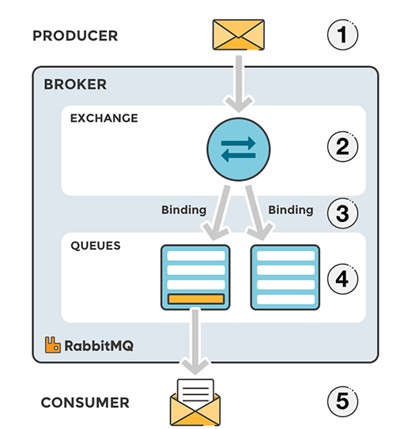
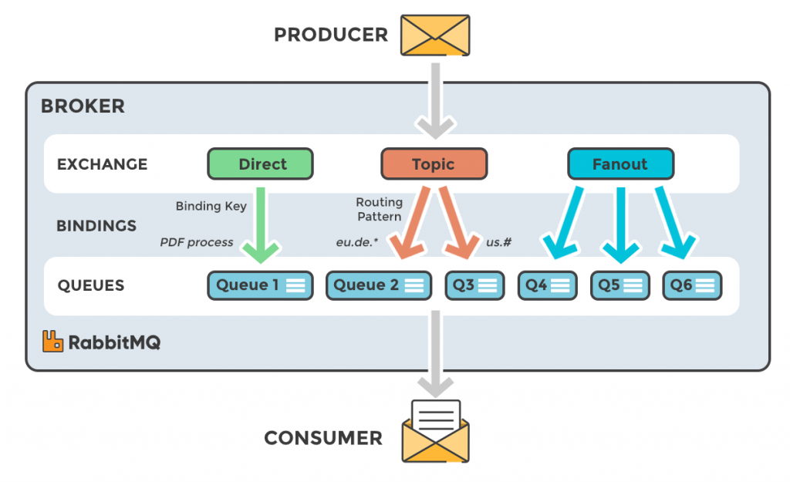
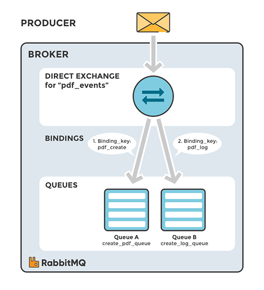
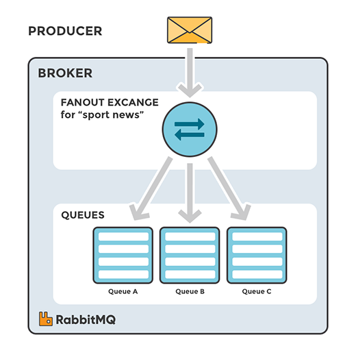
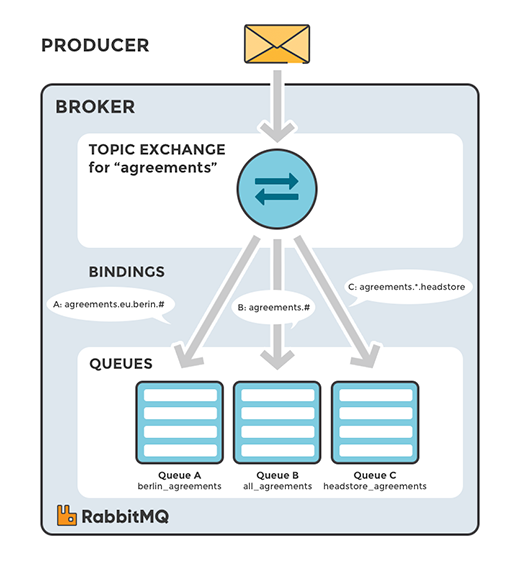
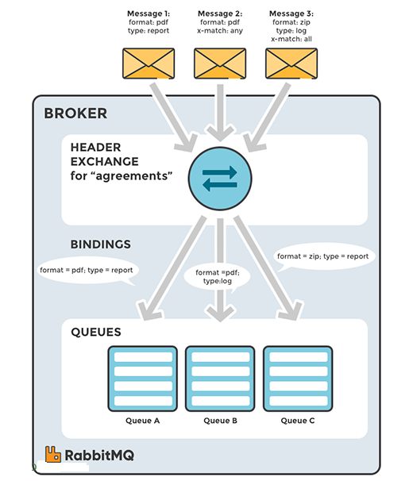

# TÌM HIỂU VỀ RABBITMQ

# 1. Tổng quan về RabbitMQ

RabbitMQ là một Message Broker sử dụng giao thức AMQP để phục vụ cho hoạt động trao đổi tin nhắn giữa các ứng dụng với nhau.RabbitMQ là một phần mềm trung gian giúp các hệ thống, server, ứng dụng có thể giao tiếp, trao đổi dữ liệu với nhau. Nhiệm vụ của RabbitMQ được hiểu đơn giản là: nhận message từ nhiều nguồn => lưu trữ, sắp xếp sao cho hợp lý => đẩy tới đích đến

# 2. Những tính năng đặc biệt của RabbitMQ là gì?
RabbitMQ sở hữu rất nhiều tính năng ưu việt. Đó cũng là lý do khiến RabbitMQ lại được nhiều người sử dụng đến như vậy.

- **Giao diện dễ sử dụng**: Rabbit MQ sở hữu một bộ giao diện rất tối giản và cơ bản. Những mục chính và quan trọng được bố trí ở nơi dễ nhìn và dễ thao tác. Chính vì thế khi thực hiện các hoạt động trên RabbitMQ người dùng sẽ cảm thấy rất thoải mái và tiện lợi.
- **Khả năng bảo mật tốt**: Hệ thống lưu trữ của RabbitMQ có tính an toàn rất cao. Người dùng có thể yên tâm sử dụng nhiều tác vụ cùng lúc mà không cần lo đến việc bảo vệ dữ liệu.
- **Tính linh hoạt cao**: Các Message được thông qua router trước, sau đó mới đi đến queue. Nếu định tuyến sở hữu một mô hình phức tạp, người dùng có thể viết riêng các kiểu trao đổi như một plugin.
- **Tạo sự liên kết chặt chẽ**: RabbitMQ có khả năng tạo ra sự liên kết giữa các đối tượng với nhau. Nếu phải làm việc với các máy chủ không yêu cầu liên kết hoặc có hệ thống liên kết lỏng lẻo, RabbitMQ sẽ tiến hành gia cố lại các liên kết cho phù hợp với nhu cầu sử dụng của người dùng.
- **Tối ưu hóa danh sách chờ**: RabbitMQ là một công cụ gửi tin nhắn có sử dụng danh sách chờ. Bằng cách nhân bản nhiều queue ở những máy khác nhau trong quy trình truyền tin, người dùng có thể dễ dàng lấy lại dữ liệu khi máy chủ bị lỗi.

# 3. Những khái niệm cơ bản
- **Producer**: Ứng dụng gửi message.
- **Consumer**: Ứng dụng nhận message.
- **Queue**: Lưu trữ messages.
- **Message**: Thông tin truyền từ Producer đến Consumer qua RabbitMQ.
- **Connection**: Một kết nối TCP giữa ứng dụng và RabbitMQ broker.
- **Channel**: Một kết nối ảo trong một Connection. Việc publishing hoặc consuming message từ một queue đều được thực hiện trên channel.
- **Exchange**: Là nơi nhận message được publish từ Producer và đẩy chúng vào queue dựa vào quy tắc của từng loại Exchange. Để nhận được message, queue phải được nằm (binding) trong ít nhất 1 Exchange.
- **Binding**: là quy tắc (rule) mà Exchange sử dụng để định tuyến Message đến Queue. Đảm nhận nhiệm vụ liên kết giữa Exchange và Queue.
- **Routing key**: Một key mà Exchange dựa vào đó để quyết định cách để định tuyến message đến queue. Có thể hiểu nôm na, Routing key là địa chỉ dành cho message.
- **AMQP (Advance Message Queuing Protocol)**: là giao thức truyền message được sử dụng trong RabbitMQ.
- **User**: Để có thể truy cập vào RabbitMQ, chúng ta phải có username và password. Trong RabbitMQ, mỗi user được chỉ định với một quyền hạn nào đó. User có thể được phân quyền đặc biệt cho một Vhost nào đó.
- **Virtual host/ Vhost**: Cung cấp những cách riêng biệt để các ứng dụng dùng chung một RabbitMQ instance. Những user khác nhau có thể có các quyền khác nhau đối với vhost khác nhau. Queue và Exchange có thể được tạo, vì vậy chúng chỉ tồn tại trong một vhost.

# 4. Cơ chế hoạt động 

- `(1)` Producer đẩy message vào Exchange. Khi tạo Exchange, bạn phải mô tả nó thuộc loại gì. Các loại Exchange sẽ được giải thích phía dưới.
- `(2)` Sau khi Exchange nhận Message, nó chịu trách nhiệm định tuyến message. Exchange sẽ chịu trách nhiệm về các thuộc tính của Message, ví dụ routing key, loại Exchange.
- `(3)` Việc binding phải được tạo từ Exchange đến Queue (hàng đợi). Trong trường hợp này, ta sẽ có hai binding đến hai hàng đợi khác nhau từ một Exchange. Exchange sẽ định tuyến Message vào các hàng đợi dựa trên thuộc tính của của từng Message.
- `(4)` Các Message nằm ở hàng đợi đến khi chúng được xử lý bởi một Consumer.
- `(5)` Consumer xử lý Message nhận từ Queue.

# 5. Các loại Exchange
Message không được publish trực tiếp vào Queue, thay vào đó, Producer gửi message đến Exchange.

Exchange là nơi mà các message được gởi. Exchange nhận tin nhắn và định tuyến nó đến 0 hoặc nhiều Queue với sự trợ giúp của các ràng buộc (binding) và các khóa định tuyến (routing key).

Thuật toán định tuyến được sử dụng phụ thuộc vào loại Exchange và quy tắc (còn gọi là ràng buộc hay binding).

Có 4 loại Exchange: Direct, Fanout, Topic, Headers. Lựa chọn các exchange type khác nhau sẽ dẫn đến các đối xử khác nhau của message broker với tin nhắn nhận được từ producer. Exchange được bind (liên kêt) đến một số Queue nhất định.

## 5.1. Direct Exchange

Direct Exchange (trao đổi trực tiếp) định tuyến message đến Queue dựa vào routing key. Thường được sử dụng cho việc định tuyến tin nhắn unicast-đơn hướng (mặc dù nó có thể sử dụng cho định tuyến multicast-đa hướng). Các bước định tuyến message:

Một queue được ràng buộc với một direct exchange bởi một routing key K.
Khi có một message mới với routing key R đến direct exchange. Message sẽ được chuyển tới queue đó nếu R=K.
Một Exchange không xác định tên (empty sstring), đây là loại Default Exchange, một dạng đặc biệt của là Direct Exchange. Default Exchange được liên kết ngầm định với mọi Queue với khóa định tuyến bằng với tên Queue.

Direct Exchange hữu ích khi muốn phân biệt các thông báo được publish cho cùng một exchange bằng cách sử dụng một mã định danh chuỗi đơn giản.

## 5.2.Fanout Exchange
Fanout exchange định tuyến message (copy message) tới tất cả queue mà nó được bind, với bất kể một routing key nào. Giả sử, nếu nó N queue được bind bởi một Fanout exchange, khi một message mới published, exchange sẽ định tuyến message đó tới tất cả N queues. Fanout exchange được sử dụng cho định tuyến message broadcast (quảng bá).

## 5.3. Topic Exchange (Publish/Subscribe)
Topic exchange định tuyến message tới một hoặc nhiều queue dựa trên sự trùng khớp giữa routing key và pattern. Topic exchange thường sử dụng để thực hiện định tuyến thông điệp multicast. Ví dụ một vài trường hợp sử dụng:

Phân phối dữ liệu liên quan đến vị trí địa lý cụ thể.
Xử lý tác vụ nền được thực hiện bởi nhiều workers, mỗi công việc có khả năng xử lý các nhóm tác vụ cụ thể.
Cập nhật tin tức liên quan đến một category hoặc gắn tag.
Điều phối các dịch vụ của các loại khác nhau trong cloud.

## 5.4. Headers Exchange
Header exchange được thiết kế để định tuyến với nhiều thuộc tính, để dàng thực hiện dưới dạng header của message hơn là routing key. Header exchange bỏ đi routing key mà thay vào đó định tuyến dựa trên header của message. Trường hợp này, broker cần một hoặc nhiều thông tin từ application developer, cụ thể là, nên quan tâm đến những tin nhắn với tiêu đề nào phù hợp hoặc tất cả chúng.

Headers Exchange rất giống với Topic Exchange, nhưng nó định tuyến dựa trên các giá trị header thay vì routing key.

Một Message được coi là phù hợp nếu giá trị của header bằng với giá trị được chỉ định khi ràng buộc.

*Tài liệu tham khảo*

[1] [https://gpcoder.com/6828-gioi-thieu-rabbitmq/](https://gpcoder.com/6828-gioi-thieu-rabbitmq/)    
[2] [https://200lab.io/blog/rabbitmq-la-gi#rabbitmq-hoat-dong-nhu-nao?](https://200lab.io/blog/rabbitmq-la-gi#rabbitmq-hoat-dong-nhu-nao?)