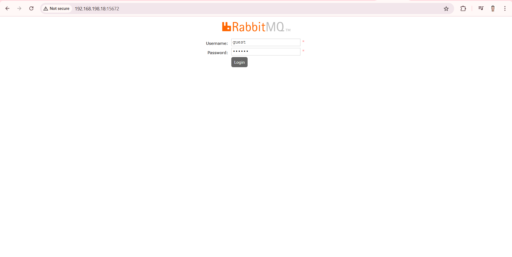
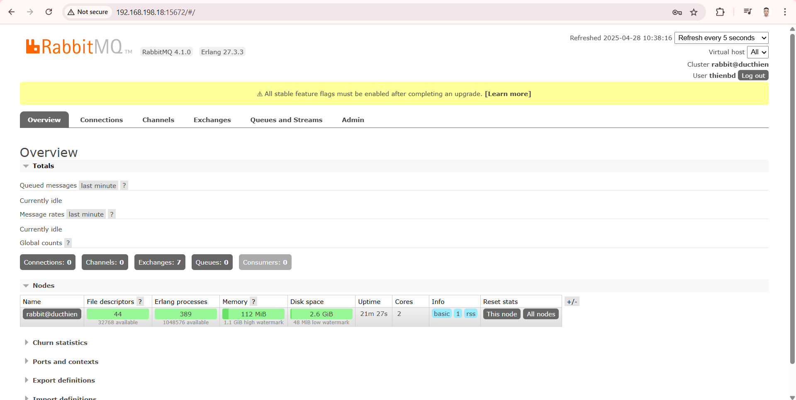

# HƯỚNG DẪN CÀI ĐẶT RABBITMQ TRÊN UBUNTU 22.04

# 1. Cài đặt các công cụ 

- Cài ba công cụ hỗ trợ để chuẩn bị môi trường cho việc thêm repository từ Internet
```
sudo apt-get install curl gnupg apt-transport-https -y
```
- Lấy public key của RabbitMQ từ openpgp.org rồi lưu vào máy ở đúng thư mục `/usr/share/keyrings/`
```
curl -1sLf "https://keys.openpgp.org/vks/v1/by-fingerprint/0A9AF2115F4687BD29803A206B73A36E6026DFCA" | sudo gpg --dearmor | sudo tee /usr/share/keyrings/com.rabbitmq.team.gpg > /dev/null
```
- Tải và lưu public key của Erlang, và lưu vào thư mục `/usr/share/keyrings/` để hệ thống có thể tin tưởng khi cài đặt các gói từ RabbitMQ.
```
curl -1sLf https://github.com/rabbitmq/signing-keys/releases/download/3.0/cloudsmith.rabbitmq-erlang.E495BB49CC4BBE5B.key | sudo gpg --dearmor | sudo tee /usr/share/keyrings/rabbitmq.E495BB49CC4BBE5B.gpg > /dev/null
```
- Tải và lưu public key của RabbitMQ Server vào hệ thống để đảm bảo rằng hệ thống có thể xác thực gói RabbitMQ khi thêm repository và cài đặt.

```
curl -1sLf https://github.com/rabbitmq/signing-keys/releases/download/3.0/cloudsmith.rabbitmq-server.9F4587F226208342.key | sudo gpg --dearmor | sudo tee /usr/share/keyrings/rabbitmq.9F4587F226208342.gpg > /dev/null
```

- Thêm các repository của RabbitMQ vào hệ thống, lưu chúng vào file `/etc/apt/sources.list.d/rabbitmq.list`

```
## Provides modern Erlang/OTP releases
##
deb [arch=amd64 signed-by=/usr/share/keyrings/rabbitmq.E495BB49CC4BBE5B.gpg] https://ppa1.rabbitmq.com/rabbitmq/rabbitmq-erlang/deb/ubuntu jammy main
deb-src [signed-by=/usr/share/keyrings/rabbitmq.E495BB49CC4BBE5B.gpg] https://ppa1.rabbitmq.com/rabbitmq/rabbitmq-erlang/deb/ubuntu jammy main

# another mirror for redundancy
deb [arch=amd64 signed-by=/usr/share/keyrings/rabbitmq.E495BB49CC4BBE5B.gpg] https://ppa2.rabbitmq.com/rabbitmq/rabbitmq-erlang/deb/ubuntu jammy main
deb-src [signed-by=/usr/share/keyrings/rabbitmq.E495BB49CC4BBE5B.gpg] https://ppa2.rabbitmq.com/rabbitmq/rabbitmq-erlang/deb/ubuntu jammy main

## Provides RabbitMQ
##
deb [arch=amd64 signed-by=/usr/share/keyrings/rabbitmq.9F4587F226208342.gpg] https://ppa1.rabbitmq.com/rabbitmq/rabbitmq-server/deb/ubuntu jammy main
deb-src [signed-by=/usr/share/keyrings/rabbitmq.9F4587F226208342.gpg] https://ppa1.rabbitmq.com/rabbitmq/rabbitmq-server/deb/ubuntu jammy main

# another mirror for redundancy
deb [arch=amd64 signed-by=/usr/share/keyrings/rabbitmq.9F4587F226208342.gpg] https://ppa2.rabbitmq.com/rabbitmq/rabbitmq-server/deb/ubuntu jammy main
deb-src [signed-by=/usr/share/keyrings/rabbitmq.9F4587F226208342.gpg] https://ppa2.rabbitmq.com/rabbitmq/rabbitmq-server/deb/ubuntu jammy main
```
- Cập nhật lại các gói cài đặt dịch vụ 
```
sudo apt-get update -y 
```
# 2. Cài đặt Erlang
- Cài đặt Erlang cho ubunut 22.04
```
sudo apt-get install -y erlang-base \
                        erlang-asn1 erlang-crypto erlang-eldap erlang-ftp erlang-inets \
                        erlang-mnesia erlang-os-mon erlang-parsetools erlang-public-key \
                        erlang-runtime-tools erlang-snmp erlang-ssl \
                        erlang-syntax-tools erlang-tftp erlang-tools erlang-xmerl

```
- Tạo tài khoản để đăng nhập giao diện web 
```
rabbitmqctl add_user newuser matkhau
rabbitmqctl set_user_tags newuser administrator
rabbitmqctl set_permissions -p / newuser ".*" ".*" ".*"
```
newuser: bạn tự đặt tên user mới.   
matkhau: mật khẩu user mới.
Ví dụ :
```
rabbitmqctl add_user thienbd 123
rabbitmqctl set_user_tags thienbd administrator
rabbitmqctl set_permissions -p / thienbd ".*" ".*" ".*"
```
# 3. Cài đặt RabbitMQ
- Cài đặt Rabbit và các gói phụ thuộc 
```
sudo apt-get install rabbitmq-server -y --fix-missing
```

- Sau khi cài xong, để khởi động RabbitMQ:
```
sudo systemctl enable rabbitmq-server
sudo systemctl start rabbitmq-server
```
- Kiểm tra trạng thái dịch vụ 
```
sudo systemctl status rabbitmq-server
```
- Bật RabbitMQ Management UI (web để quản lý RabbitMQ):
```
sudo rabbitmq-plugins enable rabbitmq_management
```
- Sau đó truy cập: http://192.168.198.18:15672



- Sau khi login sẽ thấy kết quả như sau 



*Tài liệu tham khảo*          
[1] [https://www.rabbitmq.com/docs/install-debian#installation-methods](https://www.rabbitmq.com/docs/install-debian#installation-methods)